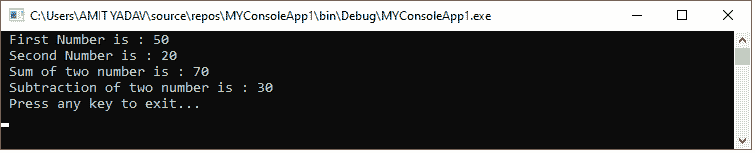
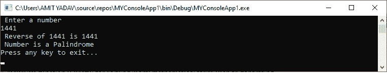
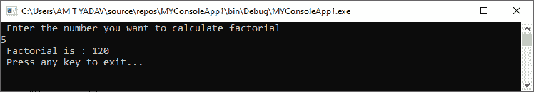
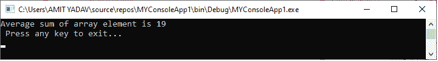

# VB.NET 函数

> 原文：<https://www.javatpoint.com/vb-net-functions>

在 VB.NET，函数是一组单独的代码，当在程序中调用定义的函数时，用来执行特定的任务。一个功能执行后，控制转移到 **main()** 方法进一步执行。它返回一个值。在[VB.NET](https://www.javatpoint.com/vb-net)中，我们可以在一个程序中创建多个函数来执行各种功能。通过减少代码的重复，该函数对于代码的可重用性也很有用。例如，如果我们需要在程序的多个地方使用相同的功能，我们可以简单地创建一个函数，并在需要时调用它。

### 定义函数

定义函数的语法是:

```

[Access_specifier ] Function Function_Name [ (ParameterList) ] As Return_Type
[ Block of Statement ]
Return return_val
End Function

```

哪里，

*   **Access _ 说明符:**定义函数的访问级别，如公共、私有或友元，Protected 函数访问方法。
*   **函数名:**函数名表示应该唯一的函数名。
*   **参数列表:**定义从一个方法发送或检索数据的参数列表。
*   **Return_Type:** 定义函数返回的变量的数据类型。

以下是定义 VB.NET 函数的各种方法。

```

Public Function add() As Integer
' Statement to be executed
End Function

Private Function GetData( ByVal username As String) As String
' Statement to be executed
End Function

Public Function GetData( ByVal username As String, ByVal userId As Integer) As String
' Statement to be executed
End Function

```

**示例:**编写一个程序，利用函数求出两个数的和与减。

**Find_Sum.vb**

```

Imports System
Module Find_Sum
    ' Create the SumOfTwo() Function and pass the parameters.
    Function SumOfTwo(ByVal n1 As Integer, ByVal n2 As Integer) As Integer
        ' Define the local variable.
        Dim sum As Integer = 0
        sum = n1 + n2
        Return sum
    End Function
    Function SubtractionOfTwo(ByVal n1 As Integer, ByVal n2 As Integer) As Integer
        ' Define the local variable.
        Dim subtract As Integer
        subtract = n1 - n2
        Return subtract
    End Function
    Sub Main()
        ' Define the local variable a and b.
        Dim a As Integer = 50
        Dim b As Integer = 20
        Dim total, total1 As Integer
        Console.WriteLine(" First Number is : {0}", a)
        Console.WriteLine(" Second Number is : {0}", b)
        total = SumOfTwo(a, b) 'call SumOfTwo() Function
        total1 = SubtractionOfTwo(a, b) 'call SubtractionOfTwo() Function
        Console.WriteLine(" Sum of two number is : {0}", total)
        Console.WriteLine(" Subtraction of two number is : {0}", total1)
        Console.WriteLine(" Press any key to exit...")
        Console.ReadKey()
    End Sub
End Module

```

**输出:**



在上面的例子中，我们定义了一个 **SumOfTwo()和减法 OfTwo()** 函数来加减两个预定义的数字。当在 main()方法中调用函数时，每个函数都会被执行，并分别返回两个数的和与减。

**例:**写一个程序，把一个数字倒过来，检查给定的数字是不是回文。

**回文. vb**

```

Imports System
Module Palindrome
    ' Define a reverse() function 
    Function reverse(ByVal num As Integer) As Integer
        ' Define the local variable
        Dim remain As Integer
        Dim rev As Integer = 0
        While (num > 0)
            remain = num Mod 10
            rev = rev * 10 + remain
            num = num / 10
        End While
        Return rev
    End Function
    Sub Main()
        ' Define the local variable as integer
        Dim n, num2 As Integer
        Console.WriteLine(" Enter a number")
        n = Console.ReadLine() 'Accept the number
        num2 = reverse(n) ' call a function
        Console.WriteLine(" Reverse of {0} is {1}", n, num2)

        If (n = reverse(n)) Then
            Console.WriteLine(" Number is a Palindrome")
        Else
            Console.WriteLine(" Number is not a Palindrome")
        End If
        Console.WriteLine("Press any key to exit...")
        Console.ReadKey()
    End Sub
End Module

```

**输出:**



### 递归函数

当一个函数调用自己直到定义的条件被满足时，它被称为**递归函数**。递归函数对于解决许多数学任务很有用，例如生成斐波那契数列、一个数的阶乘等。

让我们创建一个程序，使用递归函数计算一个数的阶乘。

**阶乘函数 vb**

```

Imports System
Module Factorial_function
    ' Create a Fact() function
    Function Fact(ByVal num As Integer) As Integer
        If (num = 0) Then
            Return 0
        ElseIf (num = 1) Then
            Return 1
        Else
            Return num * Fact(num - 1)
        End If
    End Function
    Sub Main()
        ' Define the local variable as integer
        Dim n, f As Integer
        Console.WriteLine(" Enter the number you want to calculate factorial")
        n = Console.ReadLine() 'Accept a number
        f = Fact(n) 'call Fact() function
        Console.WriteLine(" Factorial is : {0}", f)
        Console.WriteLine(" Press any key to exit...")
        Console.ReadKey()
    End Sub
End Module

```

**输出:**



### 将数组作为参数传递

让我们创建一个程序，将数组解析为函数中的传递参数。

**Array_Parameter.vb**

```

Imports System
Module array_Parameter
    Function AddPara(ByVal Arr As Integer(), ByVal size As Integer) As Double
        'Declare a local variable.

        Dim i As Integer
        Dim avg As Double
        Dim Sum As Integer = 0

        For I = 0 To size - 1
            Sum = Sum + Arr(i)
        Next
        avg = Sum / size
        Return avg
    End Function
    Sub Main()
        Dim arrays As Integer() = {50, 10, 20, 5, 4, 25}
        Dim getAvg As Double
        getAvg = AddPara(arrays, 6)
        Console.WriteLine("Average sum of array element is {0}", getAvg)
        Console.WriteLine(" Press any key to exit...")
        Console.ReadKey()
    End Sub
End Module

```

**输出:**



* * *