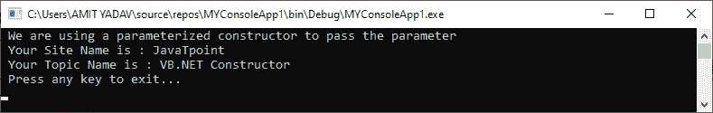
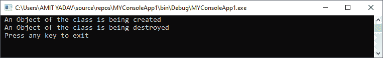

# VB.NET 类和对象

> 原文：<https://www.javatpoint.com/vb-net-classes-and-object>

类是一组不同的数据成员或对象，它们具有相同的属性、过程、对象的事件以及与其他成员函数的一般关系。此外，我们可以说它就像一个模板或架构师，告诉我们当它包含在一个类对象中时会出现什么数据和函数。例如，它表示将在类的对象上工作的方法和变量。

对象是类的基本运行时单元。一旦定义了一个类，我们就可以创建任意数量的与该类相关的对象来访问定义的属性和方法。例如，汽车是类名，速度、里程和车轮是对象可以访问的类的属性。

**创建类**

我们可以使用 class 关键字创建一个类，后跟类名。并且类的主体以语句 End Class 结束。以下是在[VB.NET 编程语言](https://www.javatpoint.com/vb-net)中创建类和对象的一般语法。

```

[ Access_Specifier ] [ Shadows ] [ MustInherit | NotInheritable ] [ Partial ] Class ClassName
' Data Members or Variable Declaration
' Methods Name
' Statement to be executed
End Class

```

**在哪里，**

*   **Access _ 说明符:**定义类的访问级别，如 Public、Private 或 Friend、Protected、Protected Friend 等。使用方法。(这是可选参数)。
*   **阴影:**为可选参数。它表示变量的重新声明，并隐藏基类中相同的元素名称或一组重载元素。
*   **MustInherit:** 是一个可选参数，指定类只能作为基类使用，对象不会直接访问基类或抽象类。
*   **NotInheritable:** 它也是一个可选参数，表示没有被用作基类的类。
*   **Partial:** 正如名称所定义的，Partial 表示类的部分定义(可选)。
*   **实现:**用于指定类继承的接口(可选)。

**My_program.vb**

```

Public Class My_program
' properties, method name, etc
' Statement to be executed
End Class

```

在上面的语法中，我们使用 class 关键字创建了一个名为‘My _ program’的类。

**创建对象的语法**

```

Dim Obj_Name As Class_Name = New Class_Name() ' Declaration of object
Obj_Name.Method_Name() ' Access a method using the object

```

在上面的语法中，我们为类**类名**创建了一个实例**(对象名)**。通过使用对象名**‘对象名’**访问所有数据成员和方法名**类名**。

让我们创建一个程序，使用 VB.NET 的类和对象来查找矩形的面积和参数。

**My_program.vb**

```

Imports System
Module My_program
    Sub Main()
        Dim rect As Rectangle = New Rectangle() 'create an object
        Dim rect2 As Rectangle = New Rectangle() 'create an object
        Dim area, para As Integer

        'rect specification
        rect.setLength = (5)
        rect.setBreadth= (6)

        'rect2 specification
        rect2.setLength = (5)
        rect2.setBreadth = (10)

        'Area of rectangle 
        area = rect.length * rect.Breadth
        'area = rect.GetArea()
        Console.WriteLine(" Area of Rectangle is {0}", area)

        'Parameter of rectangle 
        'para = rect.GetParameter()
         para = 2 (rect2.length + rect.Breadth)
        Console.WriteLine(" Parameter of Rectangle is {0}", para)
        Console.WriteLine(" Press any key to exit...")
        Console.ReadKey()
    End Sub
    Public Class Rectangle
        Public length As Integer
        Public Breadth As Integer

        Public Sub setLength(ByVal len As Integer)
            length = len
        End Sub

        Public Sub setBreadth(ByVal bre As Integer)
            Breadth = bre
        End Sub
        Public Function GetArea() As Integer
            Return length * Breadth
        End Function

        Public Function GetParameter() As Integer
            Return 2 * (length + Breadth)
        End Function
    End Class
End Module

```

**输出:**


### 成员函数

类的成员函数用于在类的定义中定义成员的结构。该类的所有已定义对象都可以访问它，并对数据成员进行操作。此外，成员变量是要实现到成员函数的对象的属性。我们可以使用公共成员函数访问成员变量。

### 构造函数和析构函数

在 VB.NET，构造函数是一种特殊的方法，在创建特定类的对象时实现。构造函数对于为数据成员的新对象创建和设置默认值也很有用。

当我们创建一个没有定义构造函数的类时，编译器会自动创建一个默认的构造函数。这样，每个类中都有一个始终可用的构造函数。此外，我们可以使用 **New** 关键字在一个类中创建多个构造函数，但是使用不同的参数，并且它不返回任何东西。

**默认构造函数:**在 VB.NET，当我们创建一个没有定义参数的构造函数时，它被称为默认构造函数。

**VB.NET 默认构造函数语法**

以下是在 VB.NET 使用 New 关键字创建构造函数的语法。

```

Public Class MyClass
' Creates a Constructor using the New       
Public Sub New()
	'Statement to be executed
       End Sub
End Class 

```

让我们创建一个程序来定义 VB.NET 编程语言中的默认构造函数。

**Default_Const.vb**

```

Imports System
Module Default_Const
    Class Tutor
        Public name As String
        Public topic As String
        ' Create a default constructor
        Public Sub New()
            name = "JavaTpoint"
            topic = "VB.NET Tutorial"
        End Sub
    End Class
    Sub Main()
        ' The constructor will automatically call when the instance of the class is created
        Dim tutor As Tutor = New Tutor() ' Create an object as a tutor
        Console.WriteLine(" Your Site Name is : {0}", tutor.name)
        Console.WriteLine(" Your Topic Name is : {0}", tutor.topic)
        Console.WriteLine(" Press any key to exit...")
        Console.ReadKey()
    End Sub
End Module

```

**输出:**


在上面的例子中，我们创建了一个类**‘Tutor’**，并使用 **New()** 关键字定义了一个默认的构造函数方法，而没有传递任何参数。创建对象(导师)时，会在类中调用默认构造函数。

**参数化构造器**

在 VB.NET，当我们向构造函数传递一个或多个参数时，该构造函数被称为参数化构造函数。并且类的对象应该在创建时用参数初始化。

让我们创建一个程序，使用参数化构造函数在类中传递参数。

至 _Const.vb

```

Imports System
Module Para_Const
    Class Tutor
        Public name As String
        Public topic As String
        ' Create a parameterized constructor to pass parameter
        Public Sub New(ByVal a As String, ByVal b As String)
            name = a
            topic = b
            Console.WriteLine(" We are using a parameterized constructor to pass the parameter")
        End Sub
    End Class
    Sub Main()
        ' The constructor will automatically call when the instance of the class is created
        Dim tutor As Tutor = New Tutor("JavaTpoint", "VB.NET Constructor")
        Console.WriteLine(" Your Site Name is : {0}", tutor.name)
        Console.WriteLine(" Your Topic Name is : {0}", tutor.topic)
        Console.WriteLine(" Press any key to exit...")
        Console.ReadKey()
    End Sub
End Module

```

**输出:**



### VB.NET 破坏者

在 VB.NET，析构函数是一种特殊的函数，当类对象超出范围时，它用来销毁类对象。可以表示为 **Finalize()** 方法，不接受任何参数，也不返回值。此外，当不需要类对象时，可以自动调用它。

**VB.NET 析构函数语法**

在 VB.NET 使用 Finalize()方法的析构函数。

```

Class My_Destructor
 ' define the destructor 
    Protected Overrides Sub Finalize()
' Statement or code to be executed 
End Sub
End Class

```

让我们创建一个程序来使用 VB.NET 析构函数中的 Finalize()方法。

**自毁. vb**

```

Imports System
Module Destruct
    Class Get_Destroy
        Public Sub New()
            Console.WriteLine(" An Object of the class is being created")
        End Sub
        ' Use Finalize() method of Destructor
        Protected Overrides Sub Finalize()
            Console.WriteLine(" An Object of the class is being destroyed")
            Console.WriteLine(" Press any key to exit")
        End Sub
    End Class

    Sub Main()
        Get_Details() ' After invoking the Get_Details() method, garbage collector is called automatically
        GC.Collect()
        Console.ReadKey()
        End Sub
    Public Sub Get_Details()
        Dim dest As Get_Destroy = New Get_Destroy()
    End Sub
End Module

```

**输出:**



### 构造函数重载

在 VB.NET，构造函数的重载是一个概念，在这个概念中，我们可以通过定义多个同名但具有不同参数列表的构造函数来重载构造函数，以执行不同的任务。

让我们创建一个在类中使用构造函数重载的程序。

**Const_Over.vb**

```

Imports System
Module Const_Over
    Class Details
        Public name As String
        Public course As String
        ' Define Default Constructor
        Public Sub New()
            name = "Prince"
            course = "Coputer Science"
            Console.WriteLine(" Uses of Overloading Constructor")
        End Sub
        ' Create a parametrized constructor
        Public Sub New(ByVal a As String, ByVal b As String)
            name = a
            course = b
        End Sub
    End Class
    Sub Main()
        ' Called default constructor
        Dim det As Details = New Details()
        ' Called the parametrized constructor 
        Dim det1 As Details = New Details("Peter", "Knowledge of Data Mining")
        Console.WriteLine(" Your Details are: Name : {0} and Course : {1}", det.name, det.course)
        Console.WriteLine(" Your Overloaded Details are: Name : {0} and Course :{1}", det1.name, det1.course)
        Console.WriteLine(" Press any key to exit...")
        Console.ReadKey()
    End Sub
End Module

```

**输出:**


### 遗产

在 VB.NET，**继承**是通过从旧类继承属性和函数并扩展现有类的功能来创建新类的过程。它还提供了代码的可重用性和更快的实现时间。当我们创建一个派生类或继承类时，继承允许我们继承现有类的所有属性。旧类称为**基类**，继承类称为**派生类**。

**继承语法**

以下是 VB.NET 的继承语法。

```

<access_modifier> Class <Name_of_baseClass>
' Implementation of base class
End Class
<access_modifier> Class <Name_of_derivedClass>
Inherits Name_of_baseClass
' Implementation of derived class
End Class

```

让我们创建一个程序来理解 VB.NET 的继承概念

**Simple_Inherit.vb**

```

Imports System
Module Simple_Inherit
    Public Class Vehicle
        Public Sub speed()
            Console.WriteLine(" 4 Wheeler cars are more luxurious than 2 Wheeler")
        End Sub

        Public Overridable Sub perform()
            Console.WriteLine(" Both Vehicles are good, but in a narrow lane, two-wheeler are more comfortable than 4-Wheeler")
        End Sub
    End Class

    Class Bike
        Inherits Vehicle
        Public Overrides Sub perform()
            Console.WriteLine(" Two-wheeler are lesser weight as compared to 4 wheeler")
        End Sub
    End Class
    Class Car
        Inherits Vehicle
        Public Overrides Sub perform()
            Console.WriteLine(" It is 4 wheelar car")
        End Sub
    End Class

    Sub Main()
        Dim vehicle As Vehicle = New Vehicle()
        Dim bike As Bike = New Bike()
        Dim car As Car = New Car()
        vehicle = bike
        vehicle.perform()
        vehicle = car
        vehicle.perform()
        Console.WriteLine(" Press any ley to exit...")
        Console.ReadKey()
    End Sub
End Module

```

**输出:**


让我们使用 VB.NET 的 MyBase 创建一个继承程序。

**Inherit_class.vb**

```

Module Inherit_class
    Class Circle   'base class
        Protected radius As Integer
        Public Const PI As Double = 3.14
        Public Sub New(ByVal r As Integer)
            radius = r
        End Sub
        Public Function GetAreaCircle() As Double
            Return (PI * radius * radius)
        End Function
        Public Overridable Sub Show()
            Console.WriteLine(" Radius of circle : {0}", radius)
            Console.WriteLine(" Area of circle is {0}", GetAreaCircle())
        End Sub
    End Class

    'Derived Class
    Class MyDeriveClass : Inherits Circle
        Private dimen As Double
        Public Sub New(ByVal r As Integer)
            MyBase.New(r)
        End Sub
        Public Function Getdimen() As Double
            Dim dimen As Double
            dimen = GetArea() * 50
            Return dimen
        End Function
        Public Overrides Sub Show()
            MyBase.Show()
            Console.WriteLine("Total Cost: {0}", Getdimen())
        End Sub
    End Class

    Class Circle_Class
        Shared Sub Main()
            Dim c As MyDeriveClass = New MyDeriveClass(5)
            c.Show()
            Console.WriteLine("Press any key to exit")
            Console.ReadKey()
        End Sub
    End Class
End Module

```

**输出:**


### 多级继承

VB.NET 只支持单一继承，这意味着一个类可以从基类继承。然而，VB.NET 使用层次继承将一个类扩展到另一个类，这被称为**多级继承**。比如类 **C** 扩展类 **B** ，类 **B** 扩展类 **A** ，类 **C** 将继承类 **B** 和类 **A** 的成员。将一个类扩展到另一个类的过程称为多级继承。

```

Public Class A
     ' implementation of code
End Class

Public Class B
      Inherits A
      ' Implementation of Code
End Class

Public Class C
       Inherits A
       ' Implementation of code
End Class

```

让我们创建一个程序来理解 VB.NET 的多层次继承的概念

**Multi_inherit1.vb**

```

Module Multi_inherit1
    Public Class A
        Public SName As String
        Public Sub Display()
            Console.WriteLine(" Name of Student : {0}", SName)
        End Sub
    End Class
    Public Class B
        Inherits A
        Public place As String
        Public Sub GetPlace()
            Console.WriteLine(" Address : {0}", place)
        End Sub
    End Class

    Public Class C
        Inherits B
        Public rollno As Integer
        Public Sub GetRollno()
            Console.WriteLine(" Student Roll no. {0}", rollno)
        End Sub
    End Class

    Class Profile
        Public Sub Main(ByVal args As String())
            Dim c As C = New C()
            c.SName = "Donald Trump"
            c.place = "USA"
            c.rollno = 102
            c.Display()
            c.GetPlace()
            c.GetRollno()
            Console.WriteLine(" Press any key to exit")
            Console.ReadKey()
        End Sub
    End Class
End Module

```

**输出:**


### 连接

在 VB.NET，接口类似于类，用于继承类或结构可以实现的所有属性、方法和事件。使用 VB.NET 的接口，我们可以使用类的多个继承。它用 **Implements** 关键字实现接口，用 Interface 关键字创建接口。VB.NET 的所有界面都以 I 开头。

在类中实现接口的语法。

```

Class MyClass
	Inherits IClass
	Private Sub FetchDetails() Implements IClass.FetchDetails
	' Method Implementation 
	End Sub
End Class

```

在上面的片段中，我们继承了类**中的一个接口( **IClass** )，该接口实现了类中定义的接口方法。**

让我们使用 VB.NET 的一个类来创建和实现一个实例。

**Get_Interface.vb**

```

Module Get_Interface
    Interface IStudent
        Sub Details(ByVal y As String)
    End Interface
    Class Student
        Implements IStudent
        Public Sub Details(ByVal a As String) Implements IStudent.Details
            '       Throw New NotImplementedException()
            Console.WriteLine(" Name of Student: {0}", a)
        End Sub
    End Class

    Class Student1
        Implements IStudent
        Public Sub Details(ByVal a As String) Implements IStudent.Details
            'Throw New NotImplementedException()
            Console.WriteLine(" Course: {0}", a)
        End Sub
    End Class
    Sub Main(ByVal args As String())
        Dim stud As IStudent = New Student()
        stud.Details(" James Watt")
        Dim stud1 As IStudent = New Student1()
        stud1.Details("Computer Science")
        Console.WriteLine(" Press any key to exit...")
        Console.ReadKey()
    End Sub
End Module 

```

**输出:**


* * *