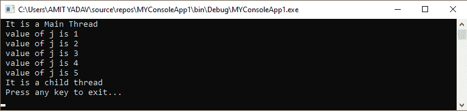
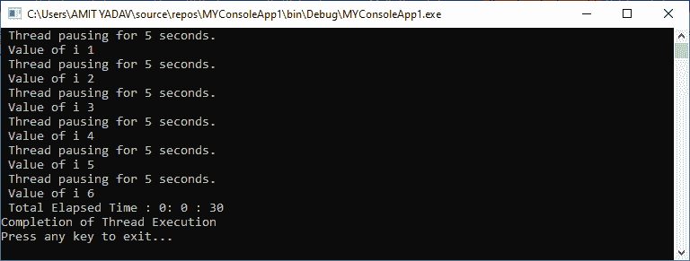
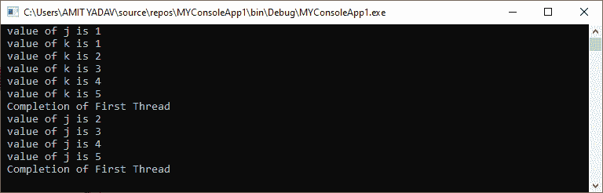

# VB.NET 多线程

> 原文：<https://www.javatpoint.com/vb-net-multithreading>

### 什么是 VB.NET 线程？

当两个或多个进程在一个程序中同时执行时，这个进程被称为多线程。每个过程的执行称为**线程**。单个线程用于在应用程序中执行单个逻辑或任务。默认情况下，每个应用程序都有一个或多个线程来执行每个进程，该线程被称为**主线程**。

要在线程**类**中创建和访问一个新线程，我们需要导入**系统。线程**命名空间。当一个程序在 VB.NET 开始执行时，主线程被自动调用来处理程序逻辑。如果我们在线程类中创建另一个线程来执行该过程，新线程将成为主线程的**子**线程。

### 创建新线程

在[VB.NET](https://www.javatpoint.com/vb-net)中，我们可以通过扩展 thread 类来创建一个线程，并将 ThreadStart 委托作为参数传递给 Thread 构造函数。A **ThreadStart()** 是由新线程执行的方法。我们需要调用 **Start()** 方法来启动新线程的执行，因为它最初处于**非启动**状态。而 PrintInfo 参数包含**一条可执行语句，即**在创建新线程时执行。

```vb

' Create a new thread
Dim th As Thread = New Thread( New ThreadStart(PrintInfo)
' Start the execution of newly thread
th.Start()  

```

让我们编写一个程序来创建和访问线程类中的线程。

**create_Thread.vb**

```vb

Imports System.Threading 'Imports the System.Threading namespace. 
Module create_Thread
    Sub Main(ByVal args As String())
        ' create a new thread 
        Dim th As Thread = New Thread(New ThreadStart(AddressOf PrintInfo))
        ' start the newly created thread
        th.Start()
        Console.WriteLine(" It is a Main Thread")
    End Sub
    Private Sub PrintInfo()
        For j As Integer = 1 To 5
            Console.WriteLine(" value of j is {0}", j)
        Next j
        Console.WriteLine(" It is a child thread")
        Console.WriteLine(" Press any key to exit...")
        Console.ReadKey()
    End Sub
End Module

```

**输出:**



在上面的程序中，主线程和子线程同时开始执行。主线程的执行在完成其功能后停止，但是子线程将继续执行，直到其任务完成。

### VB.NET 螺纹方法

以下是 Thread 类最常用的方法。

| 方法 | 描述 |
| **中止()** | 顾名思义，它用于终止线程的执行。 |
| **AllocateDataSlot()** | 它用于为所有线程上的未命名数据创建一个槽。 |
| **AllocateNamedDatsSlot()** | 它用于为所有线程上定义的数据创建一个槽。 |
| **等于()** | 用于检查当前和定义的线程对象是否相等。 |
| **中断()** | 它用于从等待、睡眠和连接线程状态中断线程。 |
| **Join()** | 它是一种同步方法，在执行线程完成之前停止调用线程。 |
| **恢复()** | 顾名思义，Resume()方法用于恢复已挂起的线程。 |
| **睡眠()** | 它用于将当前正在执行的线程挂起指定的时间。 |
| **Start()** | 它用于启动线程的执行或改变正在进行的实例的状态。 |
| **暂停()** | 它用于停止当前正在执行的线程。 |

### VB.NET 线程生命周期

在 VB.NET 多线程中，每个线程都有一个生命周期，这个生命周期从使用线程类创建新对象时开始。一旦线程类定义的任务完成，线程的生命周期就结束了。

VB.NET 程序设计中有一些线程循环的状态。

| 状态 | 描述 |
| **未启动** | 当我们创建一个新线程时，它最初处于未启动状态。 |
| **可运行** | 当我们调用 Start()方法准备线程运行时，就会出现可运行的情况。 |
| **运行** | 运行状态表示当前线程正在运行。 |
| **不可运行** | 它指示线程不处于可运行状态，这意味着线程处于睡眠()或等待()或挂起()状态，或者被输入/输出操作阻塞。 |
| **死亡** | 如果线程处于死状态，要么线程已经完成其工作，要么被中止。 |

让我们通过使用线程类的各种方法来创建一个管理线程的程序。

**Thread_cycle.vb**

```vb

Imports System.Threading
Module Thread_cycle
    Sub Main(ByVal args As String())
        Dim s As Stopwatch = New Stopwatch()
        s.Start()
        Dim t As Thread = New Thread(New ThreadStart(AddressOf PrintInfo))
        t.Start()
        ' Halt another thread execution until the thread execution completed
        t.Join()
        s.[Stop]()
        Dim t1 As TimeSpan = s.Elapsed
        Dim ft As String = String.Format("{0}: {1} : {2}", t1.Hours, t1.Minutes, t1.Seconds)
        Console.WriteLine(" Total Elapsed Time : {0}", ft)
        Console.WriteLine("Completion of Thread Execution ")
        Console.WriteLine("Press any key to exit...")
        Console.ReadKey()
    End Sub
    Private Sub PrintInfo()
        For j As Integer = 1 To 6
            Console.WriteLine(" Halt Thread for {0} Second", 5)
            ' It pause thread for 5 Seconds
            Thread.Sleep(5000)
            Console.WriteLine(" Value of i {0}", j)
        Next
    End Sub
End Module

```

**输出:**



在上面的例子中，我们使用了 **Thread** 类的不同方法，例如 **Start()** 方法来开始执行线程，使用 **Join()** 方法来停止线程的执行，直到线程的执行完成。 **Sleep()** 方法用于暂停线程执行 **5** 秒。

### 多线程操作

当一个程序中执行两个或多个进程同时执行多个任务时，该进程称为**多线程**。

当我们执行一个应用程序时，会自动调用 Main 线程来同步执行编程逻辑，这意味着它会执行一个又一个进程。这样，第二个过程要等到第一个过程完成，需要时间。为了克服这种情况，VB.NET 引入了多线程的新概念，通过在一个程序中创建多个线程来同时执行多个任务。

让我们编写一个多线程程序，在 VB.NET 应用程序中同时执行多个任务。

**多线程. vb**

```vb

 Imports System.Threading
Module Multi_thread
    Sub Main(ByVal arg As String())
        Dim th As Thread = New Thread(New ThreadStart(AddressOf PrintInfo))
        Dim th2 As Thread = New Thread(New ThreadStart(AddressOf PrintInfo2))
        th.Start()
        th2.Start()
        Console.ReadKey()
    End Sub
    Private Sub PrintInfo()
        For j As Integer = 1 To 5
            Console.WriteLine(" value of j is {0}", j)
            Thread.Sleep(1000)
        Next
        Console.WriteLine(" Completion of First Thread")
    End Sub
    Private Sub PrintInfo2()
        For k As Integer = 1 To 5
            Console.WriteLine(" value of k is {0}", k)
        Next
        Console.WriteLine(" Completion of First Thread")
    End Sub
End Module

```

**输出:**



在上面的例子中，我们创建了两个线程( **th，th2** )来同时执行**打印信息**和**打印信息 2** 方法。当执行开始时，两个线程同时执行。但是 PrintInfo 方法的第一条语句被执行，然后它等待下一条语句，直到 PrintInfo2 方法在程序中完成。

* * *