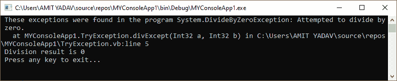
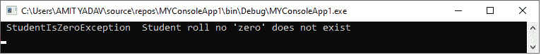
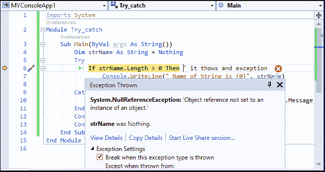
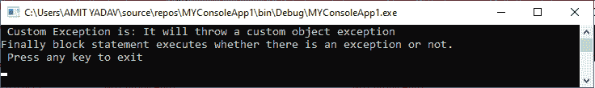

# VB.NET 异常处理

> 原文:[https://www.javatpoint.com/vb-net-exception-handling](https://www.javatpoint.com/vb-net-exception-handling)

### 什么是例外？

**异常**是在程序执行过程中出现的不想要的错误，可以是系统异常或应用程序异常。异常只是一些异常，通常是在执行过程中出现的事件或情况，可能会中断程序的正常流程。

异常可能由于不同的原因而发生，包括以下原因:

*   用户输入了不正确的数据或执行了除法运算，例如试图除以零。
*   通信过程中连接中断，或者系统内存不足。

### 异常处理

当程序执行过程中出现错误时，异常提供了一种方法，使用**异常处理**处理错误，将控制从程序的一部分转移到另一部分。[VB.NET](https://www.javatpoint.com/vb-net)异常有四个内置关键字，如**尝试、捕捉、最后**和**抛出**来处理控制并将控制从程序的一部分移动到另一部分。

| 关键字 | 描述 |
| **试试** | try 块用于监视可能在应用程序中引发异常的特定异常。为了处理这些异常，它总是遵循一个或多个 catch 块。 |
| **接住** | 它是一段代码，在程序中出现问题的地方用异常处理程序捕获异常。 |
| **最后** | 它用于执行程序中的一组语句，不管是否发生了异常。 |
| **投掷** | 顾名思义，抛出处理程序用于在问题发生后抛出异常。 |

### VB.NET 的例外类

在 VB.net，有各种类型的由类表示的异常。这些异常类源自它们的父类“系统”。异常。

**以下是主要在 VB.NET 使用的两个异常类。**

1.  **系统。系统异常**
2.  **系统。应用异常**

**系统。系统异常:**它是一个基类，包括所有预定义的异常类，以及一些在运行时生成的系统生成的异常类，如 **DivideByZeroException、IndexOutOfRangeException、StackOverflowExpression** 等。

**系统。ApplicationException:** 它是一个异常类，抛出程序员或开发人员在应用程序中定义的异常。此外，我们可以说它是一个继承自**系统的用户定义的异常。应用异常类**。

**异常处理程序块的语法**

```

Try
	' code or statement to be executed
	[ Exit Try block]
' catch statement followed by Try block
Catch [ Exception name] As [ Exception Type] 
[Catch1 Statements] Catch [Exception name] As [Exception Type]
[ Exit Try ]
 [ Finally
	[ Finally Statements ] ]
End Try

```

在上面的语法中，Try/Catch 块总是被可能引发异常的代码包围。该代码被称为受保护代码。此外，我们还可以使用多个 catch 语句来捕获程序中的各种类型的异常，如语法所示。

### 异常处理示例

让我们创建一个程序来处理一个异常，在 VB.NET 编程中使用 Try、Catch 和 Finally 关键字将一个数除以零。

**TryException.vb**

```

Module TryException
    Sub divExcept(ByVal a As Integer, ByVal b As Integer)
        Dim res As Integer
        Try
            res = a \ b
            ' Catch block followed by Try block
        Catch ex As DivideByZeroException
            Console.WriteLine(" These exceptions were found in the program {0}", ex)
            ' Finally block will be executed whether there is an exception or not.
        Finally
            Console.WriteLine(" Division result is {0}", res)
        End Try
    End Sub
    Sub Main()
        divExcept(5, 0) ' pass the parameters value
        Console.WriteLine(" Press any key to exit...")
        Console.ReadKey()
    End Sub
End Module

```

**输出:**



### 创建用户定义的例外

它允许我们创建从 **ApplicationException** 类派生的自定义异常。

让我们创建一个程序来理解用户定义异常在 VB.NET 异常处理中的用途。

**User_Exception.vb**

```

Module User_Exception
    Public Class StudentIsZeroException : Inherits Exception

        Public Sub New(ByVal stdetails As String)
            MyBase.New(stdetails)
        End Sub
    End Class
    Public Class StudentManagement
        Dim stud As Integer = 0
        Sub ShowDetail()
            If (stud = 0) Then
                Throw (New StudentIsZeroException(" Student roll no 'zero' does not exist"))
            Else
                Console.WriteLine("  Student is {0}", stud)
            End If
        End Sub
    End Class
    Sub Main()
        Dim stdmg As StudentManagement = New StudentManagement()
        Try
            stdmg.ShowDetail()
        Catch ex As StudentIsZeroException
            Console.WriteLine(" StudentIsZeroException {0}", ex.message)
        End Try
        Console.ReadKey()
    End Sub
End Module

```

**输出:**



### 使用尝试-捕获语句

让我们在 VB.NET 使用 Try-Catch 语句创建一个程序来处理异常。

**Try_catch.vb**

```

Imports System
Module Try_catch
    Sub Main(ByVal args As String())
        Dim strName As String = Nothing
        Try
            If strName.Length > 0 Then ' it thows and exception
                Console.WriteLine(" Name of String is {0}", strName)
            End If
        Catch ex As Exception  ' it cacthes an exception
            Console.WriteLine(" Catch exception in a proram {0}", ex.Message)
        End Try
        Console.WriteLine(" Press any key to exit...")
        Console.ReadKey()
    End Sub
End Module

```

**输出:**



### 投掷物品

在 VB.NET 异常处理中，我们可以直接或间接抛出一个从**系统派生的对象异常。例外类**。在 catch 块中使用 throw 语句抛出对象，例如:

```

Throw [ expression ]

```

让我们创建一个程序，在 VB.NET 异常中抛出一个对象。

**throwexcept.vb**

```

Imports System
Module thowexcept
    Sub Main()
        Try
            Throw New ApplicationException("It will throw a custom object exception")
        Catch ex As Exception
            Console.WriteLine(" Custom Exception is: {0}", ex.Message)
        Finally
            Console.WriteLine("Finally block statement executes whether there is an exception or not.")
        End Try
        Console.WriteLine(" Press any key to exit")
        Console.ReadKey()
    End Sub
End Module

```

**输出:**



* * *