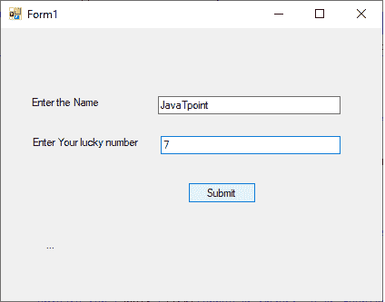

# VB.NET 表单控件

> 原文：<https://www.javatpoint.com/vb-net-form-controls>

在 VB.NET 使用**表单**来创建基于表单或基于窗口的应用程序。使用表单，我们可以构建一个吸引人的用户界面。它就像一个容纳不同控件的容器，允许用户与应用程序交互。控件是某种形式的对象，如[按钮](https://www.javatpoint.com/html-button-tag)、文本框、[文本区](https://www.javatpoint.com/html-textarea)、[标签](https://www.javatpoint.com/html-label-tag)等。来执行一些动作。但是，我们可以通过创建运行时的实例来将任何控件添加到运行时中。

表格使用**系统。Windows.Form** 命名空间，它有一系列控件，可以在基于窗口的用户界面中添加表单和函数。

### VB.NET 形式属性

以下是与表单相关的最重要的属性列表。这些属性可以在应用程序执行时设置或读取。

| 性能 | 描述 |
| **背景色** | 它用于设置窗体的背景颜色。 |
| **背景影像** | 它用于设置窗体的背景图像。 |
| **光标** | 它用于在光标悬停在窗体上时设置光标图像。 |
| **AllowDrop** | 在窗体中使用 AllowDrop 控件，它允许是否在窗体上拖放。 |
| 字体 | 它用于获取或设置表单中使用的字体。 |
| **锁定** | 它确定窗体是否被锁定。 |
| **表格表格表格样式** | 它用于设置或获取窗体中的边框样式。 |
| **文字** | 它用于设置窗体窗口的标题。 |
| **最小化盒** | MinimizeBox 用于在表单的标题栏上显示最小选项。 |
| **伊斯米主义形象** | 它用于验证表单是否是多文档接口子表单的容器。 |
| **自动滚动** | 它允许是否在表单中启用自动滚动。 |
| **最大化框** | 它用于在表单的标题栏上显示最大选项。 |
| 最大化 | 它用于设置表单的最大高度和宽度。 |
| **语言** | 它用于指定表单中的本地化语言。 |
| **接受按钮** | 它用于在按下回车键时设置表单按钮。 |
| **顶部，左侧** | 它用于以像素为单位设置窗体的左上角坐标。 |
| **名称** | 它用于定义表单的名称。 |
| 最小化 | 它用于设置窗体的最小高度和宽度。 |
| **启用** | 它使用“真”或“假”值来启用窗体中的鼠标或键盘事件。 |
| **最顶端** | 它使用一个布尔值来表示是否要将窗口窗体放在另一个窗体的顶部。默认情况下，它是 False。 |

**表单事件**

以下是与表单相关的最重要的事件列表。

| 事件 | 描述 |
| **激活** | 当用户或程序激活表单时，会发现激活的事件。 |
| **点击** | 单击窗体时，单击事件处于活动状态。 |
| **关闭** | 在关闭表单之前，会发现一个已关闭的事件。 |
| **关闭** | 它在窗体关闭时存在。 |
| **双击** | 双击
当用户双击表单时，双击事件被激活。 |
| 疏浚 | 当执行拖放操作时，DragDrop 事件被激活。 |
| 慕斯敦 | 当鼠标指针在窗体上并且鼠标按钮被按下时，MouseDown 事件被激活。 |
| **获得焦点** | 当窗体控件接收到焦点时，GotFocus 事件被激活。 |
| **帮助按钮点击** | 当用户点击帮助按钮时，它被激活。 |
| **键击** | 当聚焦在表单上按下一个键时，向下键事件被激活。 |
| 【T0 娱乐】T1 | 当您在关注表单的同时释放某个键时，会激活一个 KeyUp 事件。 |
| **加载** | load 事件用于在窗体首次显示之前加载窗体。 |
| **脱颖而出** | 当窗体失去焦点时，它被激活。 |
| **鼠标输入** | 当鼠标指针进入表单时，鼠标输入事件被激活。 |
| **鼠标悬停** | 当鼠标指针放在窗体上时，鼠标悬停事件被激活。 |
| moueleve | 当鼠标指针离开窗体表面时，MouseLeave 事件被激活。 |
| **显示** | 每当第一次显示表单时，它就会被激活。 |
| **滚动** | 当窗体在用户或代码中滚动时，滚动事件被激活。 |
| **调整尺寸** | 调整窗体大小时，将激活调整大小事件。 |
| **移动** | 移动表单时会激活移动事件。 |

要在[VB.NET](https://www.javatpoint.com/vb-net)创建一个 Windows 窗体应用程序，我们需要在微软 [Visual Studio](https://www.javatpoint.com/install-visual-studio) 中遵循以下步骤。

1.  GoTo 菜单文件。
2.  单击新建项目。
3.  点击 Windows 窗体应用程序或应用程序

最后，点击“创建”按钮来创建您的项目，然后，它会显示以下名为 Form1 的窗口表单。


现在在 VB.NET 创建一个简单的 [Windows](https://www.javatpoint.com/windows) 窗体控件程序。

**Form1.vb**

```

Public Class Form1
' Create nameStr and num variables
    Dim nameStr As String
    Dim num As Integer
    Private Sub Form1_Load(sender As Object, e As EventArgs) Handles MyBase.Load

    End Sub
   ' It is Label1
    Private Sub Label1_Click(sender As Object, e As EventArgs) Handles Label1.Click

    End Sub
  ' It is TextBox1 for inserting the value.
    Private Sub TextBox1_TextChanged(sender As Object, e As EventArgs) Handles TextBox1.TextChanged

    End Sub
    ' It is Label2
    Private Sub Label2_Click(sender As Object, e As EventArgs) Handles Label2.Click

    End Sub

' It is a Button1 for transferring the control.
    Private Sub Button1_Click(sender As Object, e As EventArgs) Handles Button1.Click
        nameStr = TextBox1.Text
        num = TextBox2.Text
        Label3.Text = "You have entered the Name " & nameStr + " Number " & num

    End Sub

    ' It is TextBox2 for inserting the value.
    Private Sub TextBox2_TextChanged(sender As Object, e As EventArgs) Handles TextBox2.TextChanged

    End Sub
' It is label3
    Private Sub Label3_Click(sender As Object, e As EventArgs) Handles Label3.Click

    End Sub
End Class

```

**输出:**


现在在表格中输入以下详细信息:



填写完所有细节后，点击**提交**按钮。之后，它显示以下输出:


* * *