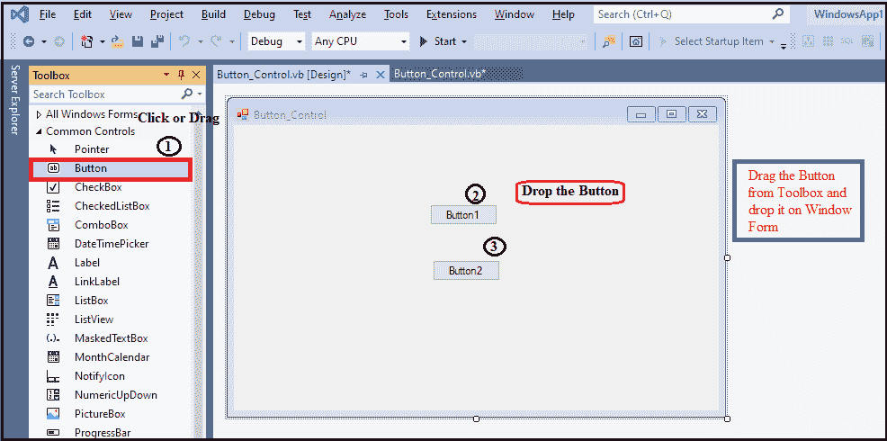
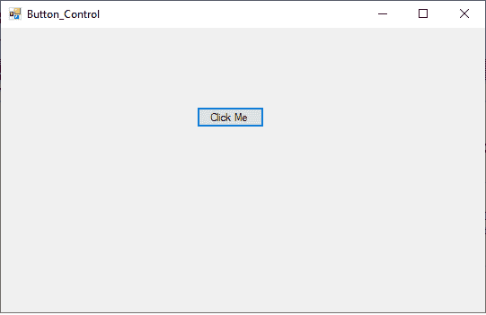
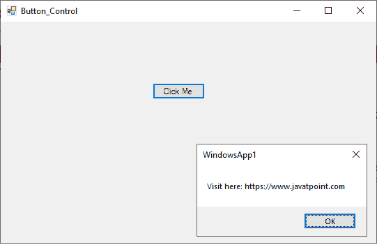
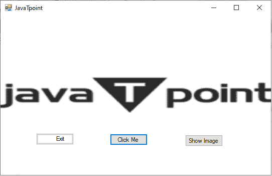
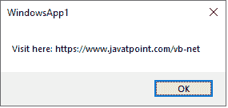
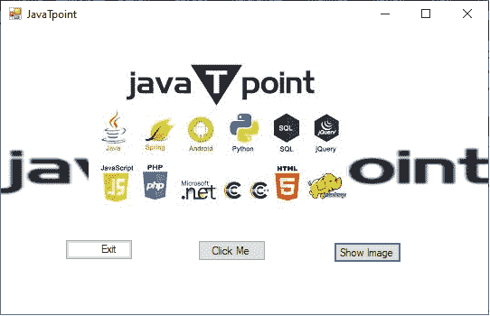

# VB.NET 按钮控制

> 原文:[https://www.javatpoint.com/vb-net-button-control](https://www.javatpoint.com/vb-net-button-control)

按钮控件用于在 Windows 窗体中执行单击事件，它可以通过鼠标或按回车键来单击。它用于通过单击提交按钮提交表单的所有查询，或将控制转移到下一个表单。但是，我们可以使用拖放操作来设置表单上的按钮。

让我们通过以下步骤在[VB.NET](https://www.javatpoint.com/vb-net)[窗口](https://www.javatpoint.com/windows)表单中创建一个按钮:

**步骤 1:** 我们必须从工具箱中拖动 Button 控件，并将其放到 Windows 窗体上，如下所示。



**第二步:**按钮添加到表单后，我们可以通过点击 button 控件来设置 Button 的各种属性。

### VB.NET 按钮属性

| 性能 | 描述 |
| 自动模式 | 它用于获取或设置自动模式值，通过该值，按钮可以在窗口窗体中自动调整大小。 |
| **背景色** | 它用于设置窗口窗体中按钮的背景颜色。 |
| **背景影像** | 它用于设置按钮控件的背景图像。 |
| **前颜色** | 它用于设置或获取按钮控件的前景色。 |
| **图像** | 它用于设置或获取显示的按钮控件上的图像。 |
| **位置** | 它用于设置按钮控件左上角相对于 windows 窗体左上角的坐标。 |
| **文字** | 它用于设置 windows 窗体中按钮控件的名称。 |
| **AllowDrop** | 它用于设置或获取一个值，该值表示按钮控件是否可以接受用户可以在窗体上拖动的数据。 |
| **选项卡索引** | 它用于设置或获取窗体中按钮控件的制表符顺序。 |

### VB.NET 按钮事件

| **背景颜色变化** | 当“背景”属性更改时，在按钮控件中会发现一个“背景颜色”事件。 |
| **BackgroundImageChanged** | 当 BackgoundImageChanged 属性的值更改时，在按钮控件中会发现 BackgoundImageChanged 事件。 |
| **点击** | 单击按钮控件时，会在该控件中发现一个单击事件。 |
| **上下文手抄报** | 当 ContextMenu 属性的值改变时，在按钮控件中可以找到它。 |
| **控制增加了** | 当一个新控件被添加到 Control.ControlCollection 时，在按钮控件中会发现一个 ControlAdded 事件。 |
| **光标改变** | 当控件的值更改时，在按钮控件中会发现 CursorChanged 事件。 |
| **双击** | 当用户双击按钮时，会在按钮控件中发现双击事件。 |
| **文本已更改** | 当 text 属性的值更改时，它会出现在按钮控件中。 |
| 疏浚 | 当在窗体中完成拖放操作时，在按钮控件中会出现 DragDrop 事件。 |

此外，我们还可以参考 VB.NET 微软文档来获得按钮属性和事件的完整列表。

让我们创建一个程序，使用 VB.NET 的按钮控件在 Windows 窗体上显示消息。

**按钮控制 vb**

```

Public Class Button_Control
    Private Sub Button_Control_Load(sender As Object, e As EventArgs) Handles MyBase.Load
        Button1.Text = "Click Me" ' Set the name of button
    End Sub

    Private Sub Button1_Click(sender As Object, e As EventArgs) Handles Button1.Click
        MsgBox(" Visit here: https://www.javatpoint.com") 
 ' Display the message, when a user clicks on Click me button
    End Sub
End Class

```

**输出:**



现在点击**‘点击我’**按钮，在表单上显示如下信息。



让我们创建另一个程序，在表单上显示单独的按钮来执行不同的任务。

**按钮控制 vb**

```

Public Class Button_Control
    Private Sub Button_Control_Load(sender As Object, e As EventArgs) Handles MyBase.Load
        ' Button1.Text = "Submit" ' Set the name of button
        Button2.Text = "Exit"
        Button3.Text = "Show Image"
    End Sub

    Private Sub Button1_Click(sender As Object, e As EventArgs) Handles Button1.Click
        MsgBox(" Visit here: https://www.javatpoint.com/vb-net") ' Display the message, when a user click on Click me button
    End Sub

    Private Sub Button2_Click(sender As Object, e As EventArgs) Handles Button2.Click
        End ' It is used for terminating the program.
    End Sub

    Private Sub Button3_Click(sender As Object, e As EventArgs) Handles Button3.Click
        PictureBox1.Visible = True
    End Sub

    Private Sub PictureBox1_Click(sender As Object, e As EventArgs) Handles PictureBox1.Click
    End Sub
End Class

```

**输出:**



现在点击**点击我**按钮，屏幕上显示如下信息。



现在点击**显示图像**按钮，在屏幕上显示如下图像。



点击退出按钮终止程序。

* * *