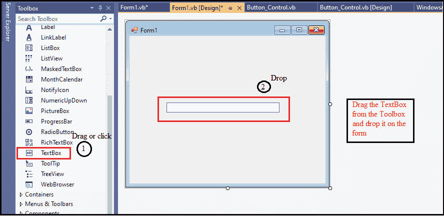
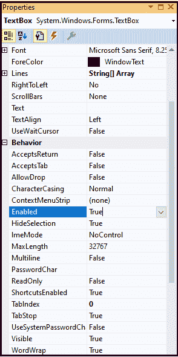
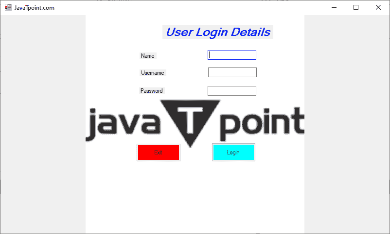
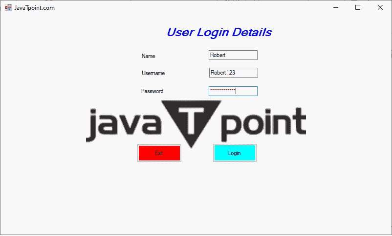
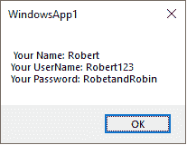

# VB.NET 文本框控件

> 原文：<https://www.javatpoint.com/vb-net-textbox-control>

文本框控件用于显示、接受用户输入的文本，或者在运行时显示 VB.NET 窗体上的单行文本。此外，我们可以在文本框控件中添加多个文本和滚动条。但是，我们可以在表单上显示的文本框上设置文本。

让我们通过以下步骤在[VB.NET](https://www.javatpoint.com/vb-net)T2 窗口中创建一个文本框控件:

**第一步:**我们必须将 TextBox 控件从工具箱中拖放到 Windows 窗体上，如下所示。



**第二步:**一旦将 TextBox 添加到表单中，我们就可以通过点击 TextBox 控件来设置 TextBox 的各种属性。

### VB.NET 文本框属性

文本框控件有以下属性。



| 性能 | 描述 |
| 自动完成 | 它用于获取或设置一个值，该值指示文本框控件的自动完成方式。 |
| 字体 | 它用于设置窗口窗体上显示的文本的字体样式。 |
| **线** | 它用于设置文本框控件中的行数。 |
| **字符框** | 它用于获取或设置一个值，该值表示文本框控件是否可以在键入时修改字符的大小写。 |
| **多行** | 它用于在文本框控件中输入多行，方法是将 Multiline 属性值从 False 更改为 True。 |
| **接受回复** | 它用于获取或设置一个值，该值指示在多行文本框中是否按 enter 按钮；它在控件中创建新的文本行。 |
| **密码字元** | 它用于设置密码字符，可以作为文本框控件单行中的掩码。 |
| **首选高度** | 它用于设置窗口窗体中文本框控件的首选高度。 |
| **卷轴栏** | 它用于通过设置文本框控件的值来显示多行文本框上的滚动条。 |
| **文字** | 它用于获取或设置与 textbox 控件关联的文本。 |
| **可见** | 可见属性设置一个值，该值指示文本框是否应显示在窗口窗体上。 |
| **文字环绕** | WordWrap 属性验证多行文本框控件是否在必要时自动将单词换行到下一行的开头。 |

### VB.NET 文本框事件

| 事件 | 描述 |
| **点击** | 单击文本框时，会在文本框控件中调用单击事件。 |
| **原因验证已更改** | 当原因验证属性的值更改时，它会出现在文本框控件中。 |
| **接受制表符改为** | 当 AcceptTab 的属性值更改时，在 TextBox 控件中可以找到它。 |
| **背景颜色变化** | 当背景颜色的属性值改变时，在文本框控件中可以找到它。 |
| **边框样式已更改** | 当边框样式的值改变时，它会出现在文本框控件中。 |
| **控制增加了** | 当新控件添加到 Control.ControlCollection 中时，会找到它。 |
| **光标改变** | 当文本框控件从 Control.ControlCollection 中移除时，它会出现在文本框中。 |
| **FontChanged** | 当字体的属性改变时，就会发生这种情况。 |
| 获取焦点 | 在文本框控件中可以找到焦点。 |
| **慕容克** | 当鼠标单击控件时，会发生 MouseClick 事件。 |
| **多通道** | 当多行的值改变时，在文本框控件中可以找到它。 |

此外，我们还可以参考 VB.NET 微软文档来获得文本框属性和事件的完整列表。

让我们创建一个显示登录详细信息的程序。

**推荐点 1.等**

```vb

Public Class JavatPoint1
    Private Sub JavatPoint1_Load(sender As Object, e As EventArgs) Handles MyBase.Load
        Me.Text = "JavaTpoint.com" ' title name
        Label1.Text = "User Login Details" ' Set the title name for Label1 
        Label2.Text = "Name"              ' Set the name for label2 
        Label3.Text = "Username"  ' Set the username for label2 
        Label4.Text = "Password"     ' Set the label name Passowrd
        Text3.PasswordChar = "*"
        Button1.Text = "Login"  ' Set the name of Button1 as Login
        Button2.Text = "Exit"       ' Set the name of Button2 As Exit
    End Sub

    Private Sub Button2_Click(sender As Object, e As EventArgs) Handles Button2.Click
        End ' terminate the program when the user clinks button 2
    End Sub

    Private Sub Button1_Click(sender As Object, e As EventArgs) Handles Button1.Click
        Dim name As String
        Dim Uname As String
        Dim pass As String
        name = text1.Text
        Uname = Text2.Text
        pass = Text3.Text
        ' Display the user details, when the Button1 is clicked
        MsgBox(" Your Name: " & name + vbCrLf + "Your UserName: " & Uname + vbCrLf + "Your Password: " & pass)
    End Sub
End Class

```

**输出:**



现在输入用户登录表单的所有细节，它显示如下图，如下所示。



现在，点击**登录**按钮。它显示了用户在表单中填写的所有详细信息。



表单中用于终止程序的退出按钮。

* * *