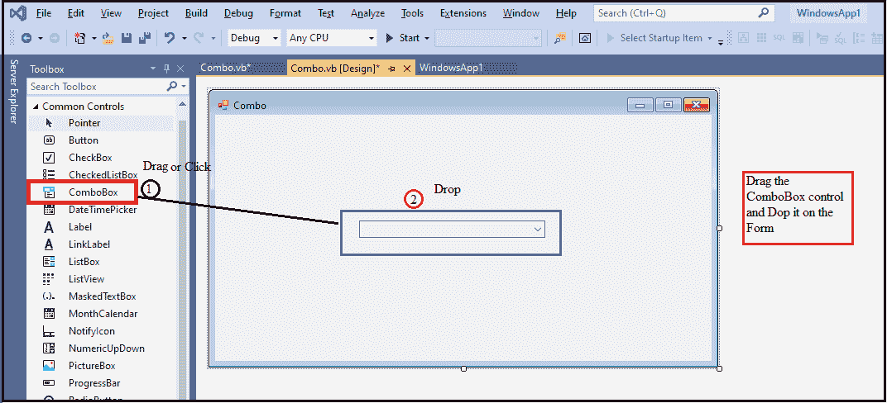
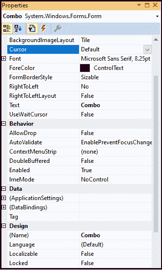
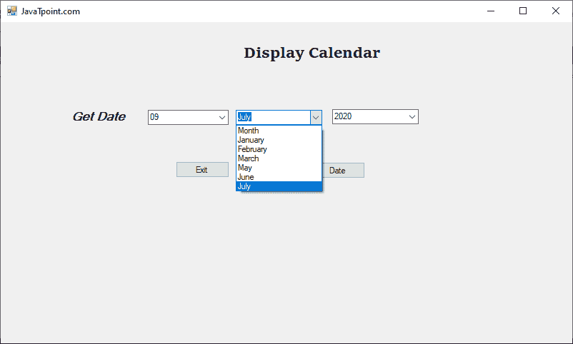
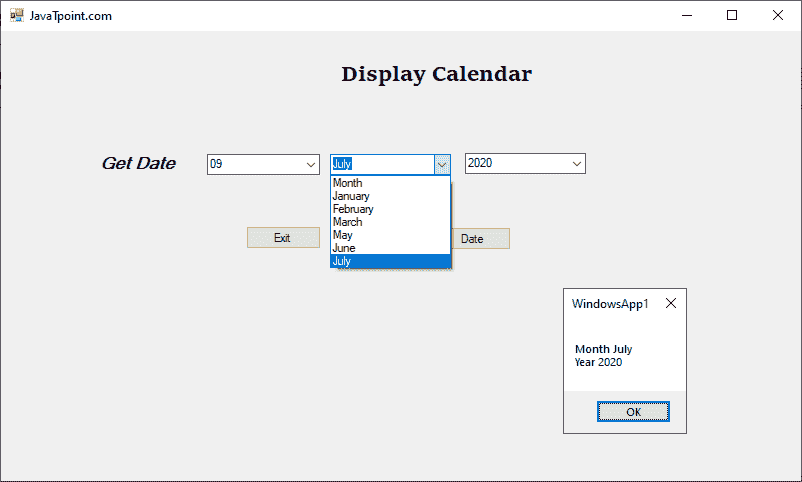

# VB.NET 组合框控件

> 原文:[https://www.javatpoint.com/vb-net-combobox-control](https://www.javatpoint.com/vb-net-combobox-control)

**组合框**控件用于在下拉列表中显示多个项目。它是**列表框**和**文本框**的组合，用户只能输入一个项目。此外，它还允许用户从下拉列表中选择一个项目。

让我们通过以下步骤在 VB.NET 窗口中创建一个组合框控件。

**第一步:**我们需要将组合框控件从工具箱中拖放到[窗口](https://www.javatpoint.com/windows)表单中，如下图所示。



**第二步:**一旦组合框添加到表单中，我们可以通过点击组合框控件来设置组合框的各种属性。

### 组合框属性

组合框控件有以下属性。



| 财产 | 描述 |
| **允许选择** | AllowSelection 属性采用指示列表是否允许选择列表项的值。 |
| 自动完成 | 它接受一个代表组合框自动完成方式的值。 |
| **已创建** | 它接受一个值，该值决定是否创建控件。 |
| **数据绑定** | 它用于将数据与组合框控件绑定。 |
| **背景色** | BackColor 属性用于设置组合框控件的背景色。 |
| **数据源** | 它用于获取或设置组合框控件的数据源。 |
| **平板式** | 它用于设置组合框控件的样式或外观。 |
| **MaxDropDownItems** | MaxDropDownItems 属性用于组合框控件中，通过设置值来显示最大项数。 |
| **最大长度** | 用户使用它在组合框的可编辑区域输入最大字符数。 |
| **选择集** | 它用于设置或获取组合框控件中的选定项目。 |
| **已排序** | “排序”属性用于通过设置值对组合框中的所有项目进行排序。 |

### 组合框事件

| 事件 | 描述 |
| **FontChanged** | 当字体值的属性更改时，就会发生这种情况。 |
| **格式** | 当数据与组合框控件绑定时，将调用格式事件。 |
| **选择变更** | 当 SelectIndexChanged 的属性值更改时，就会发生这种情况。 |
| **帮助请求** | 当用户请求控件中的帮助时，将调用 HelpRequested 事件。 |
| **离开** | 当用户将焦点留在组合框控件上时，就会发生这种情况。 |
| **余量更改** | 当组合框控件中的边距属性发生变化时，就会出现这种情况。 |

让我们创建一个程序，在[VB.NET](https://www.javatpoint.com/vb-net)窗口中显示日历。

**组合框 _ 控件. vb**

```

Public Class ComboBox_Control
    Dim DT As Integer
    Dim MM As String
    Dim YY As Integer
    Private Sub ComboBox_Control_Load(sender As Object, e As EventArgs) Handles MyBase.Load
        Me.Text = "JavaTpoint.com"
        Label1.Text = "Display Calendar"
        Label2.Text = "Get Date"
        Button1.Text = "Date"
        Button2.Text = "Exit"
        ComboBox1.Items.Add("Date")
        ComboBox1.Items.Add("01")
        ComboBox1.Items.Add("02")
        ComboBox1.Items.Add("03")
        ComboBox1.Items.Add("04")
        ComboBox1.Items.Add("05")
        ComboBox1.Items.Add("06")
        ComboBox1.Items.Add("07")
        ComboBox1.Items.Add("08")
        ComboBox1.Items.Add("09")
        ComboBox2.Items.Add("Month")
        ComboBox2.Items.Add("January")
        ComboBox2.Items.Add("February")
        ComboBox2.Items.Add("March")
        ComboBox2.Items.Add("May")
        ComboBox2.Items.Add("June")
        ComboBox2.Items.Add("July")
        ComboBox3.Items.Add("Year")
        ComboBox3.Items.Add("2016")
        ComboBox3.Items.Add("2017")
        ComboBox3.Items.Add("2018")
        ComboBox3.Items.Add("2019")
        ComboBox3.Items.Add("2020")
    End Sub

    Private Sub Button1_Click(sender As Object, e As EventArgs) Handles Button1.Click
        DT = ComboBox1.Text
        MM = ComboBox2.Text
        YY = ComboBox3.Text
        MsgBox("Month " & MM + vbCrLf + "Year " & YY)
    End Sub

    Private Sub Button2_Click(sender As Object, e As EventArgs) Handles Button2.Click
        End
    End Sub
End Class

```

**输出:**



现在从下拉框中选择日、月和年，然后单击日期按钮在表单中显示日期。



* * *