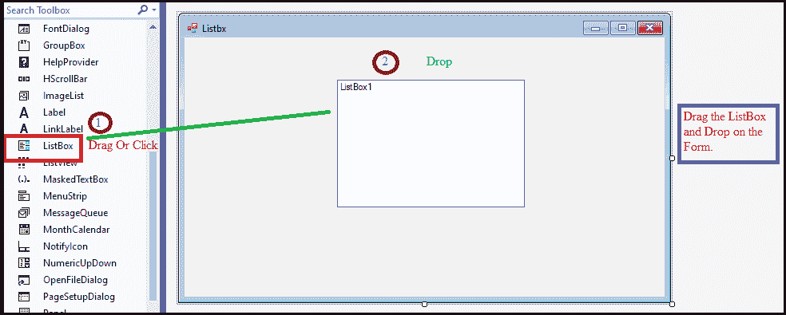
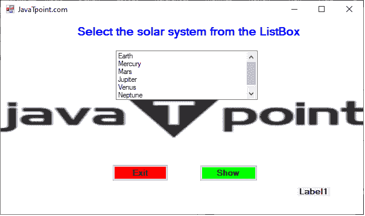
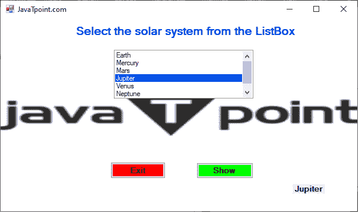
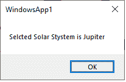

# VB.NET 列表框控件

> 原文：<https://www.javatpoint.com/vb-net-listbox-control>

列表框控件用于以窗口形式显示项目列表。它允许用户从列表框控件中选择一个或多个项目。此外，我们可以在运行时使用属性和事件窗口来添加或设计列表框。

让我们通过以下步骤在[VB.NET](https://www.javatpoint.com/vb-net)窗口中创建一个列表框控件。

**第一步:**从工具箱中拖动 ListBox 控件，将其放到[窗口](https://www.javatpoint.com/windows)表单中，如下图所示。



**步骤 2:** 一旦将 Listbox 添加到表单中，我们就可以通过单击 ListBox 控件来设置 ListBox 的各种属性。

### 列表框属性

列表框控件有以下属性。

| 属性名称 | 描述 |
| **允许选择** | 它接受一个定义列表框是否允许用户从列表中选择项目的值。 |
| **疲劳当选** | 它获取一个值，该值确定是否可以选择 Listbox 控件。 |
| **列宽** | 它用于获取或设置多列列表框中列的宽度。 |
| **容器** | 正如名称所定义的，容器获取存储列表框控件组件的图标容器。 |
| **控制** | 它用于获取控件中包含的控件集合。 |
| **已创建** | 它接受一个值，该值决定是否创建控件。 |
| **宽度** | 它用于设置列表框控件的宽度。 |
| **可见** | 它接受一个值，该值确定列表框控件及其所有子控件是否显示在窗口窗体上。 |
| **选择模式** | 它用于获取或设置确定在列表框中选择哪些项目的方法。 |
| **多列** | 它允许通过在列表框中设置真值来显示项目的多列。 |

### 列表框方法

| 方法名 | 描述 |
| **添加()** | Add()方法用于将项添加到项集合中。 |
| **移除** | 它用于从项目集合中移除项目。但是，我们可以使用项目名称移除项目。 |
| **清除** | 它用于同时从项目集合中移除所有项目。 |
| **包含** | 它用于检查列表框中是否存在特定的项目。 |
| **Show()** | 它用于向用户显示控件。 |
| **排序()** | 顾名思义，Sort()方法用于对列表框中的元素进行排列或排序。 |
| **重置文本()** | 方法用于重置列表框的文本属性并设置默认值。 |
| **ResetBackColor()** | 它用于重置列表框的背景颜色属性并设置默认值。 |
| **奥诺蒂芙讯息** | 它用于通知窗口列表框的消息。 |
| **获取选定的** | GetSelected 方法用于验证是否选择了指定的项目。 |

此外，我们还可以参考 VB.NET 微软文档来获得 ListBox 属性和方法的完整列表。

让我们创建一个程序，从 VB.NET 表单的列表框中选择一个项目。

**Listbx.vb**

```vb

Public Class Listbx
    Private Sub Listbx_Load(sender As Object, e As EventArgs) Handles MyBase.Load
        ' set the title of the Form.
        Me.Text = "JavaTpoint.com"
        ' Add the items into the ListBox
        ListBox1.Items.Add("Earth")
        ListBox1.Items.Add("Mercury")
        ListBox1.Items.Add("Mars")
        ListBox1.Items.Add("Jupiter")
        ListBox1.Items.Add("Venus")
        ListBox1.Items.Add("Neptune")
        ListBox1.Items.Add("Uranus")
        ' Set the name of the Button1 and Button2
        Button1.Text = "Show"
        Button2.Text = "Exit"
        Label2.Text = "Select the solar system from the ListBox"
    End Sub
    Private Sub Button1_Click(sender As Object, e As EventArgs) Handles Button1.Click
        Dim lt As String  ' define a local variable.
        lt = ListBox1.Text  'accept the data from the ListBox1
        MsgBox(" Selected Solar System is " & lt)  ' Display the selected item 
    End Sub
    Private Sub ListBox1_SelectedIndexChanged(sender As Object, e As EventArgs) Handles ListBox1.SelectedIndexChanged
        Label1.Text = ListBox1.SelectedItem.ToString()  'When a user clicks on an item, it displays the item name.
    End Sub

    Private Sub Button2_Click(sender As Object, e As EventArgs) Handles Button2.Click
        End 'End or exit an application
    End Sub
End Class

```

**输出:**



现在从列表中选择一个项目。我们选择了木星。



点击**显示**按钮，在 Windows 窗体中显示选中的项目，如下所示。



* * *