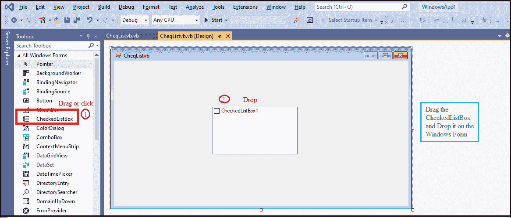
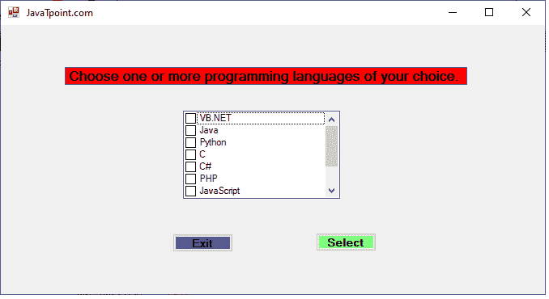
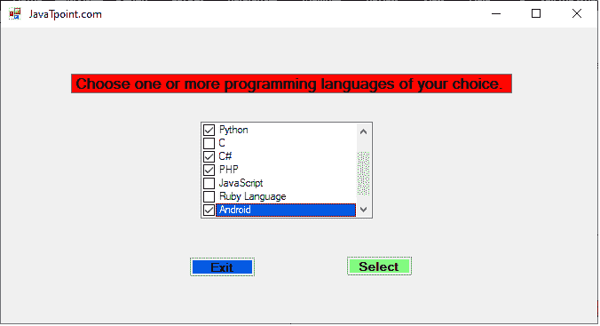
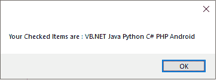

# vb . net checkedlistbox 控件

> 噻:[https://www . javatppoint . com/VB-net-check dlistbox-control](https://www.javatpoint.com/vb-net-checkedlistbox-control)

**勾选列表框**与**列表框**相似，不同之处在于它显示列表中的所有项目，并带有一个复选框，允许用户选中或取消选中单个或多个项目。

让我们使用以下步骤在[VB.NET](https://www.javatpoint.com/vb-net)窗口表单中创建一个复选框控件。

**第一步:**从工具箱中拖动**复选框**控件，将其放到[窗口](https://www.javatpoint.com/windows)表单中，如下图所示。



**步骤 2:** 一旦 CheckedListBox 被添加到表单中，我们可以通过点击 CheckedListbox 控件来设置 CheckedListBox 的各种属性。

### “特性”复选框

CheckedListBox 控件有以下属性。

| 性能 | 描述 |
| **辅助功能对象** | 它获取一个值，该值确定 AccessibilityObject 是否被分配给 CheckedListBox 控件。 |
| 无障碍 Name | 它获取或设置一个值，该值指示可访问的客户端应用程序是否使用了 checkedlistbox 控件的名称。 |
| **允许选择** | 它获取一个值，该值指示列表框是否允许从列表中选择该项。 |
| **允许串联偏置** | 它获取或设置一个值，该值表示复选框控件是否在滚动控件视图中滚动。 |
| 边框样式 | 它用于通过获取或设置一个值来设置复选框周围的边框类型。 |
| **支票跳票** | 它用于在 CheckedListBox 中存储选中项目的集合。 |
| **scroll alwaysvib** | 它用于设置或获取一个值，该值指示垂直滚动条是否始终出现在 Windows 窗体中。 |
| **selecteditem** | 它用于从 CheckedListBox 获取所有选定的项目。 |
| **选择模式** | 它用于获取或设置一个值，该值代表 CheckedListBox 中的项目选择模式。 |
| **TopIndex** | 它用于设置 CheckedListBox 中索引顶部的第一个可见项。 |

### checkedlistbox 方法

| 方法 | 描述 |
| **清除选定()** | 它用于取消选中复选框中的所有选定项目。 |
| **create accessibility instance()** | 它用于在复选框控件中创建新的对象可访问性。 |
| **CreateItemCollection()** | 它用于为列表框中收集的项目创建一个新实例。 |
| **销毁手柄()** | 它用于销毁与 CheckedListBox 关联的句柄。 |
| **等于(对象)** | 它用于验证指定的对象是否等于 CheckedListBox 中的当前对象。 |
| **查找格式()** | 它用于获取 CheckedListBox 具有控件的窗体。 |
| **获取项目文本（对象）** | 它用于获取 CheckedListBox 中指定项目的文本。 |
| gettype() | 它用于获取 CheckedListBox 中的当前项目类型。 |
| **Show()** | Show()方法用于向用户显示复选框控件。 |
| **排序()** | Sort()方法用于对 CheckedListBox 中所有可用的项目进行排序或组织。 |

此外，我们还可以参考 VB.NET 微软文档来获得一个完整的**检查列表框**属性和方法的列表。

让我们创建一个程序，从 VB 的 CheckedListBox 中选择或检查多个项目.NET 形式。

**CheqListvb.vb**

```

Public Class CheqListvb
    Private Sub CheqListvb_Load(sender As Object, e As EventArgs) Handles MyBase.Load
        Me.Text = " JavaTpoint.com"
        CheckedListBox1.Items.Add("VB.NET")
        CheckedListBox1.Items.Add("Java")
        CheckedListBox1.Items.Add("Python")
        CheckedListBox1.Items.Add("C")
        CheckedListBox1.Items.Add("C#")
        CheckedListBox1.Items.Add("PHP")
        CheckedListBox1.Items.Add("JavaScript")
        CheckedListBox1.Items.Add("Ruby Language")
        CheckedListBox1.Items.Add("Android")
        CheckedListBox1.Items.Add("Perl")
        Label1.Text = "Choose one or more programming languages of your choice. "
        Button1.Text = "Select"
        Button2.Text = "Exit"
    End Sub

    ' To submit the checked items, click on Button1 or Select
    Private Sub Button1_Click(sender As Object, e As EventArgs) Handles Button1.Click
        Dim cheq As New System.Text.StringBuilder
        For Each item In CheckedListBox1.CheckedItems
            cheq.Append(item)
            cheq.Append(" ")
        Next
        MessageBox.Show(" Your Checked Items are : " & cheq.ToString())

    End Sub

    Private Sub Button2_Click(sender As Object, e As EventArgs) Handles Button2.Click
        End 'terminate the program
    End Sub

```

**输出:**



在上面的列表中，我们可以从窗口表单的复选框中选择多个项目。



之后，点击**选择**按钮，在 Windows 窗体中显示所选项目。



* * *