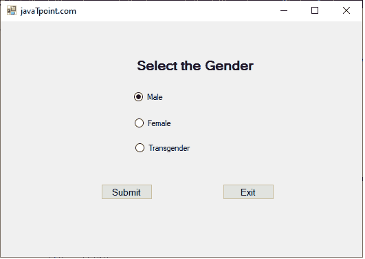

# 单选按钮控件

> 原文：<https://www.javatpoint.com/vb-net-radiobutton-control>

**单选按钮**用于从多个选项中选择一个选项。如果我们想从 windows 窗体中的相关项或项组中只选择一项，我们可以使用单选按钮。**单选按钮**是互斥的，表示只有一个项目处于活动状态，并且在表单中保持未选中状态。

让我们通过以下步骤在 VB.NET 窗口中创建一个**单选按钮**控件。

**第一步:**从工具箱中拖动**单选按钮**控件，将其放到[窗口](https://www.javatpoint.com/windows)表单中，如下图所示。


**第二步:**一旦 RadioButton 被添加到表单中，我们就可以通过点击 Radio 控件来设置 RadioButton 的各种属性。

### 单选按钮属性

[VB.NET](https://www.javatpoint.com/vb-net)单选按钮控件有以下属性。

| 财产 | 描述 |
| **AllowDrop** | 它用于设置或获取一个值，该值表示单选按钮是否允许用户在窗体上拖动。 |
| **外观** | 它用于获取或设置表示单选按钮外观的值。 |
| **自动滚动关闭设置** | 它用于获取或设置滚动控件视图(控件)中的单选控件。 |
| **汽车尾翼** | AutoCheck 属性用于检查当用户单击单选按钮控件时，控件的选中值或外观是否可以自动更改。 |
| **自动化** | AutoSize 属性用于检查是否可以通过在单选按钮控件中设置一个值来自动调整单选按钮控件的大小。 |
| **疲劳当选** | CanSelect 属性用于验证是否可以通过在单选按钮控件中设置值来选择单选控件。 |
| **检查校准** | 它用于获取或设置一个值，该值指示单选按钮控件中检查部分的位置。 |
| **文字** | 文本属性用于设置单选按钮控件的名称。 |

### 单选按钮方法

| 方法名 | 描述 |
| **包含(控制)** | Contains()方法用于检查定义的控件在单选按钮控件中是否可用。 |
| **DefWndProc(消息)** | 它用于向窗口过程发送指定的消息。 |
| **DestroHandle()** | 它用于销毁与单选按钮控件关联的句柄。 |
| **焦点()** | Focus()方法用于将输入焦点设置到窗口窗体的 RadioButton 控件。 |
| **get auto sized()** | 它用于返回一个值，该值表示在窗口窗体的单选按钮控件中启用自动调整属性时控件的操作方式。 |
| **重置文本()** | 顾名思义，ResetText()方法用于将文本的属性重置为默认值或空值。 |
| **更新()** | 它用于重新路由无效字段，这会导致客户端区域中的控制。 |

我们也可以参考微软的文档来获得一个完整的单选按钮控件属性和方法的列表

让我们创建一个程序来理解 VB.NET 表单中单选按钮控件的用法。

**电台 Btn.vb**

```vb

Public Class RadioBtn
    Private Sub RadioBtn_Load(sender As Object, e As EventArgs) Handles MyBase.Load
        Me.Text = "javaTpoint.com" ' Set the title of the form
        Label1.Text = "Select the Gender"
        RadioButton1.Text = "Male"  ' Set the radiobutton1 and radiobutton2
        RadioButton2.Text = "Female"
        RadioButton3.Text = "Transgender"
        Button1.Text = "Submit"   ' Set the button name
        Button2.Text = "Exit"
    End Sub

    Private Sub Button1_Click(sender As Object, e As EventArgs) Handles Button1.Click
        Dim gen As String
        If RadioButton1.Checked = True Then
            gen = "Male"
            MsgBox(" Your gender is : " & gen)

        ElseIf RadioButton2.Checked = True Then
            gen = "Female"
            MsgBox(" Your gender is : " & gen)
        Else
            gen = "Transgender"
            MsgBox(" You have Selected the gender : " & gen)
        End If

    End Sub

    Private Sub Button2_Click(sender As Object, e As EventArgs) Handles Button2.Click
        End 'Terminate the program
    End Sub
End Class

```

**输出:**



点击**提交**按钮。它在屏幕上显示以下信息。


* * *