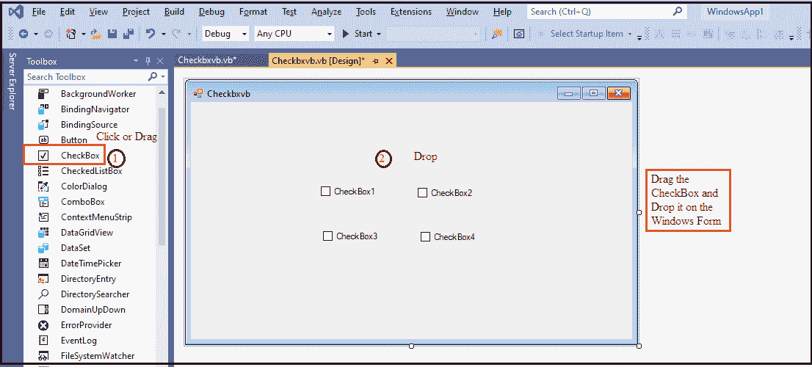

# VB.NET 复选框控制

> 原文：<https://www.javatpoint.com/vb-net-checkbox-control>

CheckBox 控件是一个允许用户从可用选项中选择或取消选择选项的控件。选中复选框后，窗口窗体上将出现一个勾号或复选标记。

让我们按照以下步骤在[VB.NET](https://www.javatpoint.com/vb-net)窗口中创建一个 CheckBox 控件。

**第一步:**我们需要将 CheckBox 控件从工具箱中拖放到[窗口](https://www.javatpoint.com/windows)表单中，如下所示。



**步骤 2:** 一旦 checkbox 被添加到表单中，我们可以通过点击 CheckBox 控件来设置 CheckBox 的各种属性。

### 复选框属性

VB.NET 复选框控件有一些属性。

| 财产 | 描述 |
| **默认** | 它用于获取复选框的默认大小。 |
| **汽车尾翼** | AutoCheck 属性用于检查当用户单击 CheckBox 控件时，控件的选中值或外观是否可以自动更改。 |
| **检查校准** | 它用于设置复选标记的对齐方式，例如复选框上的水平或垂直。 |
| **外观** | “外观”属性用于通过设置值来显示复选框控件的外观。 |
| **检查状态** | CheckState 属性用于验证是否在窗口表单中选中了复选框状态。 |
| **三态** | 三态属性用于检查控件是否允许通过设置值来设置三个而不是两个检查位置。 |
| **平板式** | 它用于获取或设置复选框的平面外观。 |

### 复选框方法

VB.NET 复选框控件有一些方法。

| 方法 | 描述 |
| onclick | OnClick 方法用于获取 CheckBox 控件中的 Click 事件。 |
| **OnCheckStateChanged** | 它用于调用 CheckBox 控件中的 CheckStateChanged 事件。 |
| **ToString** | ToString 方法用于返回 CheckBox 控件的当前字符串。 |
| **onchecked ed changed** | 当 CheckBox 控件中的 Checked 属性发生更改时，将发生 OnCheckedChanged 事件。 |
| **是 MouseUp** 的缩写 | 当它在 CheckBox 控件中接收到 OnMouseUp 事件时使用它。 |

### 复选框事件

VB.NET 复选框控件有一些事件。

| 事件 | 描述 |
| **检查已更改的** | 当选中属性的值更改为 CheckBox 时，会发现 CheckedChanged 事件。 |
| **双击** | 当用户双击 CheckBox 控件时会出现这种情况。 |
| **检查状态已更改** | 当 CheckState 属性的值更改为 CheckBox 控件时，就会发生这种情况。 |
| **外观已更改** | 当外观的属性更改为 CheckBox 控件时，就会发生这种情况。 |

让我们创建一个程序来理解 CheckBox 控件在 VB.NET 表单中的用法。

**Checkbx.vb**

```

Public Class Checkbxvb
    Private Sub Checkbxvb_Load(sender As Object, e As EventArgs) Handles MyBase.Load
        Me.Text = "javaTpoint.com" ' Set the title name of the form
        Label1.Text = "Select the fruits name"
        CheckBox1.Text = "Apple"
        CheckBox2.Text = "Mango"
        CheckBox3.Text = "Banana"
        CheckBox4.Text = "Orange"
        CheckBox5.Text = "Potato"
        CheckBox6.Text = "Tomato"
        Button1.Text = "Submit"
        Button2.Text = "Close"
    End Sub
    Private Sub Button1_Click(sender As Object, e As EventArgs) Handles Button1.Click
        Dim fruit As String
        fruit = " "
        If CheckBox1.Checked = True Then
            fruit = "Apple"
        End If
        If CheckBox2.Checked = True Then
            'fruit = CheckBox2.Text
            fruit = fruit & " Mango"
        End If
        If CheckBox3.Checked = True Then
            fruit = fruit & " Banana"
        End If
        If CheckBox4.Checked = True Then
            fruit = fruit & " Orange"
        End If
        If CheckBox5.Checked = True Then
            fruit = fruit & " Potato"
        End If
        If CheckBox6.Checked = True Then
            fruit = fruit & " Tomato"
        End If
        If fruit.Length <> 0 Then
            MsgBox(" Selected items " & fruit)
        End If
        CheckBox1.ThreeState = True
    End Sub
    Private Sub Button2_Click(sender As Object, e As EventArgs) Handles Button2.Click
        End 'terminate the program
    End Sub
End Class

```

**输出:**


现在通过点击项目选择水果名称。


现在点击**提交**按钮，它在你的屏幕上显示以下输出。


* * *