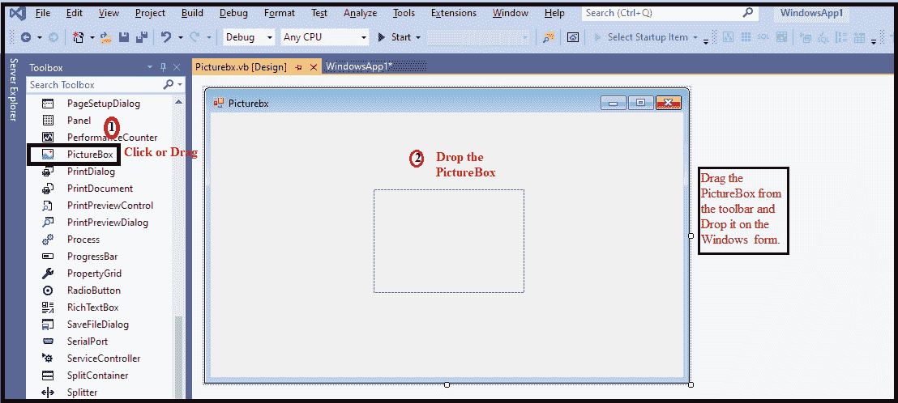
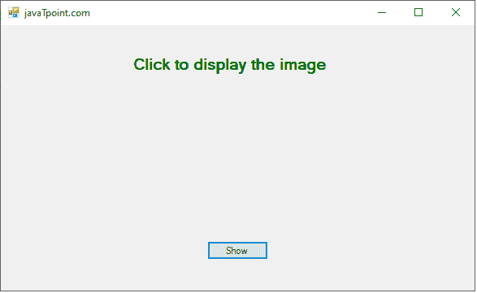
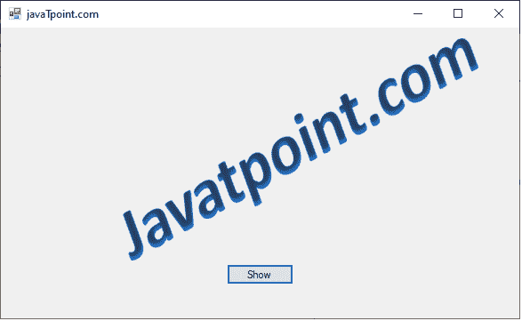

# VB.NET 图片框控件

> 原文：<https://www.javatpoint.com/vb-net-picturebox-control>

**图片框**控件用于在 Windows 窗体上显示图像。PictureBox 控件有一个图像属性，允许用户在运行时或设计时设置图像。

让我们使用以下步骤在[VB.NET](https://www.javatpoint.com/vb-net)[窗口](https://www.javatpoint.com/windows)表单中创建一个图片框控件。

**第一步:**我们必须从工具箱中找到 PictureBox 控件，然后将 PictureBox 控件拖放到窗口窗体上，如下所示。



**第二步:**一旦将 PictureBox 添加到表单中，我们就可以通过点击 PictureBox 控件来设置图像的各种属性。

### 图片框的属性

VB.NET 图片框控件有以下属性。

| 财产 | 描述 |
| **背景色** | 它用于设置窗口窗体中图片框的背景颜色。 |
| **背景影像** | 用于通过设置或获取图片框中的值来设置窗口窗体的背景图像。 |
| **误差图像** | ErrorImage 属性用于在窗口窗体上加载图像时出现错误时显示图像。 |
| 初始化 | 通过在 PictureBox 控件中设置一个值，当主图像加载到窗口窗体上时，初始图像用于在 PictureBox 上显示图像。 |
| **等待加载** | 它表示 PictureBox 控件中的特定图像是否同步。 |
| **文字** | 它用于为窗口窗体中的图片框控件设置文本。 |
| **图像** | image 属性用于在 Windows 窗体的 PictureBox 上显示图像。 |
| 边框样式 | 它用于设置 windows 窗体中图片框的边框样式。 |
| **图像位置** | 用于设置或获取窗口窗体图片框上显示的图像的路径或网址。 |
| **是一个镜像** | 它获取一个值，该值确定图片框控件是否被镜像。 |

### 图片框控件的方法

| 方法 | 描述 |
| **取消 snc()** | CancelAsync 方法用于取消 PictureBox 控件中的异步图像加载。 |
| **CreateHandle()** | 它用于为窗口窗体中的图片框控件创建句柄。 |
| **销毁手柄()** | 它用于销毁与图片框控件关联的所有句柄。 |
| get style() | GetStyle()方法用于获取 PictureBox 控件中指定位样式的值。 |
| **负载()** | Load()方法用于使用 ImageLocation 属性从控件加载指定的图像。 |
| **加载异步(字符串)** | 它用于异步加载图片框控件指定位置的图像。 |

### 图片框控件的事件

VB.NET 图片框控件有一些事件。

| 事件 | 描述 |
| **背景颜色变化** | 当 PictureBox 控件中背景色的属性更改时，就会发生这种情况。 |
| **background imagelayout changed** | 当在 PictureBox 控件中更改 BackgroundImage 的属性值时，就会发生这种情况。 |
| **ContextMenuChanged** | 当在 PictureBox 控件中更改上下文菜单的属性时，就会发生这种情况。 |
| **调整尺寸** | 更改图片框控件时，会发生调整大小事件。 |

此外，我们还可以参考 VB.NET 微软文档来获得 VB.NET 的完整列表 **PictureBox** 控件属性、方法和事件。

让我们创建一个以 VB.NET 形式显示图像的程序。

**Picturebx.vb**

```

Public Class Picturebx
    Private Sub Button1_Click(sender As Object, e As EventArgs) Handles Button1.Click
        'Dim Str As String = "C:\Users\AMIT YADAV\Desktop\"
        PictureBox1.Image = Image.FromFile("C:\Users\AMIT YADAV\Desktop\jtp2.png")
        PictureBox1.SizeMode = PictureBoxSizeMode.StretchImage
        PictureBox1.Height = 250
        PictureBox1.Width = 400
        Label1.Visible = False
    End Sub
    Private Sub Picturebx_Load(sender As Object, e As EventArgs) Handles MyBase.Load
        Me.Text = "javaTpoint.com" 'Set the title name for the form
        Button1.Text = "Show"
        Label1.Text = "Click to display the image"
        Label1.ForeColor = ForeColor.Green
    End Sub
End Class

```

**输出:**



现在点击**显示**按钮，以窗口形式显示图像。



* * *