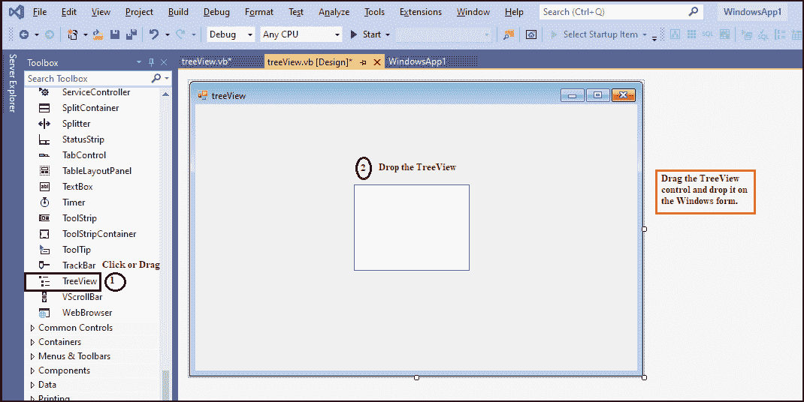
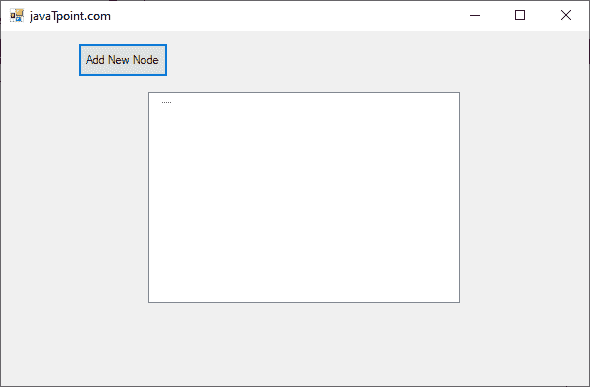
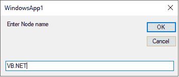
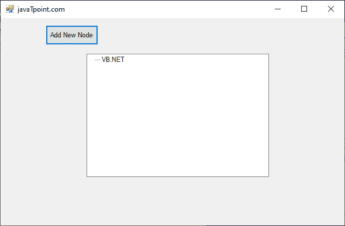
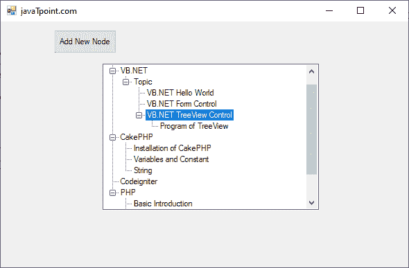

# VB.NET 树景控制

> 原文：<https://www.javatpoint.com/vb-net-treeview-control>

TreeView 控件用于在树结构中显示相同数据的分层表示。树视图中的顶层是具有一个或多个子节点的根节点。此外，可以通过单击加号(+)按钮来收缩或展开根节点。提供根节点到子节点的完整路径也很有用。

让我们使用以下步骤在[VB.NET](https://www.javatpoint.com/vb-net)[窗口](https://www.javatpoint.com/windows)表单中创建一个树形视图控件。

**步骤:**我们必须从工具箱中找到 TreeView 控件，然后将 TreeView 控件拖放到窗口窗体上，如下图所示。



**第二步:**一旦将 TreeView 添加到表单中，我们就可以通过点击 TreeView 控件来设置 TreeView 的各种属性。

### 树视图控件的属性

TreeView 控件有以下属性。

| 性能 | 描述 |
| **节点** | 树视图控件的 nodes 属性用于收集树中使用的所有节点。 |
| **精选节点** | 它用于获取或设置在树视图控件中选择的树节点。 |
| **显示根线** | 它获取或设置一个值，该值表示是否要在与树视图的根连接的树节点之间画线。 |
| **路径分隔符** | 树视图控件的路径分隔符属性用于设置树节点路径之间的分隔符字符串。 |
| **显示加减** | 它用于获取或设置一个值，该值表示是否要在包含子节点的树节点旁边显示加号(+)或减号按钮。 |
| 表演线 | 它接受一个值，该值表示是否要在树视图控件的树节点之间画线。 |
| 顶层节点 | 它用于在树视图控件中的其他节点上获取或设置完全可见的树节点。 |
| **可见计数** | 它用于获取树视图控件中完全可见的树节点。 |
| **项目高度** | ItemHeight 属性用于设置控件中每个树节点的高度。 |
| **可滚动** | 通过在控件中设置值，可滚动属性在树视图中用于显示滚动条。 |

### 树形视图控件的方法

| 方法 | 描述 |
| get nodeat | GetNodeAt()方法用于获取树视图控件指定位置的节点。 |
| **排序()** | 排序方法用于对树视图控件中可用的树节点进行排序。 |
| **expandal()** | 顾名思义，ExpandAll 方法用于扩展所有树节点。 |
| get nodecount | 它用于计算树视图控件中可用的节点数。 |
| **折叠** | 它用于折叠所有树节点，包括树视图控件中的所有子节点。 |
| **ToString** | 方法用于返回树视图控件中字符串的名称。 |

此外，我们还可以参考 VB.NET 微软文档来获得完整的 **TreeView** 控件属性和方法列表。

让我们创建一个程序，在 VB.NET 表单的树视图控件中插入一个节点。

**treeView.vb**

```

Public Class treeView
    Private Sub treeView_Load(sender As Object, e As EventArgs) Handles MyBase.Load
        Me.Text = "javaTpoint.com" 'Set the title name for the Windows form.
        Button1.Text = "Add New Node" 'Set the name of button
    End Sub
    Private Sub Button1_Click(sender As Object, e As EventArgs) Handles Button1.Click
        Dim nd As String
        nd = InputBox("Enter Node name")  ' takes input from the user
        If TreeView1.SelectedNode Is Nothing Then  ' insert a new node.
            TreeView1.Nodes.Add(nd, nd)
        Else
            TreeView1.SelectedNode.Nodes.Add(nd, nd)   ' insert into the sub node or child node
        End If
    End Sub
End Class

```

**输出:**



点击**添加新节点**按钮，在树形视图控件中插入新节点。它在监视器上显示以下图像。



点击**确定**按钮，插入**VB.NET'** 节点中的树视图控件。



同样，我们可以在 TreeView 控件中创建全新的节点，如下所示。



* * *