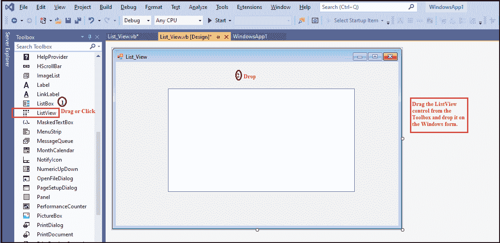
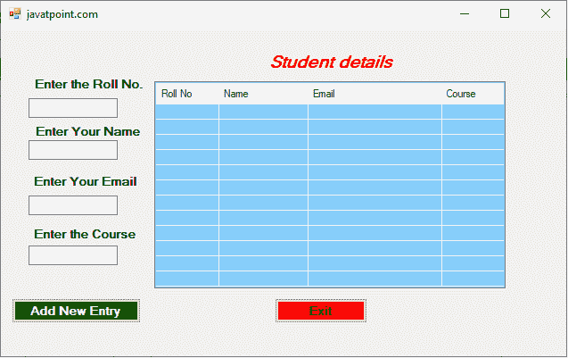
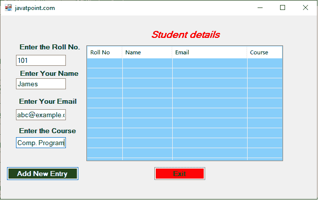
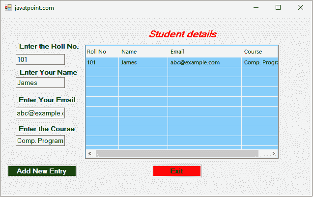
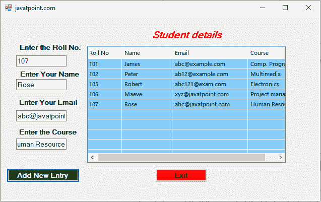

# VB.NET 列表视图控件

> 原文：<https://www.javatpoint.com/vb-net-listview-control>

列表视图控件用于显示窗口窗体中的项目集合。它使用其中一个视图列表，如大图标、小图标、详细信息、列表和平铺。此外，列表视图允许用户在列表视图控件中添加或删除图标。

让我们通过以下步骤在[窗口](https://www.javatpoint.com/windows)表单中创建一个 ListView 控件。

**第一步:**我们必须从工具箱中找到 ListView 控件，然后将 ListView 控件拖放到窗口窗体上，如下图所示。



**第二步:**一旦 ListView 被添加到表单中，我们可以通过点击 ListView 控件来设置 List 的各种属性。

### 列表视图控件的属性

列表视图控件有以下属性。

| 性能 | 描述 |
| **对齐** | 对齐属性用于设置列表视图控件中项目的对齐方式。 |
| **激活** | 激活属性用于获取或设置用户请求的操作以激活项目。 |
| **复选框** | 复选框属性设置一个值，以显示列表视图控件中每个项目旁边出现的复选框。 |
| **栏** | “列”属性用于显示列表视图控件中的列标题集合。 |
| **验证码** | “检查索引”属性用于获取列表视图控件中所有选中的项目。 |
| **网格线** | 网格线属性用于显示列表视图控件中包含项和子项的行和列之间的网格线。 |
| **项** | 它用于收集列表视图控件中的项目集合。 |
| **大图像列表** | 它用于设置或获取图像列表，使其在列表视图控件中显示为一个大图标。 |
| **标头风格** | 它用于设置或获取列表视图控件中的列标题样式。 |
| **多选** | 多选属性用于设置允许在列表视图控件中选择多个项目的值。 |
| **selecteditem** | 它用于获取列表视图控件中的所有选定项目。 |
| **展示组** | “显示组”属性设置一个值，该值表示列表视图项是否以组的形式显示。 |
| **模型图像列表** | 它用于设置或获取 ImageList，以便在 ListView 控件中将图像显示为小图标。 |
| **融化了** | TopItem 属性用于设置或获取控件中的第一项。 |
| **查看** | “视图”属性用于设置列表视图中显示的项目。视图属性具有以下值:
**【小图标:**用于显示小尺寸图标。
**列表:**用于显示列表中的项目，只显示标题。
**大号图标:**用于显示大号图标。
**报表:**用于显示项目及其子项。 |

### 列表视图控件的方法

| 方法 | 描述 |
| **排列顺序()** | “排列图标”方法用于排列列表视图控件中显示为图标的所有项目。 |
| finditemwithtext() | 它用于搜索以给定文本值开始的第一个列表视图项。 |
| **GetItemAt()** | GetItemAt 方法用于获取列表视图控件的指定位置的项。 |
| **Clear()** | Clear 方法用于清除列表视图控件中的所有项目和列。 |
| **排序()** | 排序方法用于对列表视图的项目进行排序。 |

**列表视图控件的事件**

列表视图控件有以下事件。

| 事件 | 描述 |
| 项目激活 | 当列表视图控件中的一个项目被激活时，就会发生项目激活事件。 |
| 项目已检查 | 当项目的选中状态改变时，在列表视图控件中会出现项目选中事件。 |
| 文本已更改 | 当文本的属性更改时，在列表视图控件中会出现文本更改事件。 |
| 项目检查 | 当检查项目的状态改变时，在列表视图控件中会出现项目检查事件。 |
| AfterLabelEditEvent | 当列表视图控件中的用户编辑某个项目的标签时，就会发生这种情况。 |

让我们创建一个程序，在 VB.NET 窗体的列表视图控件中插入记录。

**List_View.vb**

```

Public Class List_View
    Private Sub List_View_Load(sender As Object, e As EventArgs) Handles MyBase.Load
        Me.Text = "javatpoint.com" 'Set the title for the Windows form
        ListView1.View = View.Details  ' Display the List in details
        ListView1.GridLines = True   ' Set the Grid lines 
        Label1.Text = "Enter the Roll No." ' Set the name of Labels
        Label2.Text = "Enter Your Name"
        Label3.Text = "Enter Your Email"
        Label4.Text = "Enter the Course"
        Label5.Text = "Student details"
        ListView1.Columns.Add("Roll No", 70, HorizontalAlignment.Left) ' set the name of column
        ListView1.Columns.Add("Name", 100, HorizontalAlignment.Left) ' set the name of column
        ListView1.Columns.Add("Email", 150, HorizontalAlignment.Left) ' set the name of column
        ListView1.Columns.Add("Course", 100, HorizontalAlignment.Left) ' set the name of column
        ListView1.BackColor = Color.LightSkyBlue
        Button1.Text = "Add New Entry"
        Button1.ForeColor = Color.White
        Button1.BackColor = Color.Green
        Label5.ForeColor = Color.Red
        Button2.Text = "Exit"
        Button2.BackColor = Color.Red
    End Sub
    Private Sub Button1_Click(sender As Object, e As EventArgs) Handles Button1.Click
        Dim str(4) As String
        Dim itm As ListViewItem
        str(0) = TextBox1.Text  'Accept value from the user.
        str(1) = TextBox2.Text
        str(2) = TextBox3.Text
        str(3) = TextBox4.Text
        itm = New ListViewItem(str)
        ListView1.Items.Add(itm) 'Add the items into the ListView
    End Sub
    Private Sub Button2_Click(sender As Object, e As EventArgs) Handles Button2.Click
        End 'Exit from the program
    End Sub
End Class

```

**输出:**



现在，我们填写表格中要求的学生的所有详细信息。



现在，点击**添加新条目**按钮。它在列表视图控件或学生详细信息表中显示记录，如下所示。



同样，我们在表格中添加了以下学生详细信息。



* * *