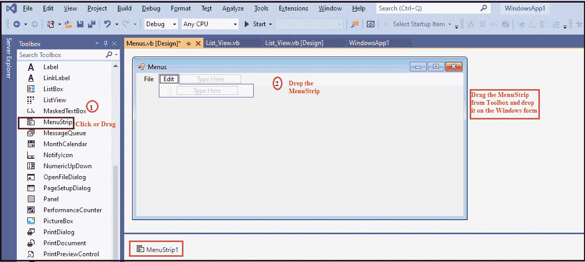
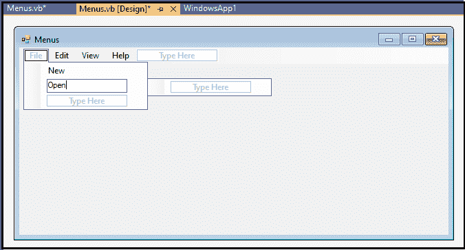
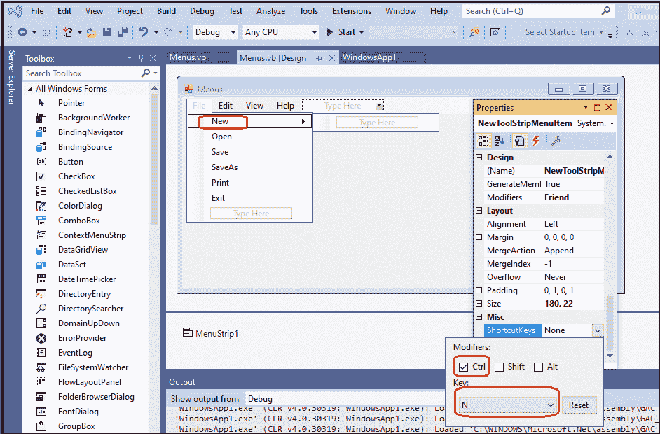
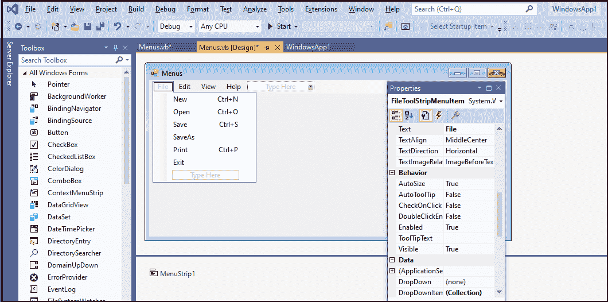
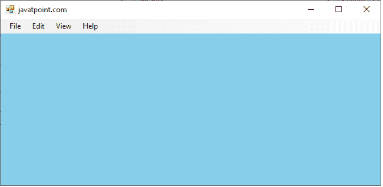
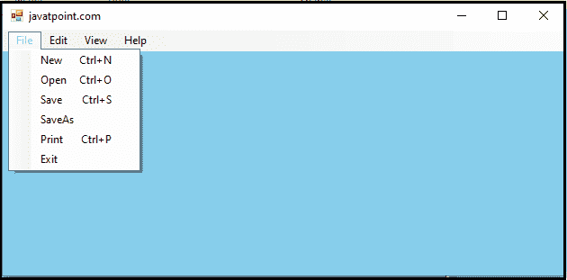

# VB.NET 菜单控制

> 原文:[https://www.javatpoint.com/vb-net-menu-control](https://www.javatpoint.com/vb-net-menu-control)

在包含相关命令列表的 Windows 窗体中，菜单用作菜单栏，它是通过 MenuStrip Control 实现的。菜单控件也被称为 VB.NET 菜单控件。菜单项是用 ToolStripMenuItem 对象创建的。此外，**工具快捷菜单**和**工具快捷菜单**对象可以完全控制结构、外观和功能，从而在[VB.NET](https://www.javatpoint.com/vb-net)应用程序中创建菜单项、子菜单和下拉菜单。

让我们通过从工具箱中拖动一个 MenuStrip 控件并将其放到[窗口](https://www.javatpoint.com/windows)表单中来创建一个 MenuBar。

**第一步**。将菜单栏控件从工具箱中拖放到窗体上。



**第二步:**一旦将 MenuStrip 添加到表单中，我们就可以通过点击 MenuStrip 控件来设置 Menu 的各种属性。

### 菜单控件的属性

VB.NET 菜单控件有以下属性。

| 性能 | 描述 |
| 独木舟交错 | CanOverflow 属性用于通过在 MenuStrip 控件中设置值来验证控件是否支持溢出功能。 |
| **拉伸** | Stretch 属性用于获取一个值，该值指定 menustrip 是否在 MenuStrip 控件中从一端延伸到另一端。 |
| 流感样式 | GripStyle 属性获取或设置使用菜单条控件的重新定位的夹点的可见性。 |
| **显示项目完成提示** | 它用于获取或设置决定是否为菜单控件显示工具提示的值。 |
| **预设大小** | DefaultSize 属性用于获取首次创建时 MenuStrip 的默认水平和垂直尺寸(以像素为单位)。 |

### 菜单控制的方法

| 方法 | 描述 |
| **create accessibility instance()** | 它用于为菜单控件创建新的辅助功能实例。 |
| **ProcessCmdKey()** | ProcessCmdKey 方法用于处理菜单控制中的命令键。 |
| **CreateDefaultItem()** | CreateDefaultItem 方法用于为新的 MenuStrip 创建一个带有指定文本、图像和事件处理程序的 ToolStripMenuItem。 |
| **OnMenuActivate()** | 它用于启动 MenuStrip 控件中的 MenuActivate 事件。 |
| **on moon deactivate()** | 它用于启动菜单栏控件中的菜单项激活事件。 |

### 菜单控件的事件

| 事件 | 描述 |
| 菜单激活 | 当用户用鼠标或键盘使用菜单栏控件时，会发生菜单激活事件。 |
| 菜单取消激活 | 当在视窗表单中停用功能表控制项时，就会发生功能表启动事件。 |

让我们创建一个程序来显示窗口表单中的菜单栏。

在这张图片中，我们已经在表单中创建了菜单栏的菜单和子项。



现在，我们为文件子项编写快捷键，如**新建- > Ctrl + N，打开- > Ctrl + O** 等。



之后，我们可以看到文件的子项及其快捷键，如下所示。



**菜单. vb**

```

Public Class Menus
    Private Sub Menus_Load(sender As Object, e As EventArgs) Handles MyBase.Load
        Me.Text = "javatpoint.com" 'set the title of the bar
        BackColor = Color.SkyBlue
    End Sub

    Private Sub ExitToolStripMenuItem_Click(sender As Object, e As EventArgs) Handles ExitToolStripMenuItem.Click
        Me.Dispose() ' exit from the form
    End Sub
End Class

```

**输出:**



单击显示与文件相关的多个选项的文件菜单。



* * *