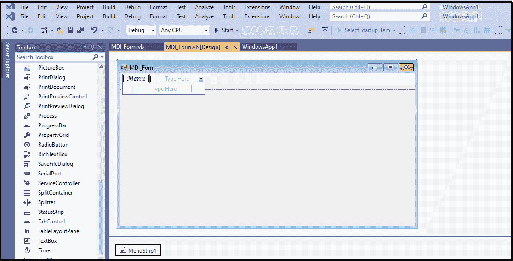
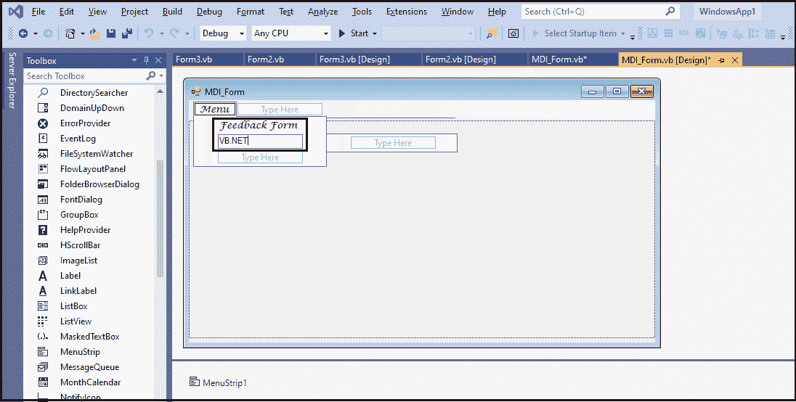
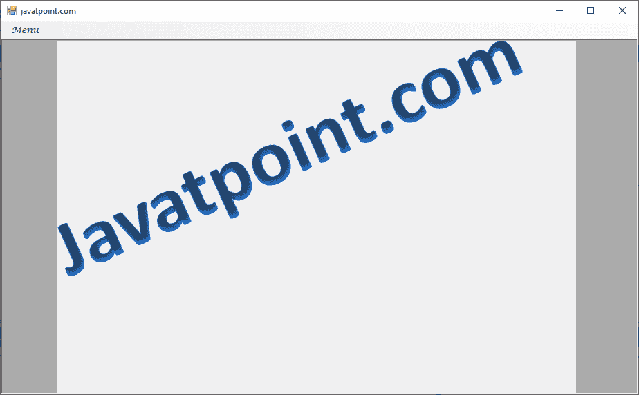
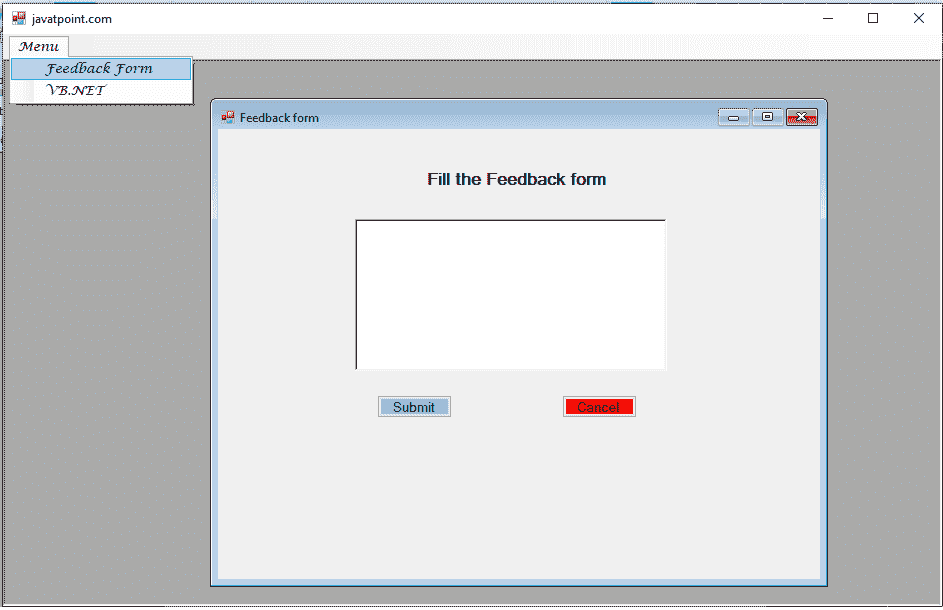
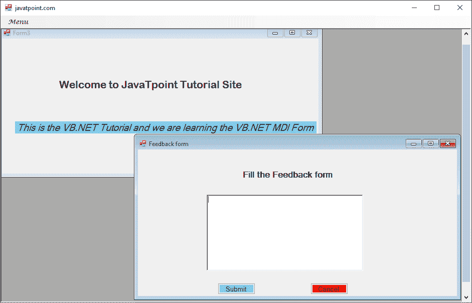

# VB.NET 计量吸入器表格

> 原文：<https://www.javatpoint.com/vb-net-mdi-form>

MDI 代表**多文档界面**应用程序，允许用户通过一次打开多个文档来处理多个文档。而**单文档界面(SDI)** 应用程序一次只能操作一个文档。

MDI 应用程序在表单中充当父子关系。父窗体是包含子窗体的容器，而子窗体可以是多个，以在父窗体中显示不同的模块。

VB.NET 有以下规则来创建一个 MDI 表单。

1.  **中间父项:**中间父项属性用于将父窗体设置为子窗体。
2.  **activimdichild:**activimdichild 属性用于获取当前子窗体的引用。
3.  **IsMdiContainer:**IsMdiContainer 属性将布尔值设置为 True，表示将表单创建为 MDI 表单。
4.  **layout MDI():**layout MDI()方法用于在父窗体或主窗体中排列子窗体。
5.  **控件:**用于从子窗体获取控件的引用。

让我们创建一个程序来显示 VB.NET 窗体中的多个窗口。

**第一步:**首先，我们要打开[窗口](https://www.javatpoint.com/windows)表单，使用 MenuStrip 控件创建菜单栏，如下图所示。



**第二步:**创建菜单后，将子项添加到菜单栏中，如下图所示。



在上图中，我们定义了两个子项，第一个是**反馈表**，第二个是 above。

**第三步:**在第三步中，我们将创建两种形态:**主形态**的子形态或**父形态**的子形态。

在这里，我们创建了第一个名为 Form2 的子窗体。

**Form2.vb**

```

Public Class Form2
    Private Sub Form2_Load(sender As Object, e As EventArgs) Handles MyBase.Load
        Me.Text = "Feedback form" ' Set the title of the form
        Label1.Text = " Fill the Feedback form"
        Button1.Text = "Submit"
        Button1.BackColor = Color.SkyBlue
        Button2.Text = "Cancel"
        Button2.BackColor = Color.Red
    End Sub
    Private Sub Button1_Click(sender As Object, e As EventArgs) Handles Button1.Click
        MsgBox(" Successfully submit the feedback form")
    End Sub
    Private Sub Button2_Click(sender As Object, e As EventArgs) Handles Button2.Click
        Me.Dispose() ' end the form2
    End Sub
End Class

```

另一个名为**的**子形态**形态 3** 。

**Form3.vb**

```

Public Class Form3
    Private Sub Form3_Load(sender As Object, e As EventArgs) Handles MyBase.Load
        Label1.Text = "Welcome to JavaTpoint Tutorial Site"
        Label.BackColor = Color.Green
        Label2.Text = "This is the VB.NET Tutorial and we are learning the VB.NET MDI Form"
        Label2.BackColor = Color.SkyBlue
    End Sub
End Class

```

**第 4 步:**现在我们为 Main 或 Parent 表单编写编程代码，下面是我们 Main 表单的代码。

**MDI_form.vb**

```

Public Class MDI_Form
    Private Sub MDI_Form_Load(sender As Object, e As EventArgs) Handles MyBase.Load
        IsMdiContainer = True 'Set the Boolean value to true to create the form as an MDI form.
        Me.Text = "javatpoint.com" 'set the title of the form
        PictureBox1.Image = Image.FromFile("C:\Users\AMIT YADAV\Desktop\jtp2.png")
        PictureBox1.Height = 550
        PictureBox1.Width = 750
    End Sub
    Private Sub FeedbackFormToolStripMenuItem_Click(sender As Object, e As EventArgs) Handles FeedbackFormToolStripMenuItem.Click
        PictureBox1.Visible = False
        Dim fm2 As New Form2
        fm2.MdiParent = Me 'define the parent of form3, where Me represents the same form
        fm2.Show() 'Display the form3
    End Sub
    Private Sub VBNETToolStripMenuItem_Click(sender As Object, e As EventArgs) Handles VBNETToolStripMenuItem.Click
        PictureBox1.Visible = False
        Dim fm3 As New Form3
        fm3.MdiParent = Me 'define the parent of form3, where Me represent the same form
        fm3.Show() 'Display the form3
    End Sub
End Class

```

**输出:**



之后，点击菜单按钮，显示菜单的两个子项目为**反馈表**和**VB.NET**。我们单击了反馈表单，该表单在窗口上显示以下表单。



当我们单击菜单项时，它会在屏幕上显示以下图像。



* * *