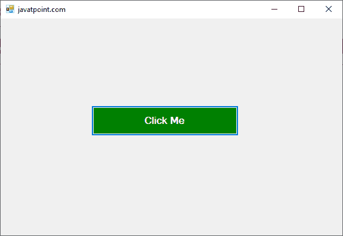
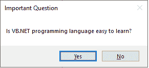

# VB.NET 对话框

> 原文:[https://www.javatpoint.com/vb-net-dialog-box](https://www.javatpoint.com/vb-net-dialog-box)

对话框是应用程序的临时窗口，通过鼠标或键盘接受用户响应，以打开文件、保存文件、通知、警报消息、颜色、打印、打开文件对话框等。在用户和应用程序之间创建通信和交互也很有用。此外，当程序需要与用户交互时，对话框会以一种形式出现，例如当出现错误、警报消息、来自用户的确认时，或者当程序需要立即采取行动时，或者是否根据更改保存决定时。

所有[VB.NET](https://www.javatpoint.com/vb-net)对话框继承了 CommonDialog 类，并覆盖了基类的 **RunDialog()** 方法来创建 OpenFileDialog 对话框、PrintDialogbox、Color 和 Font Dialog 对话框。当对话框调用其 **ShowDialog()** 方法时， **RunDialog()** 方法会在[窗口](https://www.javatpoint.com/windows)窗体中自动调用。

在 Windows 窗体中，运行时可以调用 **ShowDialog()方法**的以下函数。

*   **中止:**当用户点击中止按钮返回对话结果时，使用中止对话框。中止值。
*   **忽略:**当用户点击忽略按钮返回 DialogResult.Ignore 时，使用忽略对话框。
*   **无:**用于用户点击无按钮时不返回任何内容，对话框继续运行。
*   **确定:**当用户点击对话框的确定按钮时，返回 DialogResult。好的，
*   **取消:**当用户点击对话框的取消按钮时，返回 DialogResult。取消，
*   **是:**当用户点击对话框的是按钮时，返回 DialogResult.Yes
*   **重试:**当用户点击对话框重试按钮时，返回 DialogResult。重试，
*   **否:**当用户点击对话框的否按钮时，返回 DialogResult。不，

VB.NET 窗体中有常用的对话框控件。

1.  **颜色对话框:**用于显示颜色对话框，允许用户从预定义的颜色中选择一种颜色或指定自定义颜色。
2.  **字体对话框:**用于创建一个字体对话框，用户可以选择要应用于当前文本选择的字体、字体大小、颜色和样式。
3.  **打开文件对话框:**用于创建提示框，用户可以选择要打开的文件，也可以选择多个文件。
4.  **打印对话框:**用于创建一个打印对话框，用户可以通过选择打印机和设置通过 Windows 应用程序打印的页面来打印文档。

让我们创建一个简单的程序来显示 VB.NET 窗口表单中的对话框。

**对话框 vb**

```

Public Class Dialog
    Private Sub Dialog_Load(sender As Object, e As EventArgs) Handles MyBase.Load
        Button1.Text = "Click Me" 'Set the name of button
        Me.Text = "javatpoint.com" ' Set the title name for the Windows Form
        Button1.BackColor = Color.Green ' Background color of the button
    End Sub

    Private Sub Button1_Click(sender As Object, e As EventArgs) Handles Button1.Click
        Dim result1 As DialogResult = MessageBox.Show("Is VB.NET programming language easy to learn?",
    "Important Question",
    MessageBoxButtons.YesNo)
    End Sub
End Class

```

**输出:**



现在，点击 Windows 窗体的**点击我按钮**，显示对话框，如下图。



* * *