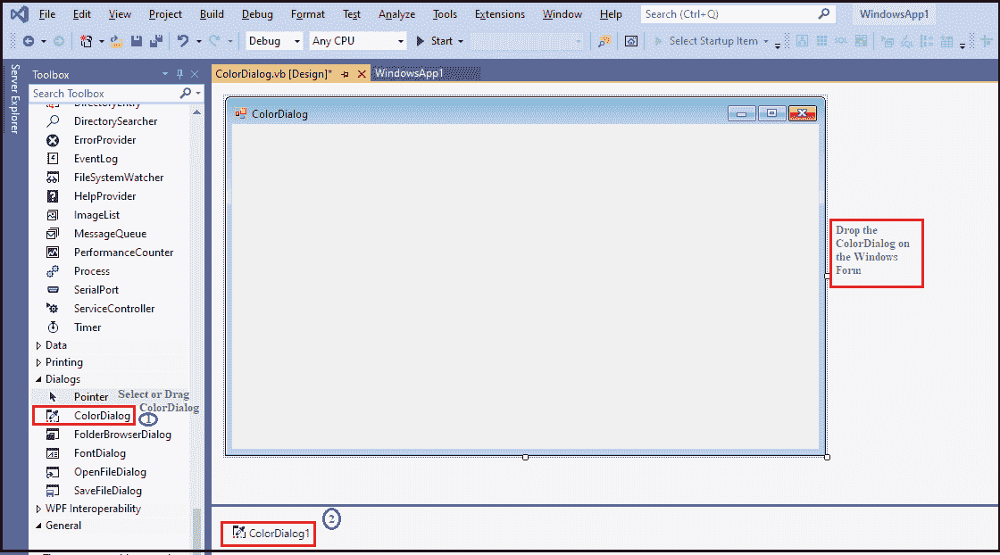
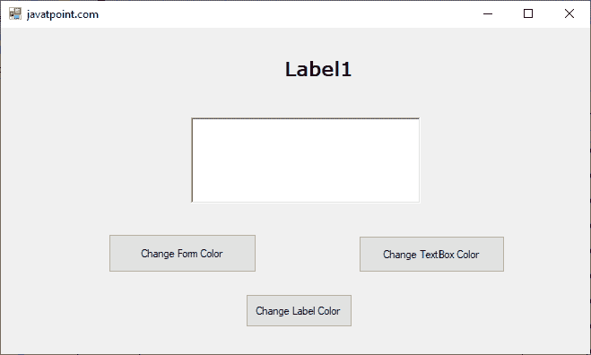
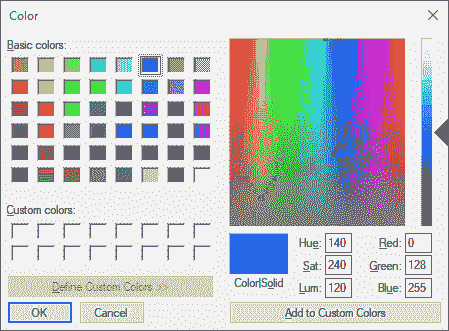
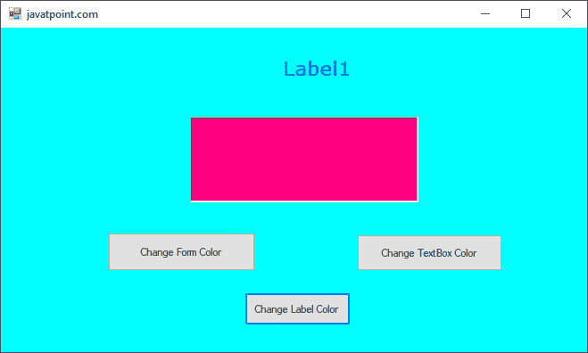

# VB.NET 颜色对话框

> 原文：<https://www.javatpoint.com/vb-net-color-dialog-box>

颜色对话框用于在微软视窗应用程序上显示颜色对话框和颜色选择。它允许用户设置或更改对象的颜色，例如控件的背景颜色或用于绘制对象的颜色。此外，控制对话框还允许用户通过混合颜色对话框的所有其他颜色来创建新的颜色。

让我们通过以下步骤在[VB.NET](https://www.javatpoint.com/vb-net)窗口中创建一个颜色对话框。

**第一步:**将颜色对话框从工具箱中拖放到[窗口](https://www.javatpoint.com/windows)表单中，如下图所示。



**第二步:**颜色对话框添加到表单后，我们可以通过点击颜色对话框来设置颜色的各种属性。

### 颜色对话框的属性

Windows 窗体中的颜色对话框有以下属性。

| 性能 | 描述 |
| **允许完全打开** | AllowFullOpen 属性使用户能够通过在颜色对话框中设置值来在 Windows 窗体中设置自定义颜色。 |
| **颜色** | 颜色属性用于从颜色对话框中设置或获取用户选择的颜色。 |
| **已完成** | FullOpen 属性用于设置一个值，该值表示对话框打开时是否显示自定义颜色。 |
| 任何颜色 | AnyColor 属性采用一个值，该值用于显示“颜色”对话框中的所有可用颜色以及一组基本颜色。 |
| **显示帮助** | ShowHelp 属性允许用户通过在对话框中设置一个值来显示颜色对话框中的帮助按钮。 |
| **CustomColors** | 它用于设置对话框上显示的自定义颜色。 |
| **SolidColorOnly** | SolidColorOnly 属性用于设置一个值，该值表示对话框是否限制用户仅选择纯色。 |

### 颜色对话框事件

| 事件 | 描述 |
| **已处理** | 当通过调用 Dispose 方法终止控件或组件时，将发生 Dispose 事件。 |
| **帮助请求** | 当用户单击颜色对话框的帮助按钮时，将调用帮助请求事件。 |

### 颜色对话框的方法

| 方法 | 描述 |
| **显示动态（）** | ShowDialog()方法用于运行具有默认设置的公共对话框。 |
| **排列()** | Dispose()方法用于释放颜色对话框中控件或组件使用的所有资源。 |
| **等于()** | Equals()方法用于检查当前或定义的对象是否相同。 |
| **OnHelpRequest（）** | 它用于调用对话框中的帮助请求事件。 |
| 重置() | Reset()方法用于将所有更改重置为默认值。例如，最后选择的颜色为黑色，自定义颜色为默认值。 |
| **诗对话()** | 它用于重写派生类以创建公共对话框。 |

让我们创建一个简单的程序来显示 VB.NET 窗口窗体中的颜色对话框。

**ColorDialog.vb**

```vb

Public Class ColorDialog
    Private Sub Button1_Click(sender As Object, e As EventArgs) Handles Button1.Click
		ColorDialog1.FullOpen = True
		If ColorDialog1.ShowDialog <> Windows.Forms.DialogResult.Cancel Then
			RichTextBox1.ForeColor = ColorDialog1.Color
			RichTextBox1.BackColor = ColorDialog1.Color
		End If
	End Sub
	Private Sub ColorDialog_Load(sender As Object, e As EventArgs) Handles MyBase.Load
		Me.Text = "javatpoint.com" 'set the title for the Windows form
		Button1.Text = "Change TextBox Color"
		Button2.Text = "Change Form Color"
		Button3.Text = "Change Label Color"
	End Sub
	Private Sub Button2_Click(sender As Object, e As EventArgs) Handles Button2.Click
		ColorDialog1.FullOpen = False
		If ColorDialog1.ShowDialog <> Windows.Forms.DialogResult.Cancel Then
			Me.BackColor = ColorDialog1.Color 'Change Background color of the form
		End If
	End Sub
	Private Sub Button3_Click(sender As Object, e As EventArgs) Handles Button3.Click
		ColorDialog1.FullOpen = True
		If ColorDialog1.ShowDialog <> Windows.Forms.DialogResult.Cancel Then
			Label1.ForeColor = ColorDialog1.Color 'set the color of the Label
		End If
	End Sub
End Class

```

**输出:**



当我们单击三个按钮中的任何一个时，它会打开颜色弹出窗口，如下所示。



单击“确定”按钮显示彩色窗口表单，如下所示。



* * *