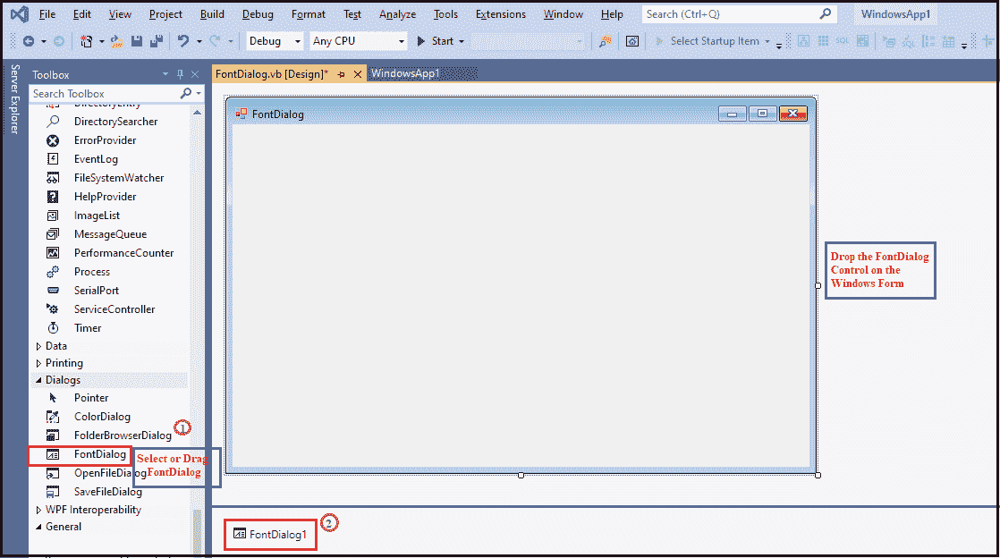
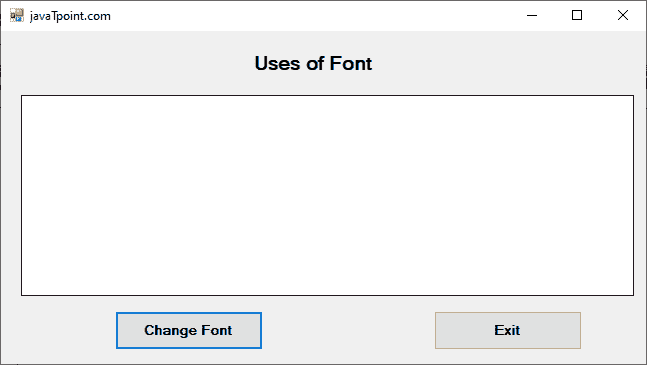
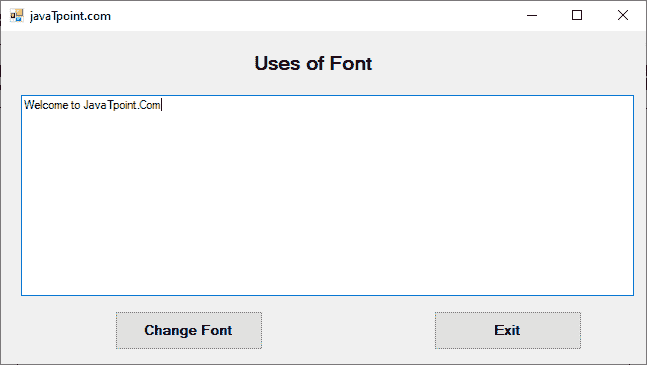
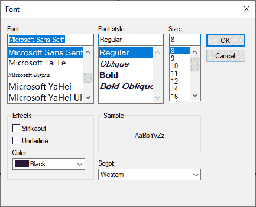
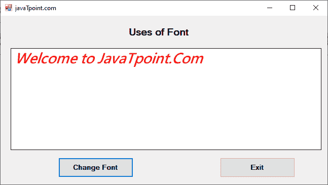

# VB.NET 字体对话框

> 原文:[https://www.javatpoint.com/vb-net-font-dialog-box](https://www.javatpoint.com/vb-net-font-dialog-box)

“字体”对话框允许用户为应用程序中的文本选择字体系列、样式和大小。但是，用户也可以通过点击**应用按钮**来选择字体颜色并将当前设置应用到控件的选定文本。

让我们使用以下步骤在 VB.NET 窗口窗体中创建一个字体对话框。

**第一步。**我们需要从工具箱中拖拽字体对话框，放到[窗口](https://www.javatpoint.com/windows)表单中，如下图所示。



**步骤 2:** 一旦将字体对话框添加到表单中，我们就可以通过点击字体对话框来设置字体的各种属性。

### 字体对话框的属性

[VB.NET](https://www.javatpoint.com/vb-net)字体对话框有以下属性。

| 性能 | 描述 |
| 表演申请 | ShowApply 属性设置一个值，该值表示是否要在对话框上显示“应用”按钮。 |
| **显示效果** | ShowEffects 属性用于通过在“字体”对话框中设置值来设置文本的各种效果，如删除线、文本颜色和下划线选项。 |
| 字体 | 字体属性用于获取或设置所选字体以显示更改。 |
| **容器** | 容器属性用于获取包含字体对话框组件的图标容器。 |
| **允许 verticalonts** | AllowverticalFonts 属性用于设置或获取一个值，该值表示“字体”对话框是显示水平和垂直字体，还是仅显示水平字体。 |
| 允许 ScriptChange | AllowScriptChange 属性用于设置一个值，该值允许用户更改脚本组合框中指定的字符，以显示当前显示字符以外的字符集。 |
| **脚本仅** | ScriptOnly 属性用于设置一个值，该值允许用户从对话框中仅选择字体、符号字符集和 ANSI 字符。 |
| **显示帮助** | ShowHelp 属性用于设置一个值，该值表示帮助按钮是否应显示在对话框中。 |
| **最大尺寸** | MaxSize 属性获取或设置一个值，该值允许用户仅选择最大磅值字符。 |
| **选项** | 它用于通过获取值来初始化字体对话框。 |

### 字体对话的方法

| 方法 | 描述 |
| **等于()** | Equals()方法用于检查当前或定义的对象是否相同。 |
| **OnHelpRequest（）** | 它用于调用对话框中的帮助请求事件。 |
| 重置() | Reset()方法用于将所有更改重置为默认值。 |
| **排列()** | Dispose()方法用于释放对话框中控件或组件使用的所有资源。 |
| **诗对话()** | 它用于重写派生类以创建公共对话框。 |
| **显示动态（）** | ShowDialog()方法用于运行具有默认设置的公共对话框。 |
| **CreateObjRef()** | CreateObjRef()方法用于创建包含所有相关信息的对象，以初始化可以与远程对象通信的代理。 |

### 字体对话框事件

| 事件 | 描述 |
| **已处理** | 当通过调用 Dispose()方法终止控件或组件时，将发生 Dispose 事件。 |
| **帮助请求** | 当用户单击对话框的帮助按钮时，将调用帮助请求事件。 |
| **应用** | 当用户单击“字体”对话框的“应用”按钮时，会发生应用事件。 |

让我们创建一个简单的程序来显示 VB.NET 窗口窗体中的字体对话框。

**FontDialog.vb**

```

Public Class FontDialog
    Private Sub FontDialog_Load(sender As Object, e As EventArgs) Handles MyBase.Load
        Me.Text = "javaTpoint.com" 'set the title name for the Windows form.
        Button1.Text = "Change Font" 'Set the name of button1
        Button2.Text = "Exit" 'name of button2
        Label1.Text = "Uses of Font"
    End Sub
    Private Sub Button1_Click(sender As Object, e As EventArgs) Handles Button1.Click
        FontDialog1.ShowColor = True
        If FontDialog1.ShowDialog = Windows.Forms.DialogResult.OK Then
            TextBox1.Font = FontDialog1.Font 'Change the font of the selected string
            TextBox1.ForeColor = FontDialog1.Color 'Change the color of selected string
        End If
    End Sub
    Private Sub Button2_Click(sender As Object, e As EventArgs) Handles Button2.Click
        Me.Dispose() 'Terminate the program
    End Sub
End Class

```

**输出:**



在文本区写一些文字，如下图。



选择字符串，点击**更改字体**按钮；它会打开“字体”窗口。在“字体”窗口中，我们可以更改选定字符串的大小、字体和字体样式。



设置字体、字体样式、大小和颜色等后。在“字体”对话框中，它显示格式化的字符串，如下所示。



* * *