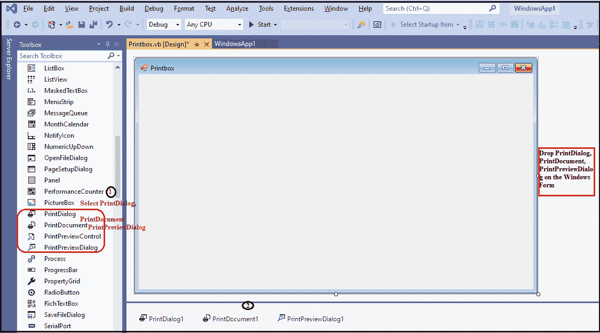
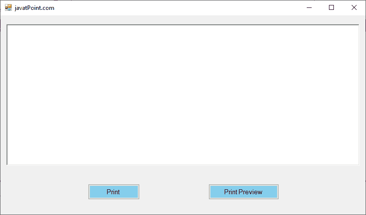
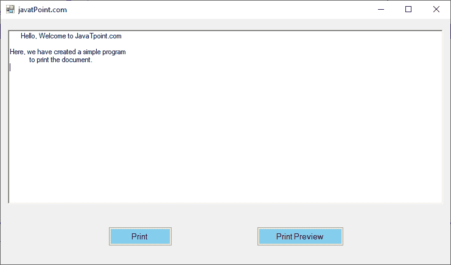
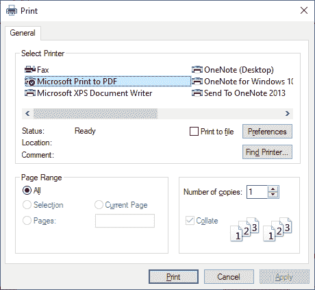
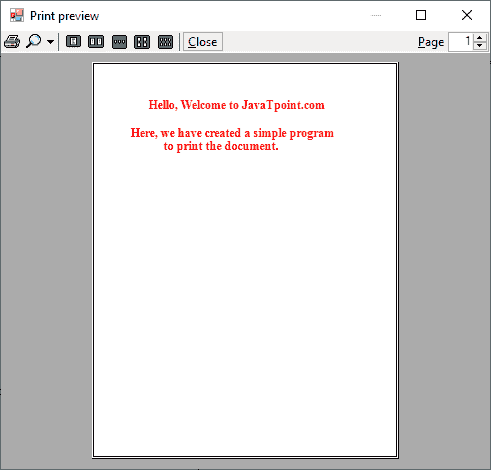

# Print 打印对话框

> 原文:[https://www.javatpoint.com/vb-net-print-dialog-box](https://www.javatpoint.com/vb-net-print-dialog-box)

用于在应用程序中显示**打印对话框**框。这是一个重要的对话框控件，允许用户选择文档的某些部分，然后从 Windows 窗体应用程序中选择打印机来打印页面。此外，用户可以在“打印”对话框中指定要打印的页面范围、要使用的打印机和份数。我们可以使用 **ShowDialog()** 方法在窗口中显示打印对话框控件。

让我们使用以下步骤在[VB.NET](https://www.javatpoint.com/vb-net)[窗口](https://www.javatpoint.com/windows)表单中创建一个打印对话框控件。

**第一步:**我们必须从工具箱中找到**打印对话框、打印文档、打印预览对话框控件**。将打印对话框、打印文档、打印预览对话框控件拖放到窗口窗体上，如下所示。



**步骤 2:** 一旦对话框被添加到表单中，我们可以通过点击打印对话框、打印文档、打印预览对话框控件来设置打印对话框的各种属性。

### 打印对话框属性

“打印对话框”有以下属性。

| 性能 | 描述 |
| **允许打印文件** | AllowPrintToFile 属性用于在控制框中设置一个值，该值表示对话框中是否启用了“打印到文件”复选框。 |
| **文件** | 文档属性用于在对话框中设置一个值，表示打印文档是否能够接收打印设置。 |
| **允许当前页** | AllowCurrentPage 属性用于设置一个值，该值表示当前页面选项按钮是否显示在打印对话框中。 |
| **打印文件** | PrintToFile 属性用于在控件中设置或获取一个值，该值表示对话框中是否选中了“打印到文件”复选框。 |
| **显示帮助** | ShowHelp 属性用于设置一个值，该值表示帮助按钮是否应显示在对话框中。 |
| **打印设置** | 它用于在打印对话框中设置打印机设置属性。 |
| **允许选择** | AllowSelection 属性用于在控件中设置一个值，该值表示是否在打印对话框中启用了选择选项按钮。 |

### 打印对话框控制方法

| 方法 | 描述 |
| **显示动态（）** | ShowDialog()方法用于运行具有默认设置的公共对话框。 |
| 重置() | Reset()方法用于将所有更改重置为默认值。 |
| **排列()** | Dispose()方法用于释放对话框中控件或组件使用的所有资源。 |
| **诗对话()** | 它用于重写派生类以创建公共对话框。 |

### 打印对话框控件的事件

| 事件 | 描述 |
| **已处理** | 当通过调用 Dispose()方法终止控件或组件时，将发生 Dispose 事件。 |
| **帮助请求** | 当用户单击对话框的帮助按钮时，将调用帮助请求事件。 |

让我们创建一个简单的程序来打印和预览 VB.NET 窗口表单中的文档。

**打印箱等**

```

Public Class Printbox
    Private Sub Printbox_Load(sender As Object, e As EventArgs) Handles MyBase.Load
        Me.Text = "javatPoint.com" 'Set the title for the Windows form
        Button1.Text = "Print"
        Button2.Text = "Print Preview"
        Button1.BackColor = Color.SkyBlue
        Button2.BackColor = Color.SkyBlue
        PrintPreviewDialog1.Document = PrintDocument1
    End Sub
    Private Sub Button1_Click(sender As Object, e As EventArgs) Handles Button1.Click
        If PrintDialog1.ShowDialog = DialogResult.OK Then 'Open the print dialog box
            PrintDocument1.PrinterSettings = PrintDialog1.PrinterSettings
            PrintDocument1.Print() 'print a document
        End If
    End Sub
    Private Sub PrintDocument1_PrintPage(sender As Object, e As Printing.PrintPageEventArgs) Handles PrintDocument1.PrintPage
        Dim font As New Font("Times New Roman", 24, FontStyle.Bold) 'set the font to display
        e.Graphics.DrawString(RichTextBox1.Text, font, Brushes.Red, 100, 100) 'The DrawString() function is used to print letters.
    End Sub
    Private Sub Button2_Click(sender As Object, e As EventArgs) Handles Button2.Click
        If RichTextBox1.Text = " " Then
            MsgBox("Please write some text...")
        Else
            PrintPreviewDialog1.ShowDialog()
        End If
    End Sub
End Class

```

**输出:**



在文本框中写一些文字。我们已经在文本框中写了以下文本，如下所示。



写完文字后，点击打印按钮打印文档并设置打印机设置，如下图所示。



甚至我们可以通过点击**打印预览**按钮来查看文档的预览；它显示了下图。



* * *