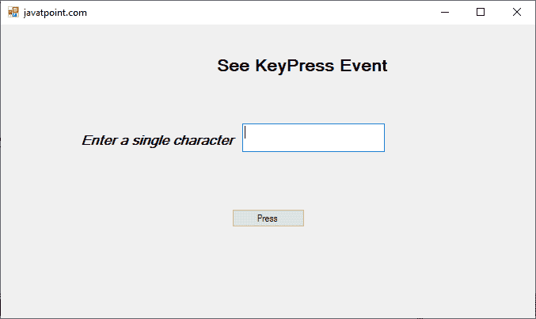
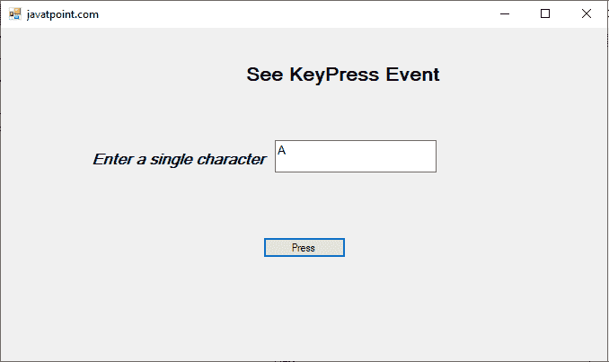
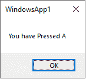
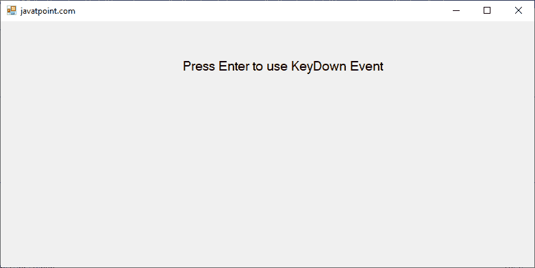
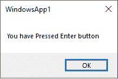
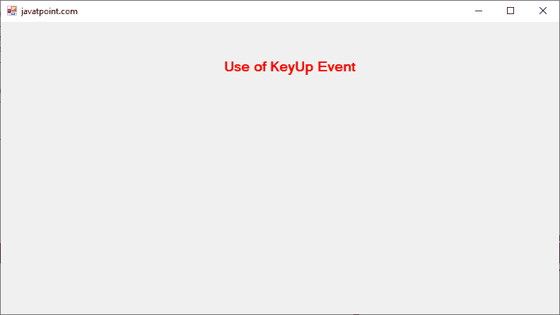
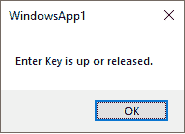

# Event 的按键事件

> 原文：<https://www.javatpoint.com/keypress-event-in-vb-net>

按键事件在 Windows 窗体中使用当用户在控件的焦点上按下字符、空格或退格键时，会发生按键事件。此外，仅当使用 Windows 窗体处理可打印的键或数字(如字母(a，b，c))时，才会引发按键事件。它不是由非字符键如 Esc、Shift、Ctrl 等拾取的。引发按键事件。非字符键与[VB.NET](https://www.javatpoint.com/vb-net)窗口应用程序中的**向下键**和**向上键**事件一起使用。

**按键事件:**按键事件发生在用户按下键盘上的某个键时。当用户保持按键时，它会重复。键盘向下事件由 VB.NET 应用程序中的键盘事件提供。

**按键事件:**当用户释放键盘上的一个按键时，按键事件上升。键盘事件由 VB.NET 应用程序中的键盘事件提供。

让我们创建一个简单的程序，在 VB.NET[窗口](https://www.javatpoint.com/windows)表单中显示按键事件。

**键代表等**

```

Public Class KeyPressEvent
    Private Sub KeyPress_Load(sender As Object, e As EventArgs) Handles MyBase.Load
        Me.Text = "javatpoint.com" 'Set the title for the Windows form
        Label1.Text = "See KeyPress Event"
        Label2.Text = "Enter a single character"
        Button1.Text = "Press" 'Name of button
    End Sub
    Private Sub TextBox1_KeyPress(sender As Object, e As KeyPressEventArgs) Handles TextBox1.KeyPress
        If Asc(e.KeyChar) > 1 Then ' Asc function returns the ANSI value
            Button1.Focus() 'Transfer control to the button
        End If
    End Sub

    Private Sub Button1_Click(sender As Object, e As EventArgs) Handles Button1.Click
        MsgBox(" You have Pressed " & TextBox1.Text)
    End Sub
End Class

```

**输出:**



按任意可打印的键。我们已经按了 a 键。



插入一个字符后，点击按下按钮，它显示如下输出。



### 按键事件示例

让我们创建一个简单的程序来显示按键事件在 VB.NET 窗口表单中的使用。

**KeyDownEvent1.vb**

```

Public Class KeyDownEvent1
    Private Sub KeyDownEvent1_Load(sender As Object, e As EventArgs) Handles MyBase.Load
        Me.Text = "javatpoint.com" 'Set the title for the Windows form
        Label1.Text = "Press Enter to use KeyDown Event"
    End Sub

    Private Sub KeyDownEvent1_KeyDown(sender As Object, e As KeyEventArgs) Handles Me.KeyDown
        If e.KeyCode = Keys.Enter Then ' If the condition is true if the block is executed.
            MsgBox("You have Pressed Enter")
        End If
    End Sub
End Class

```

**输出:**



按下**进入**按钮，显示如下图。



### 按键事件示例

让我们创建一个简单的程序来显示 VB.NET 视窗窗体中的按键事件的使用。

【T0 娱乐等】T1

```

Public Class KeyUp
    Private Sub KeyUp_Load(sender As Object, e As EventArgs) Handles MyBase.Load
        Me.Text = "javatpoint.com" 'Set the title for the Windows form
        Label1.Text = "Use of KeyUp Event"
        Label1.ForeColor = Color.Red
    End Sub

    Private Sub KeyUp_KeyUp(sender As Object, e As KeyEventArgs) Handles Me.KeyUp
        If e.KeyCode = Keys.Enter Then ' If the condition is true if the block is executed.
            MsgBox(" Enter Key is up or released.")
        End If
    End Sub
End Class

```

**输出:**



从键盘上松开回车键后，它会显示下面的图像。



* * *