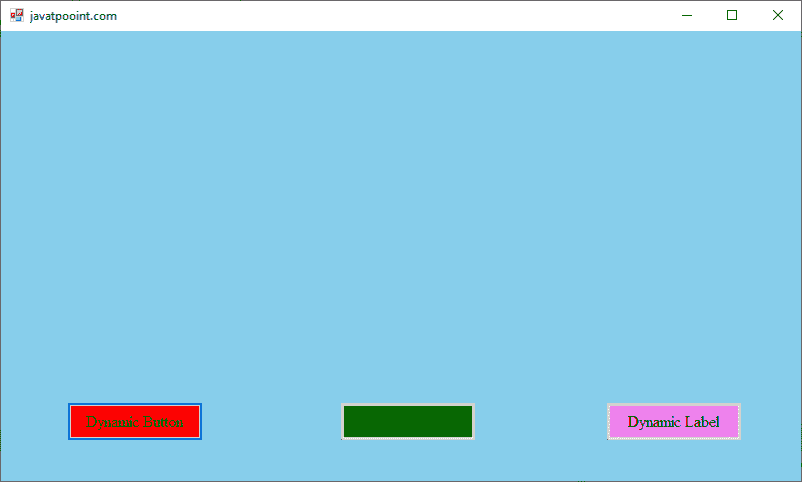
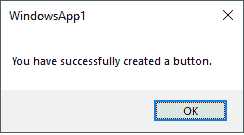
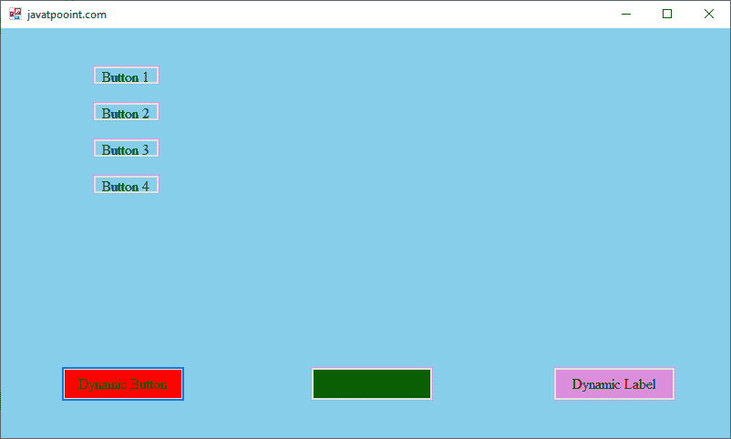
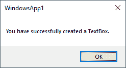
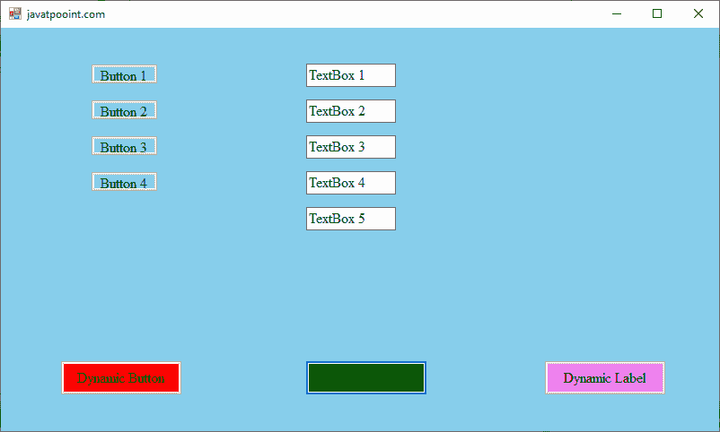
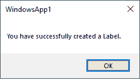
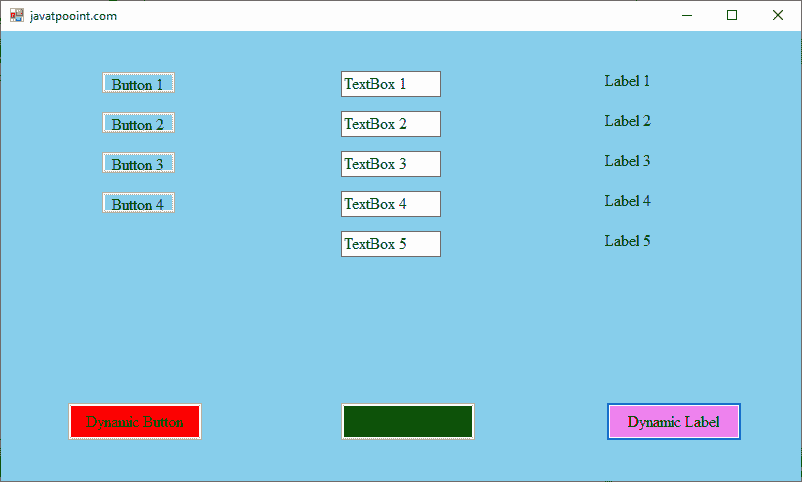

# VB.NET 的动态控制

> 原文:[https://www.javatpoint.com/dynamic-controls-in-vb-net](https://www.javatpoint.com/dynamic-controls-in-vb-net)

动态控件是动态创建的控件，如按钮、标签、文本框、单选按钮等。在运行时的窗口窗体中。VB.NET 工具箱的每个控件都是**系统中控件类的成员。Windows.Forms** 命名空间。工具箱中的每个控件都是一个类，类似于[窗口](https://www.javatpoint.com/windows)窗体类。

### 动态控制方法

**Add():** 在动态控件中，我们使用 Add()方法向控件集合的当前 Form 添加新元素。

**语法:**

```

Controls.Add(controlObj)

```

**Remove():**Remove 方法用于从控件集合中移除元素。它将“control”对象作为要从控件索引中移除的参数。

**语法:**

```

Controls.Remove(controlObj)

```

**Clear()方法:**Clear 方法用于从 controls 数组中移除控件的所有元素或清除表单。

**Count 属性:**Count 属性用于统计控件集合中作为元素的动态控件的数量。

**All()方法:** All 方法用于从 Windows 窗体中获取所有动态控件，作为 SystemWinForms.Control 的数组。

让我们创建一个简单的程序，在[VB.NET](https://www.javatpoint.com/vb-net)窗口表单中生成动态控件。

**DynamicControl.vb**

```

Public Class DynamicControl
    Private Sub DynamicControl_Load(sender As Object, e As EventArgs) Handles MyBase.Load
        Me.Text = "javatpooint.com" 'Set the title for a Windows FOrm
        Me.BackColor = Color.SkyBlue 'Set the background color of the Window form
        Button1.Text = "Dynamic Button"
        Button2.Text = "Dynamic TextBox"
        Button3.Text = "Dynamic Label"
        Button1.Font = New Font("Times New Roman", 12)
        Button1.BackColor = Color.Red
        Button2.BackColor = Color.Green
        Button2.Font = New Font("Times New Roman", 12)
        Button3.BackColor = Color.Violet
        Button3.Font = New Font("Times New Roman", 12)
    End Sub
    Dim p As Integer = 1
    Dim q As Integer = 1
    Dim r As Integer = 1
    Private Sub Button3_Click(ByVal sender As System.Object, ByVal e As System.EventArgs) Handles Button3.Click
        Dim label As New System.Windows.Forms.Label()  ' It is used to create label at run time
        Me.Controls.Add(label) ' Add() method is used to Add Label
        label.Top = r * 40
        label.Left = 600
        label.Text = "Label " & Me.r.ToString
        label.Font = New Font("Times New Roman", 12) 'Set the font style of the label 
        r = r + 1  ' Add the Label one by one 
        MsgBox("You have successfully created a Label.")
    End Sub
    Private Sub Button2_Click(ByVal sender As System.Object, ByVal e As System.EventArgs) Handles Button2.Click
        Dim Txtbox As New System.Windows.Forms.TextBox()  ' It is used to create TextBox at run time
        Me.Controls.Add(Txtbox)  ' Add() method is used to Add TextBox.
        Txtbox.Top = q * 40
        Txtbox.Left = 340
        Txtbox.Text = "TextBox " & Me.q.ToString
        Txtbox.Font = New Font("Times New Roman", 12)
        q = q + 1
        MsgBox("You have successfully created a TextBox.")
    End Sub
    Private Sub Button1_Click(ByVal sender As System.Object, ByVal e As System.EventArgs) Handles Button1.Click
        Dim button As New System.Windows.Forms.Button()  ' It is used to create button at run time
        Me.Controls.Add(button)  ' Add() method is used to Add button. 
        button.Top = p * 40
        button.Left = 100
        button.Text = "Button " & Me.p.ToString
        button.Font = New Font("Times New Roman", 12)
        p = p + 1
        MsgBox("You have successfully created a button.")
    End Sub
End Class

```

**输出:**



每次单击动态按钮时，它都会在屏幕上显示以下消息，并在运行时在 Windows 窗体中创建一个按钮，如下所示。




每次单击“动态文本框”按钮时，它都会在屏幕上显示以下消息，并在运行时在窗口窗体中创建一个文本框，如下所示。




每次单击“动态标签”按钮时，它都会在屏幕上显示以下消息，并在运行时在 Windows 窗体中创建一个标签，如下所示。




* * *