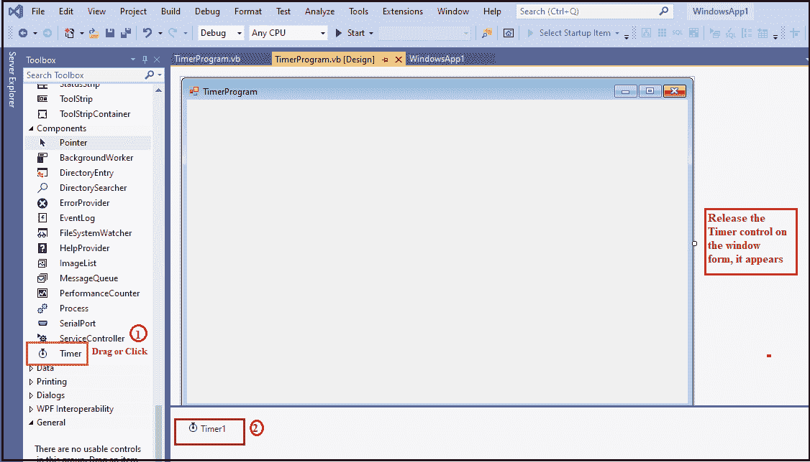
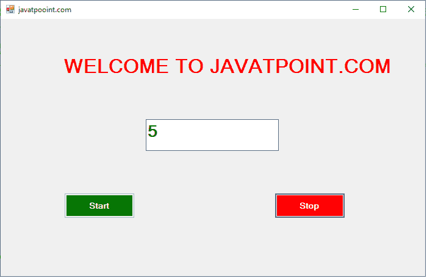
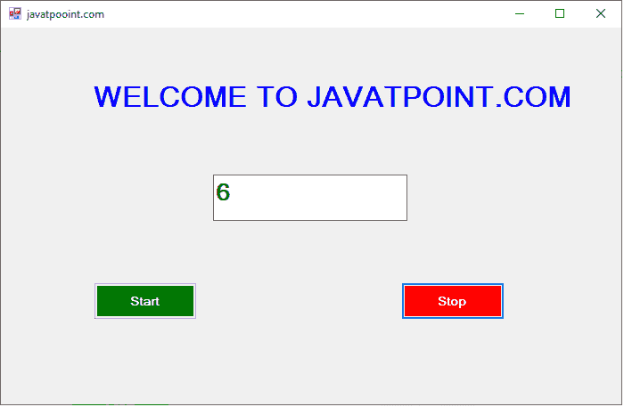

# VB.NET 定时器控制

> 原文:[https://www.javatpoint.com/vb-net-timer-control](https://www.javatpoint.com/vb-net-timer-control)

计时器控件是一个循环控件，用于在给定的时间间隔内重复任何任务。它是客户端和服务器端编程中使用的一个重要控件，在 Windows 服务中也是如此。

此外，如果我们想在特定时间后执行一个应用程序，我们可以使用**定时器控制**。一旦启用计时器，它将生成一个 tick 事件处理程序，以执行其时间间隔属性中定义的任何任务。它在调用计时器控件的 start()方法时开始，并持续重复定义的任务，直到计时器停止。

让我们通过以下步骤在[VB.NET](https://www.javatpoint.com/vb-net)[窗口](https://www.javatpoint.com/windows)表单中创建一个计时器控件。

**步骤 1:** 将 Timer 控件拖放到窗口窗体上，如下图所示。



**第二步:**一旦将 Timer 添加到表单中，我们就可以通过点击 Timer 控件来设置 Timer 的各种属性。

### 计时器控件属性

VB.NET 计时器控件有以下属性。

| 性能 | 描述 |
| **名称** | Name 属性用于设置控件的名称。 |
| **启用** | 启用属性用于启用或禁用计时器控件。默认情况下，它为真。 |
| **间隔** | Interval 属性用于设置或获取迭代间隔(以毫秒为单位)，以引发计时器控件的消逝事件。根据时间间隔，计时器重复该任务。 |
| **自动图文集** | “自动恢复”属性用于获取或设置一个布尔值，该值确定计时器是否只引发一次已过事件。 |
| **事件** | 属性用于获取与事件组件关联的事件处理程序列表。 |
| 犬吠 | 它用于获取一个值，该值表示组件是否可以引发事件。 |

### 定时器控制事件

| 事件 | 描述 |
| **已处理** | 当通过调用 Dispose 方法终止控件或组件时，将发生 Dispose 事件。 |
| **经过的时间** | 当计时器控制中的时间间隔过去时，已过去事件已经发生。 |
| **勾选** | 滴答事件用于根据“时间间隔”属性中设置的时间重复任务。它是在 Start()和 Stop()方法之间重复任务的计时器控件的默认事件。 |

### 定时器控制方法

| 方法 | 描述 |
| **开头()** | BeginInt()方法用于启动窗体或其他组件上使用的计时器控件的运行时初始化。 |
| **排列()** | Dispose()方法用于释放计时器控件或组件使用的所有资源。 |
| **排列(布尔)** | 它用于释放当前计时器控件使用的所有资源。 |
| **关闭()** | Close()方法用于释放计时器控件使用的资源。 |
| **Start()** | Start()方法用于通过将 Enabled 属性设置为 true 来开始计时器控件的消逝事件。 |
| **端金（）** | EndInt()方法用于结束窗体或其他组件上使用的计时器控件的运行时初始化。 |
| **停止()** | Stop()方法用于通过将 Enabled 属性设置为 false 来停止计时器控件的流逝事件。 |

让我们创建一个简单的程序来理解计时器控件在 VB.NET 窗口窗体中的使用。

**计时器程序等**

```

Public Class TimerProgram
    Private Sub TimerProgram_Load(sender As Object, e As EventArgs) Handles MyBase.Load
        Me.Text = "javatpooint.com" 'Set the title for a Windows Form
        Label1.Text = "WELCOME TO JAVATPOINT.COM"
        TextBox1.Text = 1
        Timer1.Enabled = True
        Button1.Text = "Start"
        Button1.BackColor = Color.Green
        Button1.ForeColor = Color.White
        Button2.Text = "Stop"
        Button2.BackColor = Color.Red
        Button2.ForeColor = Color.White
        Timer1.Start()
        Timer1.Interval = 600 'set the time interval
    End Sub
    Private Sub Timer1_Tick(sender As Object, e As EventArgs) Handles Timer1.Tick
        If Label1.ForeColor = Color.Red Then
            Label1.ForeColor = Color.Blue
        ElseIf Label1.ForeColor = Color.Blue Then
            Label1.ForeColor = Color.Red
        End If
        TextBox1.Text = TextBox1.Text + 1 'Incremenet the TextBox1 by 1
    End Sub
    Private Sub Button2_Click(sender As Object, e As EventArgs) Handles Button2.Click
        Timer1.Stop() ' Stop the timer
    End Sub
    Private Sub Button1_Click(sender As Object, e As EventArgs) Handles Button1.Click
        Timer1.Start() 'Start the timer
    End Sub
End Class

```

**输出:**



当程序执行时，它开始闪烁**欢迎来到 JAVATPOINT.COM**语句，并将数字数到 1，如上图所示。数字为奇数时，报表颜色为**红色**，数字为**偶数时**，报表颜色为**蓝色**，如下图。



* * *