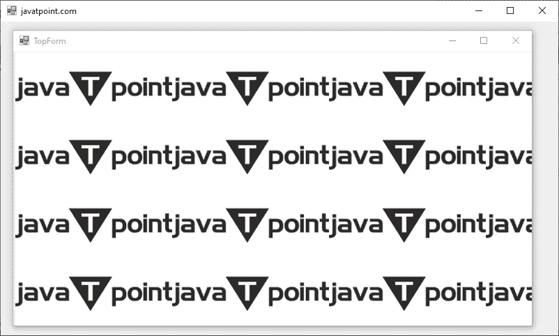
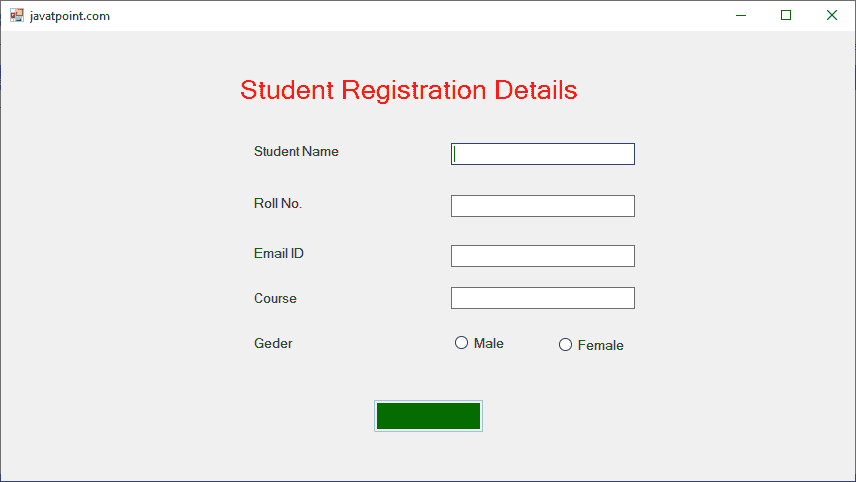
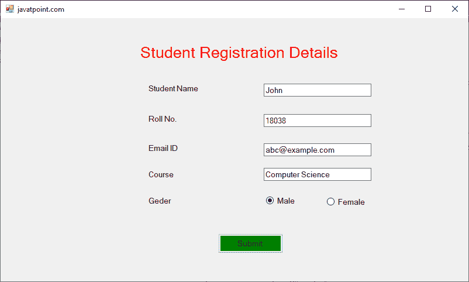
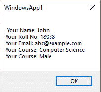

# 如何在 VB.NET 保持一个表格在其他表格之上？

> 原文：<https://www.javatpoint.com/how-to-keep-a-form-on-top-of-others-in-vb-net>

当我们创建一个 Windows 应用程序时，我们希望将主窗体保持在另一个窗体之上。我们还可以说，当应用程序启动时，会在应用程序内的主窗体上显示一个弹出窗口窗体，以启动进一步的过程。在 VB6 中，我们可以看到一个 **Win32API** ，它调用 SetWindowPos 将表单设置为始终在顶部。而在[VB.NET](https://www.javatpoint.com/vb-net)中，使用表单的 top 属性作为 True，将表单保持在顶部是很简单的。将**最上面的属性**设置为真后，即使最上面的窗体不在活动窗体或前景窗体中，窗口应用程序的最上面的窗体也会与所有其他窗体重叠。

此外，当**top 的值为真**时，表单的 ToP 属性将强制表单位于屏幕的顶层。使用 **Show()** 方法在[窗口](https://www.javatpoint.com/windows)应用程序中显示表单。

以下语法用于将表单设置在其他表单之上。

```

Dim f As New Form2
f.TopMost = True
f.Show()

```

如果我们想在另一个窗体上显示一个窗体，我们必须创建两个窗口窗体。

1.  **主页等**
2.  **锅形. vb**

要将 **TopForm.vb** 表单保留在 **MainPage.vb** 表单之上，我们需要将 **MainPage.vb** 文件中的 top 属性设置为 **True** 。

**主页等**

```

Public Class MainPage
    Private Sub MainPage_Load(sender As Object, e As EventArgs) Handles MyBase.Load
        Me.Text = "javatpoint.com" 'Set the title for a Window Form 
        Label1.Text = "Student Name"
        Label2.Text = "Roll No."
        Button1.Font = New Font("Microsoft Sans Serif", 12)
        Label3.Text = "Email ID"
        Button1.Font = New Font("Microsoft Sans Serif", 12)
        Label4.Text = "Course"
        Button1.Font = New Font("Microsoft Sans Serif", 12)
        Label5.Text = "Geder"
        Button1.Font = New Font("Microsoft Sans Serif", 12)
        Label6.Text = "Student Registration Details"
        Label6.Font = New Font("Microsoft Sans Serif", 20)  ' Set Font style
        Label6.ForeColor = Color.Red
        RadioButton1.Text = "Male"  ' Set the radiobutton1 and radiobutton2
        RadioButton2.Text = "Female"
        Button1.Text = "Submit"
        Button1.Font = New Font("Microsoft Sans Serif", 10)
        Button1.BackColor = Color.Green
        ' Define the parameter to set the TopForm on top of the MainPage Form.
        Dim frm As New TopForm
        frm.TopMost = True 'Set the TopMost property to True
        frm.Show() 'Show() method is used to display the TopForm
    End Sub
    Private Sub Button1_Click(sender As Object, e As EventArgs) Handles Button1.Click
        Dim name As String
        Dim rollno As String
        Dim email As String
        Dim course As String
        Dim gen As String
        name = TextBox1.Text
        rollno = TextBox2.Text
        email = TextBox3.Text
        course = TextBox4.Text
        If RadioButton1.Checked = True Then
            gen = "Male"
        ElseIf RadioButton2.Checked = True Then
            gen = "Female"
        End If
        ' Display the user details, when the Button1 is clicked
        MsgBox(" Your Name: " & name + vbCrLf + "Your Roll No: " & rollno + vbCrLf +
               "Your Email: " & email + vbCrLf + "Your Course: " & course + vbCrLf + "Your Course: " & gen)
    End Sub
End Class

```

**锅形. vb**

```

Public Class TopForm
    Private Sub TopForm_Load(sender As Object, e As EventArgs) Handles MyBase.Load

        PictureBox1.BackgroundImage = Image.FromFile("C:\Users\AMIT YADAV\Desktop\JTP.png")
        PictureBox1.SizeMode = PictureBoxSizeMode.StretchImage
    End Sub
End Class

```

**输出:**



在上图中，**表单**位于**【javatpoint . com】(主页面)**的顶部。如果我们关闭**表单**，它会显示如下所示的表单。



在**学生注册**表格中提供详细信息，点击**提交**按钮。



点击提交按钮后，在**主页面. vb** 文件或**javatpoint.com**表格顶部显示**弹出消息。**



* * *