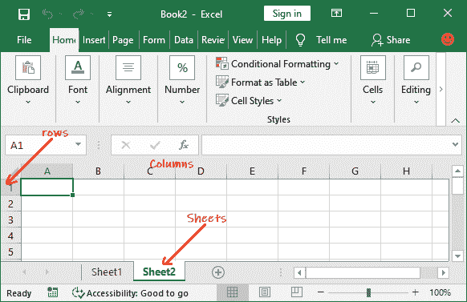
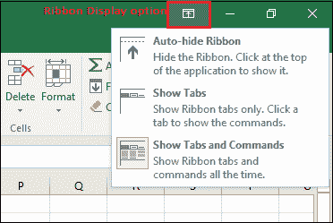

# 微软 Excel 教程

> 原文：<https://www.javatpoint.com/excel-tutorial>

MS Excel 教程提供了 Excel 的基本概念和高级概念。我们的 Excel 教程是为初学者和专业人士设计的，牢记他们的要求。

微软 Excel 是微软编写的计算机应用程序**。它主要包括选项卡、命令组和工作表。它以表格形式存储数据，并允许用户对其执行操作。**

我们的微软 Excel 教程将涵盖从基础到高级的所有主题，如微软 Excel 简介、工作表、功能区和选项卡、函数、公式、微软 Excel 在线、Excel VBA 编辑器、数据验证、条件格式等。与此同时，我们还将向您展示**下载并激活 MS Excel** 的步骤。

## 什么是微软 Excel？

微软 Excel 是由微软设计的办公用应用**。它配备了**办公套件**以及其他几个微软应用程序，如 Word、Powerpoint、Access、Outlook 和 OneNote 等。它在视窗和苹果操作系统中都受到支持。**

微软 Excel 是最合适的电子表格程序之一，它帮助我们以表格形式存储和表示数据，管理和操作数据，创建光学逻辑图表等。Excel 为您提供了在其中创建新文档的工作表。可以用**保存 Excel 文件。xls 分机**。

#### 注意:本 Excel 教程使用的是 Excel 2016。

## 工作表

工作表由行和列组成，行和列相互交叉形成输入数据的单元格。它能够执行多项任务，如计算、数据分析和数据集成。

在 Excel 工作表中，**行**用数字表示**，而**列用字母**表示。**

一个 Excel 工作簿可以由几个工作表组成，命名为**工作表 1、工作表 2、工作表 3…工作表**。您可以向 Excel 文档中添加一张或多张工作表。

## 微软 Excel 功能

Excel 中有几个功能可以让我们的任务更容易管理。一些主要特征是:

1.  **自动套用格式:**允许 Excel 用户使用预定义的表格格式选项。
2.  **自动求和:**自动求和功能通过为一系列单元格插入加法公式，帮助我们自动计算一行或一列的总和。
3.  **列表自动填充:**当一个新组件添加到列表末尾时，它会自动开发单元格格式。
4.  **自动填充:**该功能允许我们用重复或连续的记录快速填充单元格，例如按时间顺序排列的日期或数字以及重复的文档。自动填充也可以用来复制函数。我们也可以用这个特性改变文本和数字。
5.  **自选图形:**自选图形工具栏将允许我们绘制一些几何形状、箭头、流程图项目、星形等等。有了这些形状，我们可以画出我们的图表。
6.  **向导:**它根据我们正在做的事情，通过显示几个有用的提示和技巧，指导我们在工作时有效地工作。拖放功能将帮助我们通过简单地用鼠标拖动数据来重新定位记录和文本。
7.  **图表:**该功能将帮助您使用饼图、条形图、折线图等以图形形式呈现数据。
8.  **数据透视表:**它可以在几秒钟内翻转和汇总数据，并允许我们执行数据分析和生成文档，如定期财务报表、统计文档等。我们还可以图形化地分析复杂的数据关系。
9.  **快捷菜单:**快捷菜单帮助用户通过快捷命令完成需要漫长过程的工作。

## 如何打开微软 Excel？

在 Windows 10 操作系统中，单击开始按钮并搜索微软 Excel 应用程序。如果它已经安装在您的系统中，它会像这样出现在这里。

双击此图标打开 Excel。

当 Excel 打开时，会出现这样一个界面。从这里，您可以创建新工作簿，选择模板，并访问最近编辑过的工作簿。

### 创建新工作簿

要创建新的工作簿，点击这里的**空白工作簿**。

将打开一个空白的 Excel 工作表，并向您显示。

### 打开现有工作簿

如果您想使用现有工作簿，您可以从**最近的**列表中选择，或者单击**打开**按钮从特定位置选择。

当您点击**打开**按钮时，它会要求您从不同的位置打开现有的文件，如- **最近的、OneDrive、这台电脑、**和**浏览**。

这次我们去**浏览**；它会直接带你到本地电脑位置。从这里，您可以选择要打开的 Excel 文件。

从电脑中选择一个文件，点击**打开**按钮。

存储在本地计算机上的现有 Excel 文件将像这样打开。

**设置自动打开空白工作簿的选项**

在微软的电子表格中，你可以设置一个选项，当你启动电子表格时，默认打开空白的电子表格工作簿。

1.  点击**文件**然后**选项**(在右侧面板的**更多…** 里面)。
2.  在**常规**选项卡上，向下滚动至**启动选项**。
3.  在这里，取消勾选【程序启动时显示开始画面】复选框，然后点击**确定**。
    
4.  下次启动 Excel 时，它会自动打开一个空白工作簿。

## Excel 界面

它是 Excel 工作表的主界面，我们在这里工作和存储数据。该界面包含各种组件。在开始使用 Excel 工作表之前，您应该熟悉这些组件，以便能够高效地使用 Excel 应用程序。

一旦您熟悉了 Excel 界面，您将能够识别 Excel 工作簿的基本组件和最常用的组件。我们已经解释了一些关于这些组件的内容。

### 快速访问工具栏

快速访问工具栏包含了 Excel 中一些最常用的命令，用户在使用 Excel 时会反复用到这些命令。默认情况下，快速访问工具栏中会添加**保存、**撤消、**重复**命令。

通过在其中添加最常用的命令，它为用户提供了快速访问。这个快速访问工具栏是可定制的。这意味着您可以添加其他命令，无论您最需要哪个。

**向快速访问工具栏**添加命令

**步骤 1:** 点击快速访问工具栏右侧的下拉箭头。

**第 2 步:**从下拉菜单中选择您希望在快速访问工具栏中添加的命令。

更多命令，这里没有，点击**更多命令**从那里选择。

**第三步:**在这里，我们选择了命令**打印预览和打印**，该命令已经和其他命令一起添加到快速访问工具栏中。你可以在这里看到。

### Excel 功能区

Excel 2016 使用**选项卡式功能区系统**代替传统菜单。**功能区**包括多个选项卡，每个选项卡都有几组**命令**。我们将使用这些选项卡来执行 Excel 中最常见的功能。

**文件、主页、插入、页面布局、公式、数据、审阅、查看、**和**帮助**是 Excel 功能区包含的选项卡。

Excel 功能区的每个选项卡都包含其相关操作列表。**例如**，公式选项卡包含所有数学、逻辑、文本、字符串、金融、日期和时间函数。

**最小化和最大化色带**

Ribbon 是为了响应我们当前的功能而设计的，但是如果我们发现它占用了太多的屏幕空间，我们可以选择将其最小化。

1.  单击功能区右上角的功能区显示选项箭头。
    
2.  从下拉菜单中选择所需的最小化选项:
    *   **自动隐藏功能区:**自动隐藏以全屏模式显示我们的工作簿，并完全隐藏功能区。要**显示功能区**，单击屏幕顶部的**扩展功能区**命令。
        
    *   **显示选项卡:**该选项在不使用时隐藏所有命令组，但**选项卡**将保留在那里。要**显示功能区**，只需点击任一标签即可。
        
    *   **显示选项卡和命令:**该选项最大化功能区。所有的选项卡和命令对用户来说都是可见的。当我们第一次打开 Excel 时，默认选择这个选项。
        T3】

### 在 Excel 2016 中自定义功能区

我们可以通过创建我们自己的**标签**来定制功能区，使用我们想要的任何命令。命令总是存放在一个**组**中，我们可以创建任意多个组来保持选项卡的有序。如果我们愿意，我们甚至可以向任何默认选项卡添加命令，只要我们在选项卡中创建一个自定义组。

如果我们愿意，我们甚至可以向任何默认选项卡添加命令，只要我们在选项卡中创建一个自定义组。

1.  右键单击**功能区**，然后从下拉菜单中选择**自定义**功能区。
    
2.  将出现 **Excel 选项**对话框。找到并选择**新选项卡**或**新组**，无论您想要添加哪个。
    
3.  现在，从左侧面板中选择一个命令，然后单击添加按钮添加到新的自定义选项卡/组。您也可以将命令直接拖到一个组中。
    
4.  添加完命令后，单击确定。这些命令将添加到功能区的新选项卡中，如下所示。
    

#### 注意:您也可以重命名选项卡和组名。

### 编辑栏

在**公式栏**中，我们可以输入或编辑将在特定单元格中出现的数据、公式或函数。它允许编写函数和公式来操作数据。

在下图中，单元格 C1 被选中，公式栏中输入了 2000。注意数据是如何包含在公式栏和 C1 单元格中的。

### 名称框

名称框显示**选定单元格**的位置或**“名称”**。

在下图中，单元格 B4 被选中。请注意，单元格 B4 是列 B 和行 4 相交的地方。

### 后台视图(文件菜单)

单击功能区上的**文件**选项卡。**后台视图**将会出现。

这是微软 Excel 的后台视图，以及其中包含的选项信息。

### 工作表视图

Excel 2016 有多种显示选项，可以改变工作簿的显示方式。我们可以选择在**普通视图、**页面布局视图或**分页符视图**中查看任何工作簿。这些视图对于一些任务来说是有用的，尤其是如果我们计划**打印**电子表格的话。

要更改工作表视图，请在 Excel 窗口的右下角找到并选择所需的工作表视图命令。

### 缩放控制

要使用**缩放控制**，点击并拖动**滑块**。滑块右侧的数字反转**缩放比例**。它显示在 Excel 工作表的右下角。

默认情况下，Excel 视图缩放百分比为 100%。

## 先决条件

在学习微软 Excel 之前，你必须具备计算机基础的基础知识。

## 观众

我们的微软 Excel 教程旨在帮助初学者和专业人士。

## 问题

我们保证您在本微软 Excel 教程中不会发现任何问题。但是如果有任何错误，请在联系表格中发布问题。

* * *