# 如何创建和打开工作簿？

> 原文:[https://www.javatpoint.com/how-to-create-and-open-workbooks](https://www.javatpoint.com/how-to-create-and-open-workbooks)

Excel 文件被称为工作簿。每当我们在 Excel 中启动一个新项目时，我们都需要创建一个新的工作簿。在 Excel 2016 中开始使用工作簿有不同的方法。我们可以选择使用空白工作簿或预先设计的模板创建新工作簿，或者打开现有工作簿。

## 创建新的空白工作簿

要在 MS Excel 中创建新的空白工作簿，请按照给定的步骤操作-

1.选择**文件**选项卡，Excel 后台视图将从该选项卡出现。

2.选择**新建**，然后点击空白工作簿。

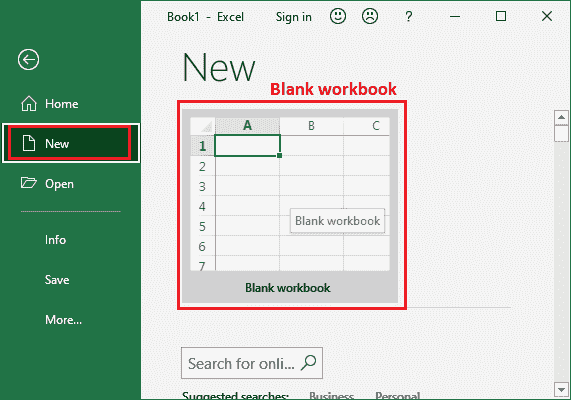

3.将出现一个新的空白工作簿，如下所示。

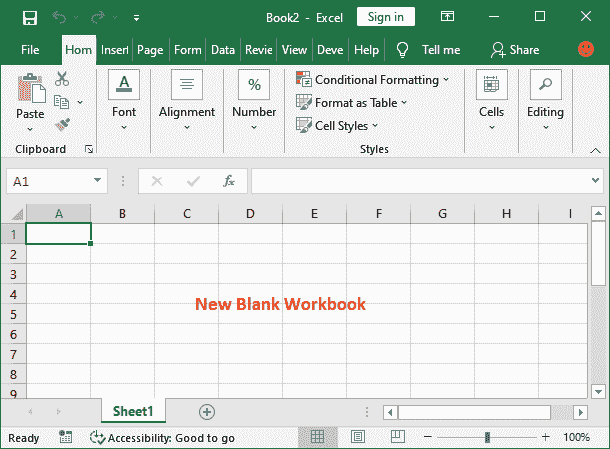

### 打开现有工作簿

除了创建新的工作簿，我们还经常需要打开以前存储的工作簿。现有工作簿中可能包含数据。我们可以直接从存放的位置打开，也可以通过 MS Excel 打开。遵循下面给出的步骤:

1.从文件菜单导航到后台视图，然后单击打开。

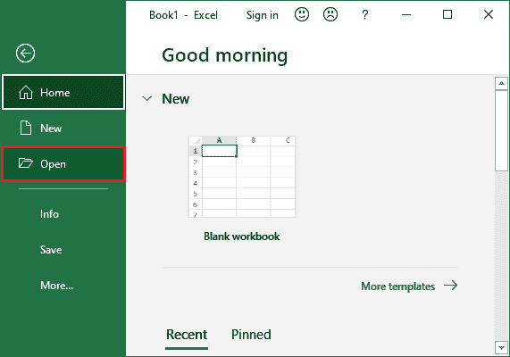

2.现在，微软 Excel 将允许我们从您的本地计算机或云存储(OneDrive)中打开一个现有文件，即最近的文件。

### 从本地存储打开现有文件

要从本地计算机打开现有文件，请单击此处的**浏览**按钮。

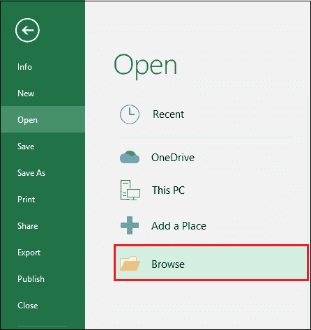

3.将出现“打开”对话框，您将导航到本地存储。找到并选择一个工作簿，然后单击“打开”。

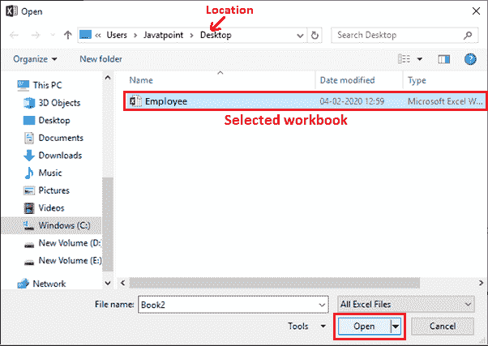

我们已经从桌面打开了名为**员工**的现有工作簿。

### 从云存储中打开现有文件

如果您的 Excel 文件存储在像 OneDrive 这样的云存储中，您可以通过以下简单步骤打开它:

1.在 Excel 后台视图中，点击**打开**，选择 **OneDrive** 云存储。

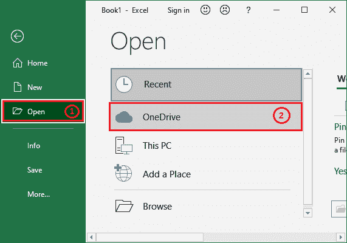

2.现在，如果您没有登录，请从这里登录到您的 OneDrive 帐户。

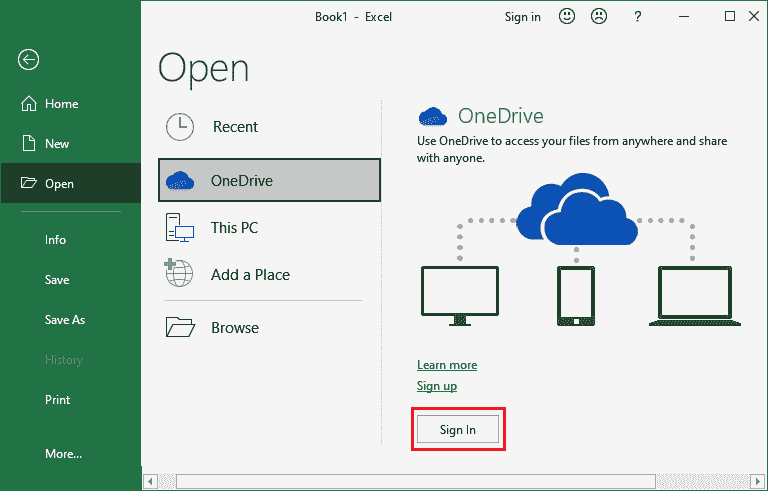

现在，打开存储在云存储中的现有文件。

#### 注意:如果我们最近打开了所需的工作簿，我们可以浏览最近的工作簿，而不是搜索文件。

### 从最近的文件中打开现有文件

Excel 在后台视图中启用“最近”文件夹。它暂时保留最近打开的文件。如果它有您想要的 Excel 文件，您可以通过以下简单步骤打开它:

1.在 Excel 后台视图中，点击**打开**，在**最近的**下查找您想要打开的已有文件

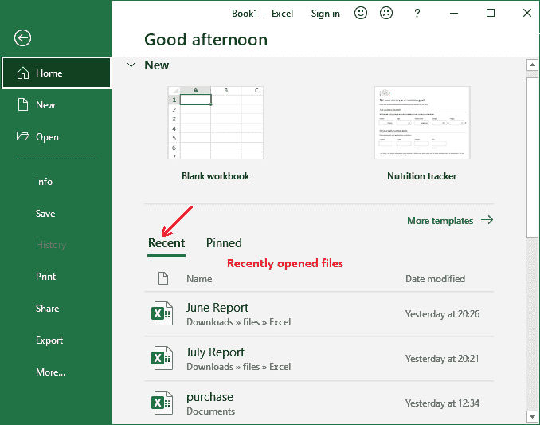

## 锁定工作簿

如果我们经常使用同一个工作簿，您可以将它固定在后台视图中以便快速访问。

1.导航到后台视图，然后单击打开。我们最近编辑的工作簿将会出现。

2.将鼠标放在我们想要锁定的工作簿上。工作簿旁边会出现一个图钉图标。单击图钉图标。

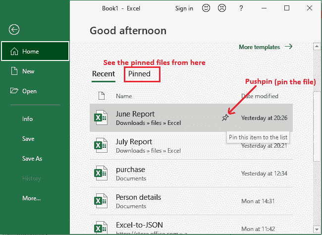

3.工作簿将保留在“最近使用的工作簿”中，或者您也可以在“固定”选项卡中找到它。要解开工作簿，只需再次单击图钉图标。

#### 注意:我们还可以将文件夹固定到后台视图，以便快速访问。在后台视图中，单击打开，然后找到我们想要锁定的文件夹，并单击图钉图标。

### 兼容模式

我们可能在旧版本的 Microsoft Excel 中创建了现有的 Excel 文件，例如 Excel 2003 或 Excel 2000。有时，我们需要对这些工作簿进行一些修改。当我们打开这类工作簿时，它们将出现在兼容模式下。

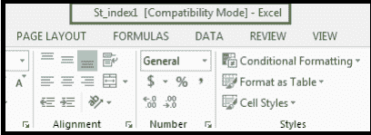

**兼容模式**禁用某些功能。**例如**，如果我们打开在 Excel 2003 中创建的工作簿，我们只能使用 Excel 2003 中可用的选项卡和命令。因此，我们只能访问用于创建工作簿的程序中的命令。

为了退出兼容性模式，我们需要将工作簿转换为当前版本类型。如果我们与刚刚创建早期版本的 Excel 的其他人合作，最好将工作簿保持在兼容模式，这样格式就不会改变。

### 转换工作簿

如果要访问当前版本的 Excel 的所有功能，可以将工作簿更改为该版本的文件格式。例如，将旧版本的工作簿转换为 2016 年的文件格式。

#### 请注意，转换数据可能会导致工作簿的原始布局发生一些变化。

按照以下步骤使旧文件与 Excel 版本兼容:

1.在 Excel 后台视图中，点击左侧面板的**信息**选项卡。

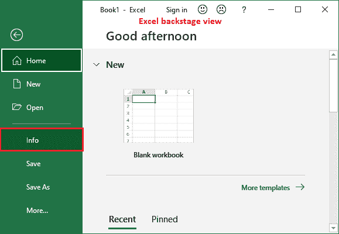

2.点击**检查问题**，然后点击**检查兼容性**选项。

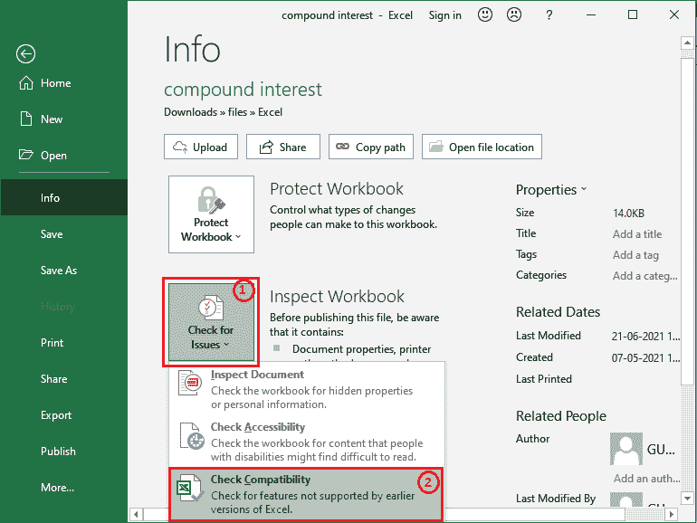

3.如果当前文件有任何兼容性问题，它将显示在这里。从这里选择一个首选的 Excel 版本，点击**确定**。

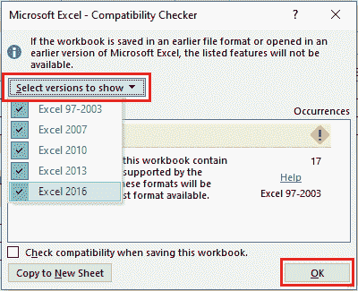

3.将出现另存为对话框。选择要保存工作簿的位置，输入演示文稿的文件名，然后单击“保存”。

4.工作簿将被更改为最新的文件类型。

## 保存和共享工作簿

每当我们在 Excel 中创建新工作簿时，我们都需要知道如何存储它，以便以后访问和编辑它。与以前版本的 Excel 一样，我们可以将文件本地保存到计算机中。但与旧版本不同的是，Excel 2016 还允许我们使用 OneDrive 将工作簿保存到云中**。**

此外，我们还可以直接从 Excel 导出工作簿并与其他人共享。

### 保存并另存为

Excel 提供了两种保存文件的方法:**保存**和**另存为**。这些选项的工作方式相似，但有一些重要的区别:

*   **保存:**当我们创建或编辑工作簿时，我们将使用保存命令保存我们的更改。我们大部分时间都会使用这个命令。
    当我们第一次保存文件时，只有那一次我们需要选择文件名和位置。之后，我们只需单击 Save 命令，以类似的名称和位置保存它。也可以使用 Ctrl+S 快捷键进行操作。
*   **另存为:**我们将使用此命令创建工作簿的副本，同时保留原始副本。当我们使用另存为时，我们需要为复制的版本提供不同的名称和/或位置。

### 保存工作簿的步骤

每当我们开始一个新项目或对现有项目进行更改时，保存工作簿是非常重要的。尽早、经常存钱可以防止我们的工作丢失。

1.在快速访问工具栏上找到并选择保存命令。

2.如果我们是第一次保存文件，“另存为”窗格将出现在后台视图中。在此选择一个位置，用新文件名保存您的文件。

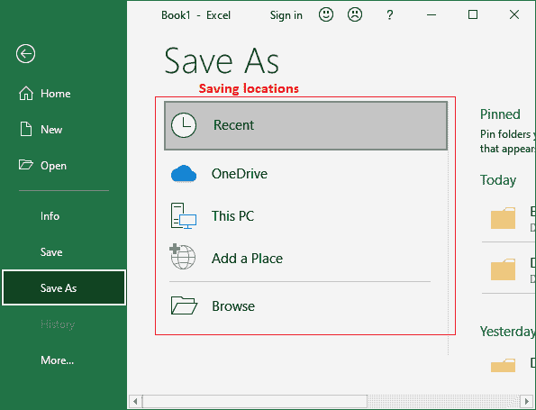

3.要将工作簿保存到我们的计算机，请单击此处的“浏览”按钮。或者，我们可以单击 OneDrive 将文件保存到您的 OneDrive。

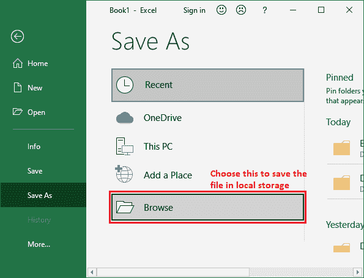

4.将出现**另存为**对话框。选择本地存储中我们要保存工作簿的位置。输入工作簿的**文件名**，然后点击**保存**。

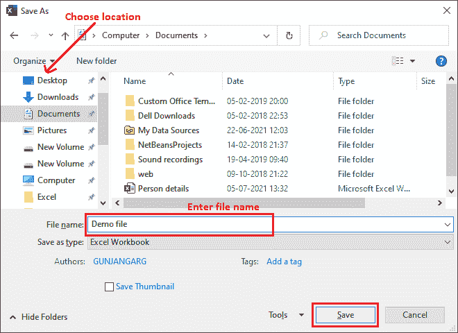

5.工作簿将被**保存**。我们可以再次单击保存命令( **Ctrl+S** ，在修改工作簿时保存我们的更改。

### 使用另存为制作副本

如果我们想保存工作簿的不同版本，同时保留原始版本，我们可以创建一个副本。**例如**，如果我们有一个文件名“**销售数据**，我们可以将其保存为“销售数据 2”，这样我们就可以编辑新文件，并且仍然参考原始版本。

在当前打开的文件上，在后台视图中选择**另存为命令**。然后按照相同的步骤操作，比如第一次存储文件时，我们需要选择保存数据的位置并给它一个新的文件名。

### 自动恢复

当我们处理工作簿时，Excel 会自动将它们保存到临时文件夹中。如果我们忘记保存更改，或者 Excel 崩溃，我们可以使用 Excel 自动恢复功能恢复文件。

**使用自动恢复**

1.打开 Excel 2016。如果找到自动保存的文件版本，将出现“文档恢复”窗格。

2.单击打开可用数据。工作簿将被恢复。

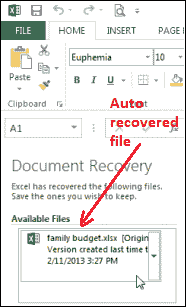

#### 注意:默认情况下，Excel 每 10 分钟自动保存一次。如果我们编辑工作簿的时间少于 10 分钟，Excel 可能不会开发自动保存版本。

如果我们没有看到我们需要的文件，我们可以从后台视图浏览所有自动保存的文件。只需转到**文件>信息>管理工作簿>恢复未保存的工作簿**。从这里，您可以设置所需的自动恢复选项。

### 导出工作簿

默认情况下，Excel 工作簿存储在。xlsx 文件类型。有时我们可能想使用另一种文件类型，如 PDF 或 Excel 97-2003 工作簿。从 Excel 导出各种文件类型的工作簿很容易。

**将工作簿导出为 PDF 文件**

将我们的工作簿导出为 Adobe Acrobat 文档，通常称为 PDF 文件，如果与没有 Excel 的人共享工作簿，会特别有帮助。PDF 可以让收件人看到，但不能编辑我们工作簿的内容。

1.单击文件选项卡创建后台视图。

2.点击**导出**，然后选择**创建 PDF/XPS** 。

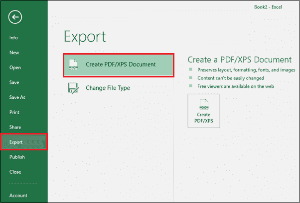

3.将出现另存为对话框。选择我们希望导出工作簿的位置，输入文件名，然后点击**发布**。

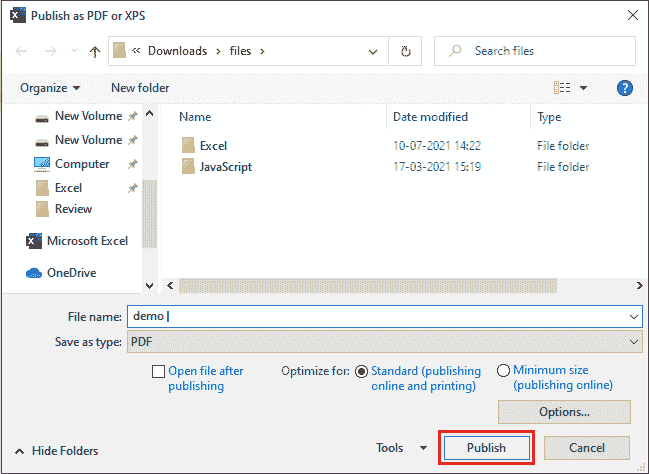

#### 注意:默认情况下，Excel 仅导出活动工作表。如果我们有多个工作表，并且希望将它们全部存储在一个类似的 PDF 文件中，请在“另存为”对话框中单击“选项”。将出现“选项”对话框。选择整个工作簿，然后单击确定。

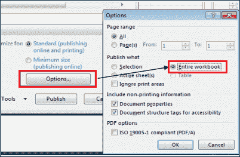

### 以其他文件类型导出工作簿

我们可能还会发现以其他文件类型导出工作簿很有帮助，例如，如果我们需要与使用旧版本 Excel 的人共享，则导出 Excel 97-2003 工作簿；如果我们需要纯文本版本的工作簿，则导出. CSV 文件。

1.  点击**文件**选项卡，创建后台视图。
2.  点击**导出**，然后选择**更改文件类型**。
3.  选择常用文件类型，然后点击**另存为**。
4.  将出现另存为对话框。选择要导出工作簿的位置，输入文件名，然后单击“保存”。

* * *