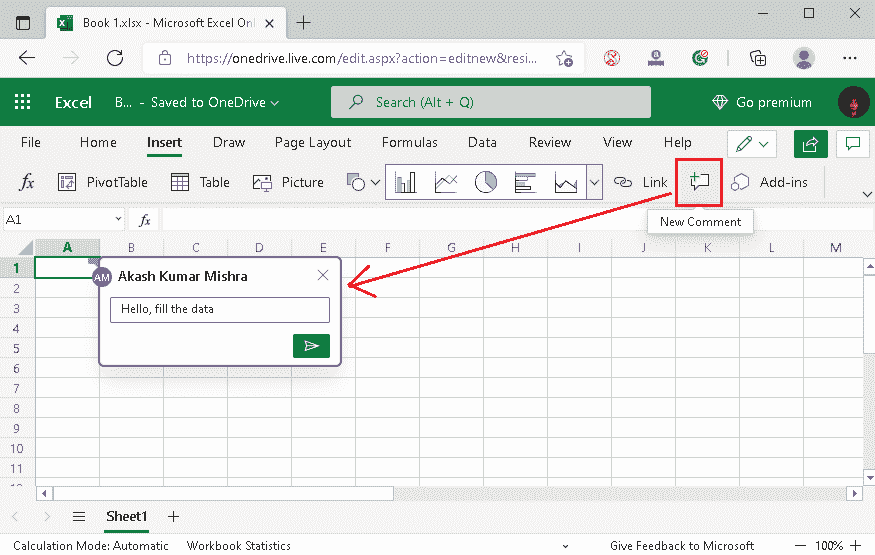

# 微软 Excel 在线

> 原文：<https://www.javatpoint.com/what-is-microsoft-excel-online>

说到组织海量的财务数据，MS Excel 是全球大多数人最早使用的电子表格软件之一。虽然 MS Excel 是一个功能强大的电子表格程序，但它也有一些局限性，主要包括:

*   它必须安装在设备上。
*   它在没有云支持的情况下离线工作。
*   它不允许协作。
*   必须购买等。

除此之外，还有另一个名为谷歌工作表的电子表格程序。Google sheets 没有上述任何限制。同样，微软开发了微软 Excel 程序的在线版本，以克服某些限制，并在竞争环境中保持更新。自微软开发以来，微软 Excel Online 迅速流行起来，并在许多组织中使用。因此，有必要了解 MS Excel Online 的基本概念，并有信心在上面工作。

## 什么是微软 Excel 在线？

MS Excel online 或 Microsoft Excel online 是 MS Excel 的升级版，附带 Office 365 软件包。顾名思义，它在线工作，允许用户将数据保存在云上(即 OneDrive)。虽然在线版不如 MS Excel 桌面版强大，但它具备了电子表格所需的所有基本功能。MS Excel Online 与 Google Sheets 非常相似，而不是桌面版的 MS Excel。

有了 MS Excel Online，Excel 不仅仅是一个桌面程序。相反，它是一个基于网络的电子表格工具。此外，该工具允许用户在不依赖任何特定平台的情况下处理电子表格。由于它完全基于网络，用户可以使用不同平台上的网络浏览器轻松访问它，如视窗、苹果、安卓等。微软在线 Excel 也被称为‘T0’Excel for web。

下图显示了空白工作表的初始界面，通常在我们创建新的电子表格或工作表时出现:

## 微软在线 Excel 的特点

以下是微软在线 Excel 的一些基本功能:

**免费使用** : MS Excel online 完全免费供个人使用，具备所有功能，用户可以将自己的文件保存在云上，最高可达 5GB。但是，要取消存储限制或将其用于商业目的，它必须购买微软 365 订阅。

**调查和投票** : MS Excel online 允许用户使用表单创建调查和投票。由于它是基于网络的版本，其他人可以在各自的调查/民意测验中分享他们的观点、反馈或答案。尽管如此，结果仍会显示给创建者进行进一步分析。它可以通过 OneDrive 访问。

**协作** : MS Excel 在线，可以让多个用户根据需要进行协作。用户可以使用“**共享**功能将其他人链接到现有的电子表格，并允许他们查看或编辑工作表中的数据。主持人或创建者仅管理权限(编辑和查看)。

**搜索** : MS Excel Online 允许用户使用顶部的搜索栏搜索任何特定的功能、快捷方式、动作等。用户还可以找到所需操作或功能的教程。

**链接工作簿** : MS Excel online 也支持**链接工作簿**功能。它主要帮助用户将可刷新的连接附加到保存在 OneDrive 上的其他工作簿。

**加载项支持**:网上有大量的 MS Excel 在线加载项。可以将外接程序添加到在线 Excel 中，以获得更多功能并更有效地使用该工具。

**备注**:备注可以用 MS Excel 在线插入到特定单元格中。它主要帮助一个人指示或通知其他团队成员对任何特定的单元采取某些行动。例如，假设团队领导想要获得任何结果的汇总分析报告。因此，领导者可以对特定的结果单元格进行注释，以告诉其他人使用图表创建分析报告。

**模板** : MS Excel online 有几个内置的即用模板，用户可以轻松导入想要的模板并进行相应的工作。模板在一定程度上有助于减少工作过程的时间。

## 微软在线 Excel 基础:理解用户界面

在讨论 Excel 在线的一些基本工作流程之前，我们必须先了解基本术语，以熟悉 Excel 在线用户界面。然而，它们类似于其他电子表格程序中使用的术语，包括微软 Excel 桌面和谷歌工作表。

让我们简单讨论一下:

**单元格**:单元格定义为任意工作表中的单个数据点。单元格通常由矩形框表示，由行和列的交点组成。由于电子表格包含几行和几列，因此它也包含几个单元格。电子表格中的每个单元格都由特定列的字母和行号构成的唯一地址表示。

例如，下图中有一个在线 Excel 中的单元格。这里，相应的单元格由行 1 和列 a 的交集形成。因此，它由单元格 A1 标识。

**行**:一行被定义为水平(从左到右)位于工作表中的一组单元格。每行都有其唯一的地址，并由一个特定的数字表示，从“1”开始。

下图，MS Excel 在线选中第 1 行。

**列**:列定义为工作表中垂直(从上到下)放置的一组单元格。每列都有其唯一的地址，并由一个特定的字母表示，从“A”开始。

下图，MS Excel 在线选择 B 列:

**范围**:范围定义为工作表中某些单元格的选择。

在下图中，b 列中选择了一些单元格(从 B1 到 B6)。因此，该范围表示为 B1:B6，如单元格地址框中所示。

**电子表格标题**:标题只不过是任何工作表的指定名称。当我们在 Excel online 中创建新工作表时，它通常使用与随机数相关联的默认名称“Book”，例如 Book 1、Book 2、Book 3…等等。

在下图中，电子表格标题位于电子表格界面的顶部:

Excel Online 会自动将当前更改保存到 OneDrive 上的现有文件中。此外，它还在电子表格标题旁边显示通知文本，通知用户工作表的更改。

除此之外，用户可以点击通知文本来查看工作表中所做更改的详细版本历史，以及进行相应更改的人员的姓名。

**工具栏菜单**:工具栏菜单定义为电子表格标题下方的水平区域，包含多个带有 Excel 命令的选项卡。可以通过点击特定的选项卡来访问这些命令。

在下图中，工具栏菜单在 Excel online 中表示:

**快捷工具栏**:快捷工具栏是顶部的另一个水平区域，包含常用的快捷选项。通常，它包括字体样式、字体大小、字体颜色、文本对齐等命令。

工具栏菜单下方有一个快捷工具栏，如下图所示:

**公式栏**:公式栏是用户可以应用、输入或更改工作表中所选单元格的数据、函数和公式的地方。用户还可以通过选择相应的单元格来查看公式栏中任何特定单元格上应用的函数。

公式栏位于快捷工具栏下方，由符号“fx”表示，如下所示:

**工作表工具栏**:工作表工具栏通常允许用户管理工作簿中的工作表相关选项。使用此功能，用户可以根据需要插入、重命名和删除图纸。它位于窗口的底部，如下所示:

可以通过在图纸名称上单击鼠标右键来访问图纸选项。

**功能** : MS Excel online 拥有广泛的内置功能，有助于对单元格中的数据执行不同的操作。使用这些函数，用户可以轻松计算值、操作数据、快速获得结果等等。通过导航到**插入>功能**可以访问这些功能。

除此之外，公式还被定义为函数、单元格、范围和运算符的组合，用于通过计算某些值来获得结果。

**工作表/工作表**:工作表或工作表定义为工作簿中包含行和列的单页。它通常代表工作簿中的主要工作区域。

**工作簿/电子表格**:工作簿/电子表格定义为包含一个或多个工作表的文档或文件。

## 在线使用微软 Excel

在我们熟悉了 MS Excel 在线的基本术语和领域后，我们必须了解如何执行基本任务。

让我们讨论一些基本的事情:

### 在线启动微软 Excel

在线推出 MS Excel 有多种方法；但是，最简单、最常用的方法是使用 Excel 的官方网站进行 Web。该方法包括以下步骤:

*   首先，我们需要推出一个像谷歌 Chrome、火狐等浏览器。然后，我们必须导航到以下链接:
    链接:[https://www.office.com/launch/excel](https://www.office.com/launch/excel)
    T4】
*   接下来，我们需要使用微软帐户登录。如果我们没有微软账户，我们可以很容易地免费创建一个。而且我们之前已经登录过，登录信息还保存着，会自动重定向到 Excel 在线的首页。这看起来像下图:
    
    主页还显示了一些内置的 Excel 模板。

### 创建新工作簿

创建新工作簿或电子表格是从 Excel 在线主页一键操作的过程。我们只需点击**加号(+)** 或带有文本“**新空白工作簿**的图块，即可创建一个新的空白工作簿。此选项主要用于从零开始创建所需的格式和数据。

我们还可以选择所需的内置模板，开始处理一些保存的格式和样本数据。Excel online 包含许多现成的模板，我们可以通过点击“**更多模板**”按钮从模板库中选择。

### 命名/重命名工作簿

一旦我们创建了一个新的工作表，Excel 会自动为其指定一个默认名称。如果我们想将其更改为所需的名称，我们必须从窗口顶部单击默认名称，如下所示:

单击默认名称后，我们将获得为工作簿输入所需名称的选项。

我们也可以通过导航到**文件>另存为>重命名**来更改电子表格的名称或标题。

### 打开现有工作簿

在微软 Excel 中也可以在线打开现有的工作簿/电子表格。为此，我们必须导航到**文件>打开**。但是，该选项不允许我们从设备打开文件。相反，它只能让我们从 OneDrive 打开任何特定的电子表格。

因此，如果我们想从本地设备打开任何文件，我们必须首先在 OneDrive 上上传它。然后，我们可以在线在 Excel 中打开它，根据需要工作。

### 向工作表添加数据

创建工作簿后，工作表将显示在屏幕上。在这里我们可以输入想要的数据。首先，我们需要选择一个特定的单元格，然后在其中键入内容。一旦我们完成了所需内容的输入，我们必须按下“输入”按钮来注册数据并移动到下一个单元格。

选定单元格的内容也可以在公式栏中查看。

#### 注意:Excel 在线还允许我们将数据直接剪切、复制、粘贴、拖放到工作表中。但是，它不支持“导入”功能，限制了我们直接从其他电子表格导入数据。

### 删除工作表中的数据

我们可以像其他电子表格程序一样，轻松删除所需单元格中的内容。为此，我们首先需要选择相应的单元格或多个单元格，然后按下“**删除**按钮。这样做将删除选定单元格或区域中的内容。

或者，我们可以使用快捷键“**”Ctrl+Z**”删除最近添加的数据或撤消我们执行的最后一步。

### 格式化工作表中的数据

将内容插入工作表后，我们可能需要格式化数据，使其更有吸引力或信息更丰富。大多数基本格式选项位于“**主页**选项卡下。

### 在工作表数据中应用函数

和其他电子表格程序一样，Excel online 也支持函数。我们可以在一个空单元格中直接插入带有等号(=)的期望函数，得到相应的结果。

让我们通过一个使用 SUM 函数的例子来理解:

假设我们分别在单元格 A1 和 B1 中键入值 5 和 8。之后，我们在 C1 单元中应用求和函数，如 **=SUM(A1，B1)** 。应用求和功能后，我们需要按下“**进入**键。通过这样做，Excel 显示单元格 C1 中 A1 和 B1 单元格的值之和，即 13。

这就是我们如何在线在 Excel 中插入想要的函数。但是如果不记得需要的功能，可以通过**插入>功能**找到。

### 打印工作表

Excel online 还使用户能够直接从网络浏览器打印表单，而无需将其保存到设备中。为此，我们需要在线给 Excel 下达打印命令。更具体地说，我们必须导航到**文件>打印**。

选择打印选项后，我们需要根据需要配置打印首选项。这通常包括页面设置、方向、布局、纸张大小、打印机等。完成所有设置后，我们需要点击**打印**按钮来完成打印过程。

### 保存工作表

微软在线 Excel 有一个自动保存功能，因此，所有的更改都会自动保存在一个驱动器上。此外，在线电子表格还允许我们在设备上本地保存所需的电子表格。为此，我们需要执行以下步骤:

*   首先，我们需要从 OneDrive 打开一个特定的电子表格。电子表格打开后，我们必须导航到**文件>另存为**。
    T3】
*   在下一个屏幕上，我们将看到几个选项，包括下载按钮。必须注意的是，在线 Excel 不允许我们将电子表格保存为几种格式。相反，它只允许我们下载一份电子表格作为 XLSX 和 ODS。
    

#### 注意:默认情况下，我们使用 MS Excel Online 创建或处理的任何工作表都会自动保存在 Microsoft OneDrive 上。因此，我们也可以随时从那里打开或启动特定的文件。

## 微软 Excel 在线快捷键

和 MS Excel 桌面一样，MS Excel online 也支持多种快捷键，可以让用户在短时间内完成相应的任务。使用快捷键，用户通常会删除相应操作或工作流程的两个或多个步骤。

虽然微软 Excel 支持多种快捷方式，但下表显示了最常用的 Excel 在线快捷键，包括相应的操作:

| 快捷键 | 行动 |
| Alt + Shift + A | 要启动快捷方式对话框窗口 |
| Shift + F10 | 要显示上下文菜单 |
| Alt + Windows，或 | 在 Excel 应用程序中打开现有文件 |
| Alt + Windows，w | 要打开“视图”选项卡 |
| Alt + Windows，r | 要打开“审阅”选项卡 |
| Alt + Windows，A | 要打开“数据”选项卡 |
| Alt + Windows， N | 要打开“插入”选项卡 |
| Alt + Windows，h | 要打开“主页”选项卡 |
| Alt + Windows，f | 要打开文件选项卡 |
| 进入 | 要完成单元格输入并移动到下面的单元格 |
| 转义字符 | 取消输入 |
| 删除 | 要清除选定的单元格 |
| Alt + Enter | 要在选定单元格中开始一行 |
| Ctrl + Z 组合键 | 若要撤消更改 |
| Ctrl + Y | 要重做更改 |
| 控制 + C | 复制所选内容 |
| 控制 + X | 剪切所选内容 |
| 控制 + V | 从剪贴板粘贴复制的内容 |
| 控制 + Alt + V | 启动“选择性粘贴”对话框 |
| Shift + F11 | 插入新工作表 |
| 控制 + K | 插入超链接 |
| Ctrl + L | 插入表格 |
| Alt + F1 | 要插入图表 |
| Ctrl + O | 要打开工作表 |
| 控制 + P | 要打印工作表 |
| Alt + F2 | 要启动“另存为”对话框 |
| 控制 + F | 选择“查找”选项卡，启动“查找和替换”对话框 |
| 控制 + H | 选择“替换”选项卡，启动“查找和替换”对话框 |
| 控制 + F7 | 拼写检查 |
| Shift + F2 | 插入注释 |
| Ctrl +空格 | 要选择整个列 |
| 移位+空格 | 要选择整行 |
| Ctrl + A | 要选择工作表中的所有单元格 |
| Ctrl + Shift + L | 打开选定单元格的过滤选项 |

## 微软 Excel 在线文件扩展名

说到在线打开微软 Excel 中的文件，它支持所有流行的电子表格文件扩展名，比如微软 Excel 桌面版本。但是，Excel 桌面的一些高级功能可能并不总是在 Excel 在线上工作。

除此之外，Excel online 不允许用户直接从设备打开现有的 Excel 文件。相反，用户必须首先将相应的 Excel 文件上传到 OneDrive，然后使用 Excel 在线打开它们。

以下是一些最流行的文件扩展名，可以在微软 Excel 在线打开:

| 文件扩展名 | 文件格式 |
| 电子表格文档 | 微软 Excel 的工作簿文件(97-2003) |
| 文件格式 | Excel 工作簿 |
| XLSM(消歧义) | Excel 启用宏的工作簿 |
| 模板 | Excel 模板文件(97-2003) |
| XLTX(数据传输协议) | Excel 模板 |
| XLTM | Excel 启用宏的模板 |
| 过量毒品 | 打开文档电子表格 |
| 超文本标记语言 | 超文本标记语言文件 |
| 拉环 | 制表符分隔的文本或数据文件 |
| TSV | 制表符分隔的值 |
| 战斗支援车 | 逗号分隔值 |
| 文本文件（textfile） | 文本文件 |

另一方面，MS Excel 在线只允许用户保存/下载 **XLSX** 扩展名和 **ODS** 扩展名的电子表格文件。要保存在其他扩展中，用户必须使用 Excel 桌面版或在线转换工具(如 **Zamzar、Online2pdf、Convertio、**等)转换下载的文件。Excel 桌面版允许在“**另存为**命令的帮助下保存不同文件类型的文件，而在线转换器会自动将所选文件转换为所需的格式。

* * *