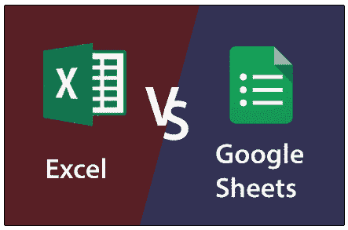
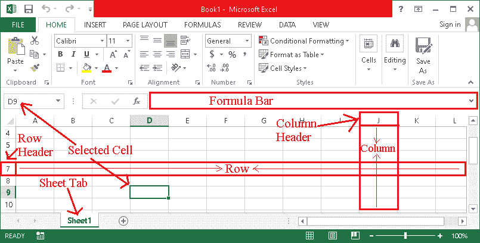
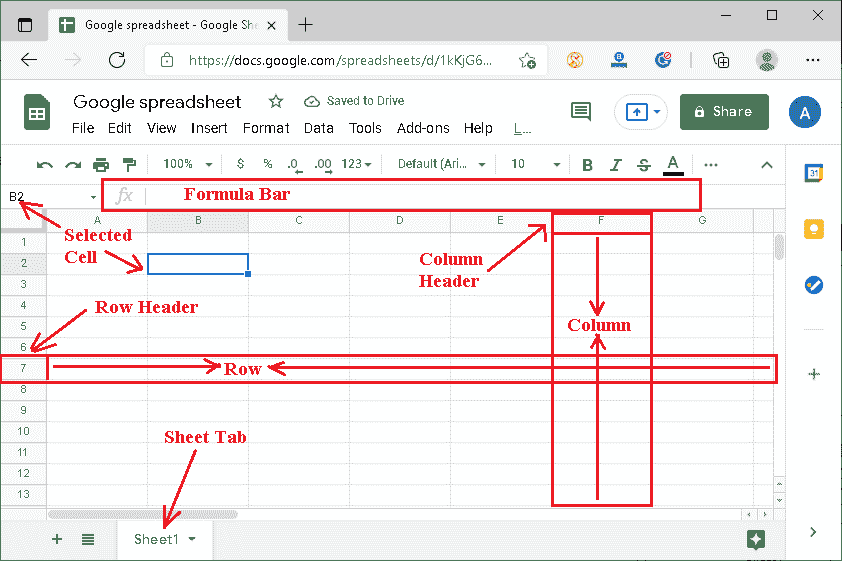

# Excel 与谷歌工作表

> 原文：<https://www.javatpoint.com/excel-vs-google-sheets>

组织数据或跟踪数据和列表是许多企业、公司和组织中最常见的任务之一。尽管许多软件声称可以将信息组织成整洁干净的电子表格，但微软的 Excel 和谷歌的 sheets 是两个最受欢迎的程序/工具。

Excel 和 Google sheets 都是功能强大的电子表格工具，具有不同的功能。尽管这些电子表格程序中的许多功能是相似的，但 Excel 和 Google Sheets 之间还是有很大的不同。

本文讨论了 Excel 和 Google sheets 的本质区别，这将有助于我们了解每个软件的价值。此外，这将帮助我们在 Excel 和电子表格之间选择合适的电子表格软件。

让我们首先理解这两个定义:

## 什么是 MS Excel？

[MS Excel](https://www.javatpoint.com/excel-tutorial) 或微软 Excel 是一个功能强大的电子表格程序，与 MS Office 软件包一起安装。Excel 主要将数据存储在表格中，表格由几行几列组成。此外，用户还可以对存储的数据应用内置公式或函数，以获得所需的输出/结果。应用的公式或函数显示在公式栏上。

微软 Excel 是一个方便的程序，用于各种与数据相关的任务和报告，如制作工资单或工资条，计算每周费用，会计等。尽管如此，在数据排序和过滤的交互支持下，查找任何信息都很容易，允许用户根据各种标准对数据集应用规则。

下图表示 MS Excel 工作表的主界面，这是我们在创建新的 Excel 工作表时第一次看到的典型屏幕:

### 优势

*   高级功能
*   响应/快速
*   广泛的数据可视化选项
*   不需要互联网(Excel 2016 和以前的版本)
*   无限存储
*   广泛的公式和函数
*   高度可定制

### 不足之处

*   不同的版本存在版本兼容性问题
*   昂贵的完整版本支持
*   没有干净的修订历史

## 什么是谷歌表单？

[Google sheets](https://www.javatpoint.com/google-excel-spreadsheet) 是谷歌开发的另一款流行的电子表格程序。然而，这个特殊的程序与微软 Excel 略有不同。谷歌表单像典型的网页一样与网络浏览器一起工作，并将数据保存在云上，例如谷歌硬盘。Google Sheets 还帮助用户将数据存储在 MS Excel 等表格中，并执行各种数据集相关任务。

Google Sheets 目前被认为不是执行复杂任务或处理大量数据的合适程序/工具。与微软 Excel 相比，它相对较新，也缺乏许多高级功能。相反，该工具有一些优秀的特性，例如它是免费的，有助于团队协作、云支持、脚本等。这在某种程度上使谷歌表单成为微软 Excel 的真正竞争对手。

下图表示 Google sheets 的主界面，这是我们在创建新工作表时第一次看到的典型屏幕:

### 优势

*   使用方便
*   免费使用
*   内置实时修订历史记录，支持聊天
*   出色的可见性和与谷歌的严格集成
*   更好的共享支持，没有版本兼容性问题
*   支持广泛的附加组件和谷歌其他产品

### 不足之处

*   随着大量的数据变得缓慢
*   支持有限的公式和函数
*   数据可视化和定制的选项有限

## Excel 和谷歌工作表的主要区别

以下是微软电子表格和谷歌表格之间的一些主要区别:

*   微软办公套件包含微软 Excel，而谷歌工作表是谷歌套件(谷歌套件)的一部分。
*   MS Excel 价格昂贵，其最新版本(Office 365 Excel Online)根据用户的选择收取月费或年费。此外，谷歌床单是完全免费的个人使用，只需要一个谷歌账户。
*   微软 Excel 支持超过 400 个函数/公式，而谷歌工作表的选项有限。
*   MS Excel 可以高效地处理复杂的任务和大型数据集。另一方面，Google sheets 更适合基本操作和小数据集。
*   MS Excel(Office 365 除外)没有协作功能，它要求用户先保存自己的文件，再与他人发送/共享。另一方面，谷歌表单是一个完全基于网络的工具，因此，它允许用户与其他人共享表单，并实时协同工作。
*   数据分析在微软 Excel 中更直接有效，因为它可以处理大量的数据。此外，谷歌工作表通常不是为数据分析而制作的。相反，它是为执行基本电子表格任务而开发的数据输入工具。
*   MS Excel 最适合大型公司或企业。相比之下，谷歌表单最适合自由职业者、学生和小公司。

## Excel 和谷歌工作表的主要区别(对比图)

Excel 和 Google Sheets 之间的主要区别可以通过下面的对比图更清楚地解释:

| 因素 | 电子表格 | 谷歌表格 |
| **成本系数** | MS excel 比较贵，用户必须购买整个 Office 套件才能使用 MS Excel。 | Google sheets 目前免费供个人使用，对于商务用户来说成本几乎可以忽略不计。 |
| **安装** | 微软 Excel 必须与办公套件一起安装在设备上。然而，Office 365 自带在线支持，允许用户在网络浏览器上使用 Excel。 | 谷歌表单不需要任何安装，完全可以与网络浏览器一起工作。 |
| **由**开发 | 微软 Excel 是由微软公司开发的。 | 谷歌床单是由谷歌有限责任公司开发的。 |
| **于**启动 | 微软 Excel 最初于 1987 年推出。 | 谷歌表单(作为谷歌套件的一部分)最初于 2006 年推出。 |
| **云支持** | MS Excel 脱机工作。Office 365 是唯一支持微软在线 Excel 的版本。它使用 Dropbox(也称为“微软 Dropbox”)来存储数据。 | 谷歌工作表使用驱动程序(也称为“谷歌驱动程序”)来存储数据。 |
| **协作** | 在 Office 365 之前，没有其他 Office 套件版本允许用户共享 MS Excel 数据与其他人协作。 | Google sheets 在线工作，支持协作。它允许多人实时处理同一个文件。 |
| **统计分析&可视化** | Excel 在统计分析和可视化方面优于谷歌工作表和其他电子表格软件，因为它具有广泛的内置公式和功能。 | 虽然谷歌工作表有许多内置公式，但这个特殊的工具不如 Excel 强大。它也不允许用户自动创建流程图或甘特图等图表。 |
| **宏支持** | MS Excel 允许用户录制宏或使用 VBE。 | Google Sheets 还允许用户录制宏；但是，它不使用 VBE。相反，它使用谷歌应用程序脚本。 |
| **复杂性** | 对于某些用户来说，微软 Excel 可能有点复杂，因为它有广泛的功能和高级功能。 | 谷歌表单有一个简单的用户界面，带有基本的电子表格功能。 |
| **巨大的数据兼容性** | MS Excel 对海量数据或大型数据集非常有效。用函数执行操作或操纵数据可以很容易地执行。 | Google sheets 最适合小型数据集。然而，除非该设备与高端硬件组装在一起，否则它可能会变得缓慢，甚至卡在大量数据中。 |
| **聊天支持** | 微软 Excel 不提供聊天支持，因为它离线工作。然而，Office 365 是一个附带聊天支持的选项，可以帮助用户在在线使用微软 Excel 时进行连接。 | Google Sheets 提供聊天支持，帮助用户在工作时高效联系。 |
| **功能可用性** | MS Excel 支持 400 多种不同类别的功能。 | Google sheets 的功能可用性相对有限。 |
| **前进** | Excel 具有高级功能，允许用户执行与电子表格相关的所有所需任务。 | 谷歌工作表没有微软 Excel 这样的高级功能。然而，它是执行几乎所有基本任务的有效工具。 |
| **输出格式** | MS Excel 允许用户将文件保存为 20 多种格式，包括 XLSX、CSV、PDF、ODS、HTML 等流行类型。 | 虽然 Google sheets 可以打开各种文件类型，但用户只能将其保存为六种文件格式。这通常包括 XLSX、ODS、PDF、HTML、CSV 和 TSV。 |
| **版本兼容性** | 微软 Excel 有不同的版本。有时，用一个版本的 Excel 创建的文件在另一个版本的 MS Excel 中无法正常工作。这在某种程度上造成了版本不兼容。 | 谷歌表单没有任何兼容性问题，因为所有用户只有一个版本。同样，更新会同时提供给所有用户。 |
| **附加功能** | 网络上有许多附加组件或扩展可以安装并与 Excel 链接，以包含/扩展更多功能。 | 谷歌表单目前对插件的支持非常有限。 |
| **细胞量子** | MS Excel 的工作表中大约有 170 亿个单元格。 | Google sheets 最多包含大约 200 万个单元格。 |
| **快捷方式可用性** | 微软 Excel 有广泛的键盘快捷键支持，允许用户高效地执行大多数任务。 | Google Sheets 支持键盘快捷键，但快捷键有限。另一方面，与微软 Excel 相比，谷歌工作表支持更少的键盘快捷键。 |
| **定制** | 微软 Excel 是高度可定制的。功能区上的所有快捷方式都可以按照要求进行管理。 | 谷歌工作表的定制选项有限，与 Excel 相比几乎可以忽略不计。 |
| **自动化** | 通过 Excel 中的 VBA，大多数任务都可以实现自动化。 | 通过谷歌表单中的脚本可以实现自动化。 |
| **支持的语言** | 微软 Excel 正式提供近 91 种不同的语言版本。 | Google sheets 正式提供近 83 种语言版本。 |

## MS Excel 和 Google sheets 哪个最好？

在 MS Excel 和 Google sheets 之间找到最好的电子表格工具主要看需求。一个用户可能需要微软 Excel，另一个用户可能需要谷歌表单。这两种工具都有其优点和局限性。

特别是，如果用户需要做基本的电子表格工作，谷歌工作表是一个很好的选择。此外，它是免费的，不强制用户安装任何软件或附加组件。此外，对于处理大量数据和应用复杂功能的高级用户来说，微软 Excel 是一个很好的选择。

* * *