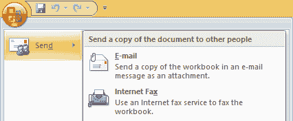

# Excel 中的办公按钮

> 原文：<https://www.javatpoint.com/office-button-in-excel>

微软 Excel 是微软办公套件中最受欢迎的电子表格软件程序之一。但是，Office 套件也有一些其他热门产品，如 Word、PowerPoint 等。为了使所有这些软件对用户友好，并在界面上有效地相似，微软试图使其所有产品的用户界面非常相似，允许用户轻松找到命令和工具。包括 Excel 在内的所有 Office 2007 产品界面中的一个常见选项是 Office 按钮。

本文讨论 Excel 中的 Office 按钮(也称为 Microsoft Office 按钮)。文章还详细介绍了 office 按钮中的所有选项及其功能。

## 什么是 Excel 中的办公按钮？

办公按钮是微软办公套件 2007 的一个实验性功能。所有 Office 2007 产品(如 Word、Excel、PowerPoint 等。)在活动窗口中有一个公共按钮，名为 Office Button。因为它也存在于电子表格中，所以在使用电子表格时，我们称它为电子表格中的办公按钮，或者参考与微软电子表格相关的按钮。

在 MS Excel 2007 和其他 Office 2007 产品中找到的 Office 按钮如下所示:

#### 注意:需要注意的是，Office 按钮仅在 Office 2007 产品中可用。这意味着 Office 按钮仅在 Excel 2007 中存在。后来，Office 按钮在 Office 2010 中被弃用，此后在 Excel 2010 和更高版本中不再可用。但是，“文件”选项卡下提供了“办公室”按钮中的选项。

## Excel 中的 Office 按钮在哪里？

当我们打开 Excel 2007 程序时，我们会在 Excel 窗口的左上角看到一个 Office 按钮。该按钮附着在功能区上，由一个包含 Office 徽标的圆圈标识。

位于微软 Excel 2007 左上角的办公按钮如下:

微软 Excel 办公按钮的主要功能是什么？

在 Excel 和其他 Office 2007 产品中，Office 按钮的主要功能是帮助用户使用快捷方式立即执行常用操作。office 按钮提供了许多有用的选项，帮助我们轻松地打开、保存和打印任何工作簿。此外，我们可以轻松访问 Excel 选项，并根据我们的选择直接从办公室按钮立即配置它们。

## Excel 办公按钮菜单选项

当我们单击 Excel 中的“办公”按钮时，我们会得到以下菜单选项:

### 新的

“办公”按钮菜单中的“**新建**”选项主要显示“新建工作簿”对话框，我们可以在其中选择创建空白工作簿/电子表格或使用微软现有的任何模板。

### 打开

“办公”按钮菜单中的“**打开**”选项显示“打开”对话框，使用该对话框，我们可以从电脑中选择并打开任何特定的 excel 文件。

### 救援

“办公室”按钮菜单中的“**保存**”选项可帮助我们将更改保存到活动工作簿中。此选项通常会将临时数据保存到当前文件中以备将来使用，即使在相应的文件关闭后也是如此。此外，如果在新创建的电子表格中第一次使用“保存”选项，它将启动“另存为”对话框，这是菜单列表中的下一个选项。

### 另存为

Office 菜单中的“**另存为**”选项会显示“另存为”对话框，帮助我们将活动文件的副本以所需的文件格式和所需的文件名保存在所需的位置。

当将鼠标光标移动到“另存为”选项或单击该选项时，我们还会获得一些选项。它们是:

*   **Excel 工作簿**:如果点击该选项，会出现‘另存为’对话框，默认文件类型选择为‘Excel 工作簿(。xlsx .)。这种文件类型可以包含除宏之外的所有典型电子表格对象，并且适合导入到其他相关的电子表格软件。
*   **Excel 启用宏的工作簿**:如果点击该选项，会出现一个“另存为”对话框，默认文件类型选择为“Excel 启用宏的工作簿(。xlsm)'。这种文件类型可以包含宏。
*   **Excel 二进制工作簿**:如果点击这个选项，会出现一个‘另存为’对话框，默认文件类型选择为‘Excel 二进制工作簿(。xlsb .)。这种文件类型可以用宏处理大量数据，但不适合导入其他相关的电子表格软件。
*   **Excel 97-2003 工作簿**:如果点击这个选项，会出现一个‘另存为’对话框，默认文件类型选择为‘Excel 97-2003 工作簿(。xls .)。此文件类型类似于 Excel 工作簿(。xlsx)，但它适用于旧版本的 Excel，如 Excel 2003 及更早版本。
*   **查找其他文件格式的加载项**:如果我们点击这个选项，我们会得到一些扩展，包括对 Excel 中没有提供的其他文件格式的支持。

它主要涉及最常见的电子表格文件格式，以帮助我们立即保存活动工作簿。但是，我们可以选择“**其他格式**”来显示“另存为”对话框或获取所有支持格式的列表。

### 打印

“办公”菜单中的“**打印**”选项可帮助我们在已连接的打印机的帮助下在纸上打印当前电子表格的硬拷贝。此外，我们还可以将活动文档的副本保存为可移植文档格式(PDF)。

当将鼠标光标移到“打印”选项上或单击该选项时，我们还会得到一些选项。它们是:

*   **打印**:如果点击这个选项，会出现一个‘打印’对话框，调整一些常用的参数进行打印。例如，打印份数、默认打印机、页面方向等。
*   **快速打印**:如果点击此选项，Excel 直接命令系统使用最近使用的设置或默认设置打印活动表。
*   **打印预览**:如果我们点击这个选项，Excel 会显示打印预览窗口，在这里我们可以看到将要打印在纸上的文档的数字视图。

### 准备

Office 菜单中的“**准备**”选项可以帮助我们准备当前的电子表格进行分发。这意味着我们可以根据自己的选择查看或修改电子表格的属性。此外，我们可以使用此选项检查活动工作簿的隐藏元数据和其他个人信息。

当将鼠标光标移到“准备”选项上或单击该选项时，我们还会得到一些选项。它们是:

*   **属性**:如果我们点击这个选项，Excel 会给我们显示属性窗口来查看或配置参数(如工作簿标题、作者姓名、关键词等)。)用于电子表格。此选项仅与工作簿的属性严格相关，与 Excel 无关。
*   **检查文档**:如果我们点击这个选项，Excel 会给我们显示‘文档检查器’对话框。该选项主要帮助我们检查(查找)和删除当前工作簿中的隐藏数据或任何个人信息。
*   **加密文档**:如果我们点击这个选项，Excel 会给我们显示‘加密文档’对话框，配置一个密码，让我们的工作表免受未经授权或不想要的人的攻击。
*   **添加数字签名**:如果我们点击这个选项，Excel 会显示一个‘签名’对话框。这个选项主要帮助我们插入一个数字签名来声明电子表格的所有权。
*   **标记为最终**:如果点击此选项，Excel 会将活动工作簿标记为最终，并相应保存。此选项主要用于电子表格中不需要进一步更改或修改的情况。特别是，该选项使电子表格成为只读且不可编辑的。
*   **运行兼容性检查器**:如果我们点击这个选项，Excel 会给我们显示一个‘兼容性检查器’对话框。使用此选项，我们可以在新版本中使用旧版本的 Excel 工作簿，反之亦然，以防止永久数据丢失或不正确的功能。

### 发送

Office 菜单中的“**发送**”选项可以帮助我们直接通过 Excel 程序与他人共享当前的电子表格文档。我们不需要保存后再发给别人。Excel 在“发送”命令下提供了多种共享选项。该选项后来在 Office 2010 中被重命名为“保存并发送”。

当将鼠标光标移动到“发送”选项或单击该选项时，我们还会获得一些选项。它们是:

*   **电子邮件**:如果我们点击这个选项，Excel 会给我们显示一个‘电子邮件’对话框，我们可以选择通过网络将当前电子表格的副本作为电子邮件附件发送。Excel 通常提供两个选项来将活动工作簿附加到电子邮件中。我们可以将当前文档附加为 PDF 或 XPS。
*   **互联网传真**:如果我们点击这个选项，Excel 使我们能够使用互联网传真服务，并根据需要传真电子表格。然而，这个特性不再有用了。

### 出版

“办公室”菜单中的“**发布**”选项使我们能够将当前的电子表格分发给网络上的人。此外，我们还可以使用电子表格的内容创建一篇博客文章，并相应地共享它。

当将鼠标光标移动到“发布”选项或单击该选项时，我们还会获得一些选项。它们是:

*   **文档管理服务器**:如果点击这个选项，会出现一个‘另存为’对话框，默认位置为‘我的网上邻居’保存对应的电子表格。
*   **创建文档工作区**:如果我们点击此选项，Excel 会启动文档管理任务窗格，为电子表格创建一个站点，并在整个系统中同步其副本。

### 关闭

“办公”按钮菜单中的“**关闭**”选项帮助我们关闭当前在 Excel 中打开的电子表格或工作簿。

### Excel 选项

Office 按钮菜单中的“ **Excel 选项**”按钮可帮助我们配置或修改 MS Excel 程序的设置/首选项。通过使用这个，我们可以相应地定制整个 Excel。

### 退出 Excel

“办公按钮”菜单中的“**退出 Excel** ”按钮帮助我们退出 Excel 程序。这意味着我们可以一次关闭所有打开的电子表格/工作簿，包括 Excel 本身。

* * *