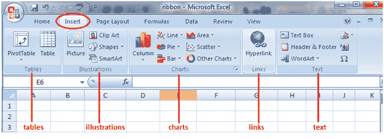

# Excel 中选项卡的功能

> 原文：<https://www.javatpoint.com/features-of-the-tabs-in-excel>

功能区旨在帮助快速查找 Excel 命令以完成任务。这些命令在逻辑组中组合在一起，这些逻辑组在选项卡下收集在一起。

每个选项卡都与特定的活动相关，例如页面布局或视图。有些选项卡只在需要减少屏幕上的混乱时出现。这些标签被称为**上下文**标签。

与使用 Excel 工作簿内容相关的命令在组成组的选项卡上表示为按钮。打开 Excel 时**首页**标签默认激活。在每个选项卡中，除了**文件**选项卡，按钮被组织成组。在某些组中，可能最常用的按钮比其他按钮大。

点击位于命令组右下角的**对话框**或**任务窗格启动器**按钮，可以访问不太常见的命令。

在 Microsoft Excel 的功能区中，有许多选项卡可用，如“主页”、“插入”、“页面布局”、“公式”、“数据”、“审阅”和“视图”，每个选项卡都有不同的功能。

### 主页选项卡

excel 主页选项卡用于执行常规指令，如粗体、下划线、复制和粘贴。它还用于将格式应用于工作表中的单元格。它包含剪贴板、字体、对齐、数字、单元格和编辑。

**1。剪贴板:**此剪贴板组主要用于剪切复制和粘贴。这意味着，如果您想将数据从一个地方传输到另一个地方，那么您有两个选择，要么是 COPY(将数据保留在原始位置)，要么是 CUT(从原始位置删除数据)。

*   有**选择性粘贴**选项，表示以所需格式复制。
*   并且还有**格式画师** Excel，用于将格式从原单元格位置复制到目的单元格位置。

**2。字体:**主页选项卡中的字体组用于选择所需的字体和大小。下拉列表中有数百种字体可供我们使用。

此外，根据您的要求，您可以将字体大小从小变大。字体的粗体、斜体和下划线也很有帮助。

**3。对齐:**该组用于对齐制表符，例如单元格内文本的顶部、中间或底部对齐。还有其他标准对齐选项，如左对齐、中间对齐和右对齐。还有一个方向选项，可用于垂直或对角放置文本。

*   **合并居中**用于合并多个单元格，将其内容放在中间。这是一个伟大的功能，用于表格格式等。
*   **环绕文字**可以在单元格内有大量内容时使用，使所有文字可见。

**4。数字:**该组提供显示数字格式的选项。有各种格式可用，如通用、会计、百分比、excel 中的逗号样式等。您也可以使用该组增加和减少小数。

**5。样式:**像好、坏、中性这样的单元格可以有多种样式。其他样式集可用于数据和模型，如计算、检查、警告等。

此外，您可以使用样式中的不同标题和标题选项。

*   **格式表**可以让你快速将平凡的数据转换成美观的数据表。
*   **条件格式**用于根据特定的预定义条件格式化单元格。这些在识别 excel 工作表中的模式时非常有用。

**6。单元格:**该组用于根据单元格的高度、宽度等进行修改。此外，您可以使用格式功能隐藏和保护单元格。您还可以在该组中插入和删除新的单元格和行。

**7。编辑:**主页选项卡中的该组对于编辑 excel 工作表中的数据非常有用。这里最突出的命令是 Excel 中的查找和替换。此外，您可以使用排序功能来分析数据(从 A 到 Z 或从 Z 到 A 排序)，也可以在这里进行自定义排序。

### 插入选项卡

“插入”选项卡用于在文档中插入不同的功能，如表格、图片、剪贴画、形状、图表、页码、艺术字、页眉和页脚。它包含表格、插图、加载项、图表、游览、迷你图、过滤器、链接、文本和符号组。下表描述了此选项卡上的每个团队和按钮。

**1。表:**这个组提供了一个组织数据的好方法。您可以使用表格对工作表中的数据进行排序、筛选和格式化。您还可以使用数据透视表非常容易地分析复杂的数据。

**2。插图:**该组提供了一种将图片、形状或图稿插入 excel 的方法。您可以直接从电脑插入图片，也可以使用“在线图片选项”搜索相关图片。

*   **形状**提供了额外的现成的正方形、圆形、箭头形状，可以在 excel 中使用。
*   **SmartArt** 提供了一个令人敬畏的图形表示，可以在列表、组织图、维恩图和流程图中直观地传达数据。

**3。图表:**它帮助您以图形格式可视化数据。您可以自己制作图表，excel 提供了各种选项，如饼图、折线图、excel 中的柱形图、Excel 中的气泡图 k、Excel 中的组合图、Excel 中的雷达图和 Excel 中的透视图。推荐的图表可以让 Excel 得出最佳的图形组合。

**4。超链接:**这是一个很好的工具，可以提供从 excel 工作表到外部网址或文件的超链接。超链接还可以用来创建易于使用的 excel 工作表导航结构。

**5。文本:**该组用于以所需格式显示文本，如添加页眉和页脚。

*   **艺术字**允许你对文本使用不同的样式。
*   您也可以使用**签名行**创建您的签名
*   **符号**是特殊字符，为了更好地表示，我们可能希望将其插入 excel 表中。
*   **方程式**可以让你写出我们通常无法在 Excel 表格中写出的数学方程式。

### 页面布局选项卡

“页面布局”选项卡包含所有选项，允许您按照自己希望的方式重新排列文档页面。您可以设置边距、应用主题、管理页面方向和大小、添加节和换行符、显示行号以及设置段落缩进和行。它包含主题、页面设置、缩放以适合、工作表选项、排列。

**1。主题:**主题可以让你改变 excel 的风格和视觉外观。您可以从菜单中选择各种可用的样式。您还可以自定义 excel 工作簿中的颜色、字体和效果。

**2。页面设置:**这是一个重要的组，主要用于打印 excel 表格。

*   您可以选择**页边距**进行打印。
*   您可以选择打印**方向**从纵向到横向。
*   您可以选择像 A3、A4、信笺等纸张的**尺寸**。
*   **打印区域**允许您查看 excel 工作表中的打印区域，并帮助进行必要的调整。
*   我们还可以添加一个**断点**，我们希望下一页从打印的副本开始。
*   另外，您可以在工作表中添加**背景**来创建样式。
*   **打印标题**就像 excel 中的页眉和页脚，我们希望它们在 excel 表的每个打印副本上重复出现。

**3。缩放以适合:**该选项用于将打印输出的页面拉伸或收缩到原始大小的百分比。您还可以缩小宽度和高度，以适合一定数量的页面。

**4。纸张选项:**这是打印的另一个有用功能。如果我们想打印网格，那么我们可以选择打印网格线选项。如果我们想在 excel 工作表中打印行号和列号，我们也可以使用这个功能来完成同样的操作。

**5。排列:**在这里，我们对插入 Excel 的对象有不同的选项，如向前移动、向后发送、选择窗格、对齐、对象分组和旋转。

### 公式选项卡

公式选项卡用于插入函数、概述名称、生成名称、查看公式等。在功能区中，“公式”选项卡具有形成动态报告的重要且最有帮助的功能。它包含函数库、定义的名称、公式审核和计算。

**1。函数库:**这是一个非常有用的组，包含了一个人在 excel 中使用的所有公式。该组被细分为重要功能，如财务功能、逻辑功能、日期&计时、查找&参考、数学和三元组以及其他功能。还可以利用插入函数功能在单元格中插入函数。

**2。已定义的名称:**此功能可用于命名单元格，这些已命名的单元格可以从工作表的任何部分调用，而无需了解其确切位置。

**3。公式审核:**用于审核公式的流向及其关联。

*   它可以**追溯先例**(数据集的起源)并显示哪个数据集依赖于此。
*   **显示公式**也可以用来调试公式中的错误。
*   当您更新 excel 工作表中的其他公式和数据集时，excel 中的**观察窗口**对于保留其值的选项卡也很有用。

**4。计算:**选择的计算选项是自动的。但是，也可以将此选项更改为手动。

### 数据选项卡

数据选项卡包含主要用于过滤、排序和操作数据的选项。它有导入外部数据的选项。

1.  **获取外部数据:**该选项用于从 Access、Web、Text、SQL Server、XML 等各种来源导入外部数据。
2.  **Power Query:** 这是一个高级功能，用于组合来自多个来源的数据，并以所需的格式呈现。
3.  **连接:**当当前 excel 表中的数据来自外部来源时，该功能用于刷新 excel 表。您还可以显示外部链接，以及通过此功能编辑这些链接。
4.  **排序&筛选:**该功能可以对 A 到 Z 或 Z 到 A 的数据进行排序，也可以使用下拉菜单对数据进行筛选。此外，可以选择高级功能来使用复杂的标准进行过滤。
5.  **数据工具:**这对高级 excel 用户非常有用。可以使用 Whatif 分析-数据表、Excel 中的目标搜索和场景管理器创建各种场景分析。此外，还可以将文本转换为列，从该组中删除重复项并进行合并。
6.  **预测:**该预测功能可用于根据历史值预测数值。
7.  **轮廓:**使用“分组”和“取消分组”选项，可以轻松地以直观的格式显示数据。

### 查看选项卡

“审阅”选项卡包含主要用于拼写检查、同义词库、共享、保护和跟踪 Excel 工作表中的更改的工具。

1.  **打样:**打样可以让你在 excel 中运行拼写检查。除了拼写检查，如果你找到了正确的单词，你还可以使用同义词库。还有一个研究按钮，可以帮助你浏览百科全书、字典等。，才能更好地执行任务。
2.  **语言:**您可以使用此功能将 excelsheet 从英语翻译成任何其他语言。
3.  **备注:该功能用于**为重要单元格写附加备注。它有助于用户清楚地理解你的计算背后的原因等。
4.  **更改:**如果您想跟踪所做的更改，可以使用“跟踪更改”选项。此外，您可以使用密码保护工作表或工作簿免受此选项的影响。

### 视图选项卡

视图选项卡主要包含查看 Excel 工作表的命令，如更改视图、冻结窗格、排列多个窗口等。

1.  **工作簿视图:**您可以从该组中选择 excel 工作表的查看选项。您可以在默认的普通视图中查看 excel 工作表，也可以选择分页符视图、页面布局视图或您选择的任何其他自定义视图。
2.  **显示:**此功能可用于在 excel 工作表中显示或不显示公式栏、网格线或标题。
3.  **缩放:**有时，excel 工作表可能包含大量数据，您可能希望更改 excel 工作表的放大或缩小所需区域。
4.  **窗口:**新窗口是一个很有帮助的功能，允许用户打开第二个窗口并同时在两个窗口上工作。此外，冻结窗格是另一个有用的功能，它允许冻结特定的行和列，这样即使滚动到极限位置，它们也总是可见的。您也可以将工作表分成两部分，以便单独导航。
5.  **宏:**这也是一个相当高级的功能，可以使用这个功能在 Excel Sheet 中自动完成某些任务。宏只不过是 excel 中动作的记录器，如果需要，它们可以再次执行相同的动作。

* * *