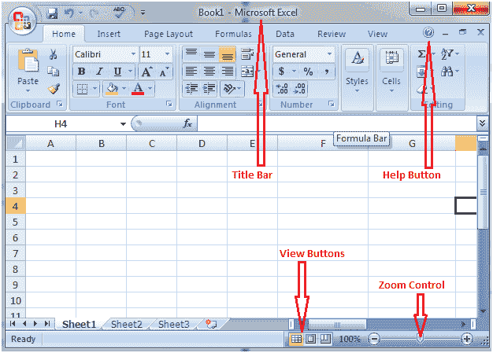

# 标题栏、帮助按钮、缩放控制和视图按钮

> 原文:[https://www.javatpoint.com/excel-title-bar](https://www.javatpoint.com/excel-title-bar)

### 标题栏

它位于快速访问工具栏旁边或 excel 窗口的顶部。它显示打开文档的名称。

* * *

### 帮助按钮

它位于 excel 窗口的右上角，在最小化窗口的选项旁边。它是一个带圆圈的问号。它提供 excel 相关的帮助。

* * *

### 缩放控制

缩放控件是一个滑块，位于状态栏右端的视图按钮旁边。它有助于放大和缩小文档。向右移动滑块，或单击加号将其放大，向左移动滑块，或单击减号将其缩小。

* * *

### 查看按钮

状态栏右端的缩放控件左侧有三个视图按钮。这些按钮提供了查看文档的不同选项。

* * *