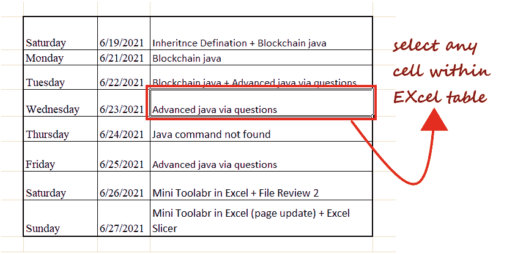

# 如何在 Excel 中选择数据

> 原文:[https://www.javatpoint.com/excel-how-to-select-data](https://www.javatpoint.com/excel-how-to-select-data)

选择数据是 Excel 用户日常生活中最常见的操作之一。

在 Excel 中选择一个单元格或多个单元格有多种方法，如通过**鼠标或键盘快捷键或两者结合**。作为 Microsoft Excel 用户，快速选择 Excel 工作表中的单元格、行、列和表格单元格至关重要。选择可帮助用户完成各种任务，如插入、删除和格式化 Excel 工作表中的多行多列。无论何时选择任何单元格、行、列或单元格区域，您都会注意到所选单元格的**颜色将会改变**，并且与其他单元格相比会变得突出显示。

本教程将探索选择单元格、行列、表格和 Excel 工作表范围的各种方法。

## 选择单个单元格

在 Excel 中选择单元格非常容易。只需将**鼠标光标放在您想要选择的相应单元格**上，就可以了。

**例如:**

我们要**选择 B 4 单元格**。所以我们将光标放在那个特定的单元格地址来选择它。

## 选择多个连续单元格

选择多个连续单元格既简单又容易。**选择您想要开始选择的第一个单元格****，并将光标拖动到所选单元格的末端**。假设要选择多个单元格 **B1: E10** 。

请遵循以下步骤:

1.  将鼠标**光标放在您想要开始选择的第一个单元格**上，即 **B1** 。
    
2.  按下鼠标按钮**并拖动鼠标光标，直到单元格 E10** 。它将包括所有中间单元格。
3.  离开鼠标光标，单元格 **B1: E10 将被选中**。
    T3】

## 选择行/列

在多次使用 Excel 时，用户需要选择整行或整列进行各种操作，如隐藏或删除行或列、应用一些条件格式、突出显示数据等。

与通过将鼠标光标放在相应单元格上来选择 Excel 中的单元格不同，您也可以通过在行或列上移动鼠标来选择任何行或列。

**1。选择单行**

下面给出了在 Excel 中选择整行的步骤。

*   将鼠标**光标放在行号**的顶部。例如，如果您可以选择第二行，那么**将您的**光标移动到第二行**。
    **
*   双击**行号**，会**选择整行**。在下图中，您可以看到整个第 2 行被选中(Excel 用蓝色突出显示单元格以表示选中)。
    

**2。选择单列**

在上面的步骤中，我们已经看到了如何在 Excel 中选择整行。同样，你也可以**选择一列**。按照以下步骤在 Excel 中选择整个列:

*   将您的**鼠标光标放在您的列字母表**的顶部。例如，如果您可以选择第二列，请将您的**光标移到第二列**。
    
*   双击**列**字母，会**选择整个列**。在下图中，可以看到整个**B 列被选中**。
    

**3。选择多个连续的行/列**

我们在 Excel 上工作并处理数据。有时候我们想**一起选择多行/多列**一次对相邻的行/列进行同样的操作。

例如，假设您想一起选择**行号 5、6 和 7** 。

遵循以下步骤。

*   **将鼠标**移到 Excel 工作表的第 5 行**上。
    **
*   双击**鼠标左键选择第 5 行**，但是**保持鼠标左键按下**，因为我们必须选择多行。
    
*   按住鼠标**的同时向下拖动光标，直到到达第 4 行**。此时，离开鼠标指针，三个相邻的行将被选中。
    T3】

按照上述步骤，您也可以选择多个列。确保单击列字母表而不是行号，并拖动到最后一列选择。

**4。选择多个不相邻的行/列**

并非总是如此，我们使用连续的行/列。我们可能要求它也与**不相邻的行/列**一起工作。我们如何选择它们？

选择不相邻的行/列很简单。但是，上述选择和拖动技术不适用于相邻的单元格、行或列。要在 Excel 中随机选择单元格、行或列，我们必须使用键盘和鼠标组合**。假设我们想要选择随机的行，例如行号 5、7、9、10。**

下面给出了步骤。

1.  **将****鼠标光标放在第一行数字**的上方，即 Excel 中的第 5 行。**点击**行号**选择。
    **
2.  接下来，按下键盘上的**控制键**。
    T3】
3.  按下控制键时，**将鼠标光标**拖动到所需的行号以选择它们。首先，我们将它拖到**第 7 排**并点击行号。如你所见，它被选中了。
    
4.  离开鼠标键，**将鼠标光标移动到第 9 行**，点击行号，选择。
    T3】
5.  同样地，**选择第 11 行**。
    T3】
6.  一旦选择了所需的行，请保留鼠标和 CTRL 键。

与使用键盘和鼠标组合选择相邻行不同，您可以应用相同的方法选择多个不相邻的列。

## 选择 Excel 表格中的单元格

大多数情况下，您使用的是 Excel 表格，并且需要选择表格中的所有单元格来应用特定的操作、格式或筛选。

您可以使用单击并拖动选项手动选择表格单元格。但这可能很耗时，而且对于大桌子来说，这变得非常困难。但是，在 Excel 键盘快捷键的帮助下，选择工作表的表格单元格可以在一瞬间完成。

下面给出了步骤。

1.  转到您的表格**并选择 Excel 表格**数据集中的任意单元格
    
2.  从键盘上按下 **Ctrl 键**和字母 **A** 键。
    
3.  它会快速**从表格中选择你所有的单元格**。
    T3】

#### 注意:CTRL + A 将选择表格数据集中的所有单元格，除非 Excel 运行到空行或空列，因为它会将空行或空列视为数据集的结尾，并且不会停止选择操作。

## 使用名称框选择单元格

到目前为止，我们已经介绍了各种选择方法，例如手动或借助键盘快捷键或使用鼠标和键盘的组合来选择单元格。但是我们选择的细胞就在附近，很容易找到。

在某些情况下，您可能需要在 Excel 工作表中选择位于一定距离的多个连续或非连续单元格、行或列。当然，那些单元格可以手动选择，但令你惊讶的是，这会很耗时，如果这是你必须定期做的事情，那么这是一个很大的问题。因此，为了节省时间，快速选择远处的单元格，可以使用**名称框**。

" ***在 Excel 中，Name Box 是放置在工作表左上角的小矩形字段。*** ”

一般来说，无论何时选择 Excel 工作表中的任何单元格，**单元格引用(活动单元格的引用)都会显示在名称框**中。虽然反之亦然也适用，即只要您**在名称框中键入任何单元格地址，它就会选择**所有提到的单元格或单元格区域。"

**例如:**假设我们必须**选择**多个不连续的单元格，不像 **B12、N43、**和 **Z50** 。如果您注意到前面提到的单元格彼此相距很远，如果我们手动选择它，将会非常麻烦和耗时。

因此，让我们尝试使用名称框来选择单元格。遵循以下步骤。

1.  用帮助光标**点击安装在 Excel 工作表左上角的名称框**。
    T3】
2.  **键入您想要选择的单元格地址**。如果要选择多个单元格，请用逗号分隔单元格引用。例如，在我们的案例中，我们将**键入 B12、N43、Z50** 。
    
3.  完成后，**按回车键**。它会立即**选择输入的单元格**。
    

#### 注意:在“名称框”栏中，只有活动单元格的单元格引用可见。它不代表您选择的总单元格；它只显示活动单元格，所以不要混淆。

## 使用键盘快捷键进行选择

选择有助于您轻松操作。到目前为止，我们已经看到了许多不同的方法，但是 Excel 也提供了一些有用的快捷键，您可以使用它们来选择单元格的组合。下面给出了一些有用的键盘快捷键，它们将帮助您轻松地自动化选择过程。

| 1. | **Ctrl+End** | 该键盘组合选择 Excel 工作表中的**右下角单元格**。 |
| 2. | **Ctrl+Home** | 该键盘组合选择 Excel 工作表中左上角的**(A1)单元格**。 |
| 3. | **家** | 该键盘组合选择 Excel 工作表中**活动行**最左边的**单元格**。 |
| 4. | **结束，进入** | 该键盘组合在 Excel 工作表的活动行的**中选择最右边的单元格**。 |
| 5. | **Ctrl，A** | 该键盘组合选择当前工作表中的**当前区域。** |
| 6. | **Ctrl， \** | 该键盘组合**选择选定行中与当前 Excel 工作表的公式**不匹配的单元格。 |
| 7. | **Ctrl，Space** | 该键盘组合选择**当前**电子表格所选范围的整列。 |

* * *