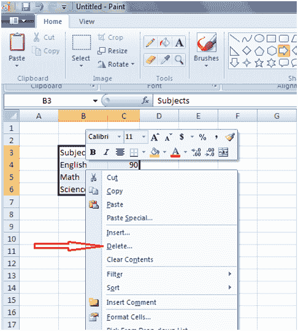
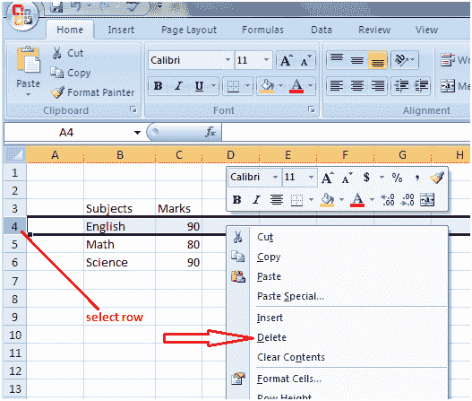
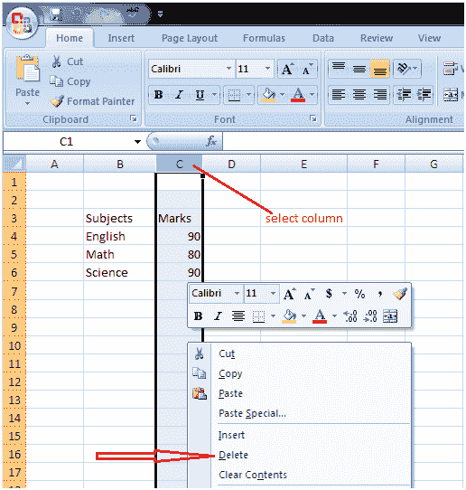

# 如何在 Excel 中删除数据、行和列

> 原文：<https://www.javatpoint.com/excel-how-to-delete-data-rows-columns>

**如何删除数据**

选择要删除的数据，右键单击它，然后从菜单中选择删除选项。您也可以按键盘上的删除键将其删除。见图:

**如何删除一行**

通过左键单击行号选择行，然后右键单击并选择删除选项。如果要删除更多行，请向下拖动鼠标以选择更多行。见图:

**如何删除一列**

通过左键单击列标题选择列，然后右键单击并选择删除选项。要删除更多列，请向左或向右水平拖动鼠标以选择更多列。见图:

