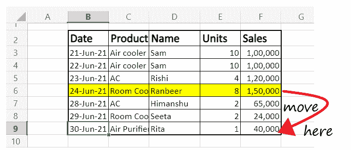
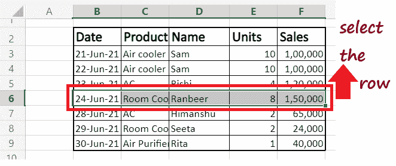
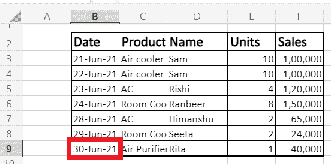
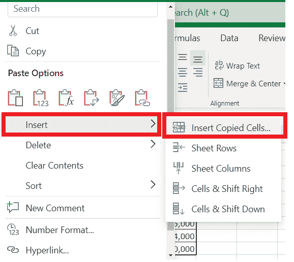
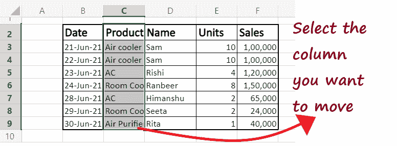
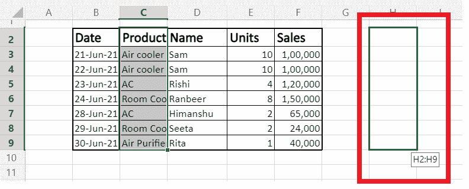
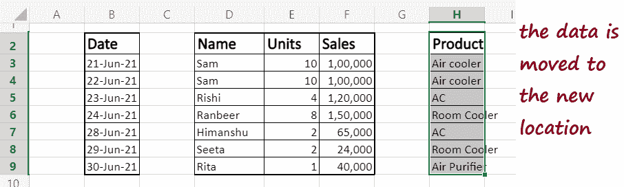

# 在 Excel 中移动数据

> 原文：<https://www.javatpoint.com/excel-how-to-move-data>

**移动单元格、行或列**是每个 Excel 用户在日常生活中都会执行的操作。

让我们用一个例子来理解这一点。假设我有一个数据集(下面给出)，我想**将**高亮显示的行移动到 Excel 表格的最后一个位置。

大多数人会想到的常见方法是复制行的内容，将复制的行粘贴到所需的位置，然后从原始位置删除内容。

但是你不认为这是一个漫长的过程吗？那么，为什么不改用更快的方式在 Excel 中移动行和列呢？使用 Excel 时，可能会经常需要插入、移动或删除单元格。每当插入、移动或删除单元格时，现有单元格及其数据都会移动，以适应对相邻单元格的修改。

在本教程中，我们将发现一些方法，可以快速帮助您将行和列从一个地方移动到另一个地方。

## 使用剪切和插入移动数据

1.  **选择要**从一个地方移动到另一个地方的数据**。
    **
2.  将光标放在任何选定的单元格上，然后右键单击它。将显示以下窗口。选择**切割**选项。
    T3】
3.  接下来，选择要移动数据的单元格。例如，在下面的例子中，我选择了 **B9 单元格。**
    
4.  再次右键单击所选单元格，并从窗口窗格中选择**插入**选项- > **插入复制的单元格。**
    
5.  如您在下面的输出中所见，数据将被**移动**到所需的位置。
    T3】

## 使用 Shift 键移动数据

使用 shift 键移动数据基本上与剪切和粘贴数据相同，并且它提供相同的输出。这两种操作都使用户能够将大量的 Excel 数据从一个地方移动到另一个地方。但是**使用 shift 键移动数据本质上是用来在短距离**内移动数据，在短距离内可以很容易地拖动鼠标光标。

让我们看看如何使用 Shift 键轻松移动 Excel 行和列。

### 在 Excel 中移动行

假设您的 Excel 工作表中有以下数据条目。您希望将突出显示的行移动到单元格 B9。

按照下面给出的步骤在 Excel 中快速移动行:

1.  将光标放在相应的**行上选择**。
    T3】
2.  按下键盘上的**换档键**。
    T3】
3.  将鼠标指针移动到选定行的末尾。您会注意到光标将变为**移动图标**(四向箭头)。
    T3】
4.  您仍然需要按下 shift 键并将**光标移动到您想要放置信息的新位置**。
    T3】
5.  整行将从其原始位置被切割，并**移动**到新的分配位置。
    T3】
6.  此时，保留鼠标光标和 Shift 键。

#### 注意:虽然我提到了行，但在上面的示例中，我已经从行中选择了一些单元格。但是按照上面的步骤，您也可以移动一整行，它会快速地将整行移动到一个新的位置。

下面是一些关于 Excel“移动”方法的要点:

*   借助这种方法，人们只能**移动连续的单元格、行或列。**此方法不适用于不连续或相邻的单元格、行或列。例如，您不能一起移动第 2 行和第 7 行，您必须逐个移动它们。但是，您可以一起移动第 2 行和第 3 行。
*   无论何时使用移动 shift 键方法移动或移动行或列中的单元格，**都不会影响 Excel 电子表格中的任何其他数据**(单元格的上方或下方/右侧或左侧)。

### 在 Excel 中移动列

到目前为止，我们已经学会了如何将一行的单元格从一个地方移动到另一个地方。使用同样的方法也可以应用于在 Excel 中移动列。

按照下面给出的步骤在 Excel 中快速移动行:

1.  将光标放在相应的列(或相邻的列)上进行选择。
    
2.  按下键盘上的**换档键**。
    T3】
3.  将鼠标指针移动到选定行的末尾。您会注意到光标将变为**移动图标**(四向箭头)。
    T3】
4.  您仍然需要按下 shift 键并**将光标移动到您想要放置所选列的新位置**。例如，在下面的例子中，我们想要移动到列 H.
    
5.  整列将从其原始位置**被切割并转移到新的分配位置。**
    
6.  此时，保留鼠标光标和 Shift 键。

* * *