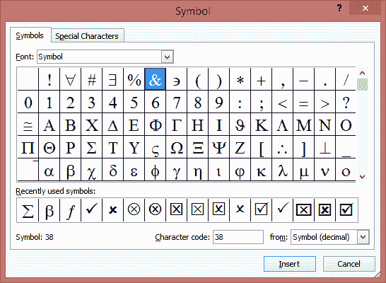
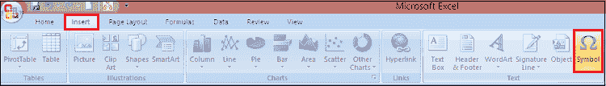
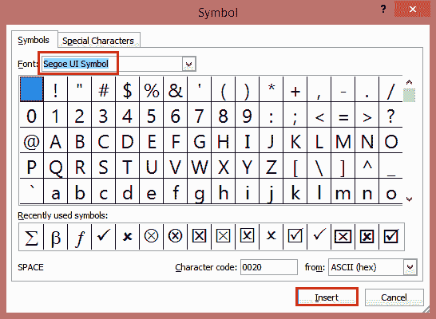
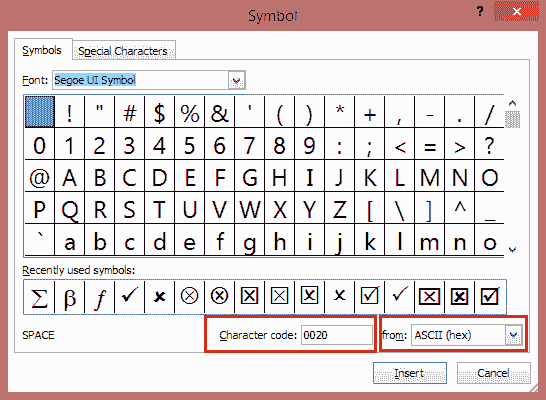
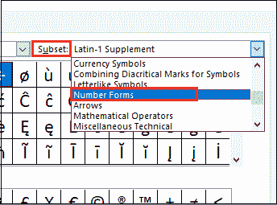
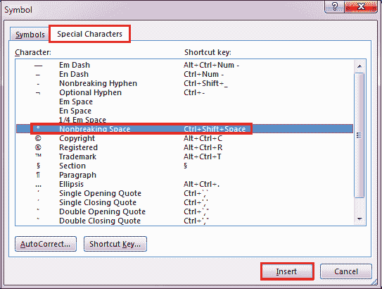

# 在 Excel 中插入符号和特殊字符

> 原文：<https://www.javatpoint.com/excel-how-to-insert-symbols-special-characters>

大多数情况下，在使用 Excel 时，您会在单元格中使用数字或文本。使用计算机键盘，您可以直接插入大约 94 个不同的字符，如字母、数字和其他符号，如标点符号。然而，还有许多其他可用的符号。

可以在 excel 中插入 ***【勾号】【叉号】*** 等符号，以及成千上万个这样的符号。Excel 还允许您插入特殊字符，如 ***商标、版权、注册*** 符号等。

当插入符号、分数、特殊字符或国际字符时，要理解的最重要的事情是您将使用的字体。不是所有的字体都有相同的字符。使用正确的字体来找到您想要的符号或字符是很重要的。

例如，大象字体中没有分数字符，而 Verdana 有。在典型的字体(如 Arial)中，大约有 200 种不同的符号可用，如英镑符号、欧元货币符号€和版权标志。

这些符号不能用键盘上的一个键直接输入。Excel 2010 使在单元格中输入符号变得容易。这些符号在“符号”对话框中可用。

所有字符都被分配了一个标准代码。这是计算机内部存储字符的方式。您应该知道在文件中使用特殊符号的代码。

### 如何在 Excel 中插入符号？

在 Excel 中，要使用“符号”对话框将符号添加到单元格中，需要执行以下步骤，例如:

**步骤 1:** 将光标放在要插入符号的文件中。

**第二步:**进入 ***插入*** 选项卡，点击 ***符号*** 按钮。

**第三步:**选择一个符号，或者选择**更多符号**。

**第四步:**上下滚动找到想要插入的符号。

不同的字体集中往往有不同的符号，最常用的符号在 **Segoe UI Symbol** 字体集中。使用符号列表上方的**字体**选择器选择您想要浏览的字体。

**第五步:**找到想要的符号后，点击。

**第六步:**然后点击**插入**按钮，这个符号会插入到你的文件中。

### 如何使用 ASCII 或 Unicode 字符代码插入符号

您也可以使用符号的字符代码作为键盘快捷键。符号和特殊字符可以使用 ASCII 码或 Unicode 码插入。你可以告诉哪一个你查找的字符的代码。

**第一步:**进入**插入**标签，点击**符号**按钮。

**第 2 步:**要显示更多符号，点击**更多符号**选项。

**第三步:**在列表中上下滚动以找到您想要的符号，或者您可能需要更改字体或子集来定位它。

**第四步:**向右下角，你会看到**字符代码**和一个来自的**的方框。**

*   ***字符代码*** 是您将输入的从键盘插入该符号的代码。
*   而 中的 ***告诉你这是一个什么样的人物。如果*中的“Unicode(十六进制)”是一个 Unicode 字符。或者如果**** *中的 ***表示“符号(十进制)”，那么它是一个 ASCII 字符。****

 *### 通用符号和代码

如果您知道代码号，您可以通过按住 ALT 键并在数字键盘上键入 4 位代码号来随时输入该字符。即使字符代码编号只有三位数(介于 0 和 255 之间)，您也必须键入前导零以确保获得正确的字符。

例如，要输入代码为 163 的英镑符号，请按住 ALT 键并在数字键盘上键入 0163。以下是一些常见的符号及其代码，例如:

| 标志 | 编码 |
| `Euro €` | `0128` |
| `Ellipsis …` | `0133` |
| `Dagger †` | `0134` |
| `Double Dagger ‡` | `0135` |
| `Bullet •` | `0149` |
| `Trademark ™` | `0153` |
| `Cents ¢` | `0162` |
| `Yen ¥` | `0165` |
| `Pounds £` | `0163` |
| `Copyright ©` | `0169` |
| `Registered ®` | `0174` |
| `Plus/Minus ±` | `0177` |
| `Paragraph ¶` | `0182` |
| `Degree °` | `0176` |

### 使用公式创建符号列表

如果您不知道符号的代码号，则可以通过在单元格 A1 中输入以下公式，然后将公式向下复制到第 255 行，在 Excel 工作表上快速创建简单的符号列表:

=CHAR(ROW())

这将在每个单元格中显示其代码为该单元格行号的字符。例如，欧元货币符号将出现在单元格 A128 中，这表明其代码号为 128。

您可以更改列的字体，以查看各种字体提供了哪些字符。有很多有用符号的字体包括**符号**、**网鼎**，以及 3 种 WingDings 字体，Ref Specialty、 **ENCICON** 、 **Marlett** 、 **MonoType Sorts** 和 MS Reference。

### 在公式中使用符号

如果需要在工作表公式中使用特殊符号，可以使用函数从其代码中返回字符。例如，假设您想在工作表中添加版权声明。您可以使用以下公式:

=CHAR(169) & " Copyright, 2000."

CHAR(169)函数返回在单元格中正确出现的实际版权符号。CHAR 函数的“逆”是 CODE 函数。当 CHAR 取一个数字并返回实际字符时，CODE 函数取一个字符并返回代码号。例如，以下公式返回 65，即大写字母“A”的字符代码。

=CODE("A")

CHAR 和 CODE 函数的 VBA 编程等价物是 Chr()和 Asc()。例如，要显示带有版权信息的消息框，请使用以下代码:

MsgBox Chr(169) & " Copyright, 2000"

### 如何在 Excel 中插入分数值？

某些分数(1/4、1/2 和 3/4)在您键入时会自动切换到分数字符(、)。但是其他分数没有(1/3，2/3，1/5，等等。)，所以如果您想将它们作为符号插入，您需要使用插入符号过程。

**第 1 步:**点击或点击要插入分数的位置。

**第二步:**进入**插入**标签，点击**更多符号**按钮。

**第三步:**在**子集**下拉列表中，选择**数字表格**。

**第四步:**双击要插入的分数。

**第五步:**然后点击 ***关闭*** 按钮。

只有少数常见的分数有你可以替代的符号。对于更不寻常的分数，例如 8/9，可以通过将分子设置为上标，将分母设置为下标来近似符号。

#### 注意:并非所有字体都有数字形式子集。如果您看不到适用于您的字体的数字表单子集，您将不得不使用不同的字体，如 Calibri，来插入分数字符。

### 如何在 Excel 中插入特殊字符？

通过使用特殊字符 Excel 功能，您可以轻松地在电子表格中插入特殊字符。当输入符号、特殊字符、国际字符或分数时，我们使用的字体至关重要。现在按照以下步骤在 Excel 电子表格中插入特殊字符:

**第一步:**将光标放在想要插入特殊字符的确切位置。

**第二步:**进入 ***插入*** 选项卡，点击 ***符号*** 按钮。

**第三步:**现在，点击 ***特殊字符*** 按钮。

**第四步:**点击要插入的特殊字符。

**第五步:**点击**插入**按钮，将该按钮插入表单。

#### 注意:许多特殊字符都有相关的快捷键。例如，ALT+CTRL+C 插入版权符号( )以及更多。如果您想快速插入该特殊字符，请按快捷键。

### Excel 中的国际字符

如果您想用其他语言键入，或者考虑将键盘布局切换到该语言。对于一次性字符，Office 中几乎总是有键盘快捷键可以做到这一点。例如:

| 快捷键 | 插入字符 |
| `CTRL+` (ACCENT GRAVE), the letter` | `à, è, ì, ò, ù,
À, È, Ì, Ò, Ù` |
| `CTRL+SHIFT+^ (CARET), the letter` | `â, ê, î, ô, û
Â, Ê, Î, Ô, Û` |
| `CTRL+SHIFT+: (COLON), the letter` | `ä, ë, ï, ö, ü, ÿ,
Ä, Ë, Ï, Ö, Ü, Ÿ` |
| `CTRL+SHIFT+~ (TILDE), the letter` | `ã, ñ, õ
Ã, Ñ, Õ` |
| `CTRL+' (APOSTROPHE), the letter` | `á, é, í, ó, ú, ý
Á, É, Í, Ó, Ú, Ý` |
| `CTRL+SHIFT+&, a or A` | `æ, Æ` |
| `CTRL+, (COMMA), c or C` | `ç, Ç` |
| `CTRL+/, o or O` | `ø, Ø` |
| `ALT+CTRL+SHIFT+!` | `¡` |
| `CTRL+SHIFT+&, s` | `ß` |
| `ALT+CTRL+SHIFT+?` | `¿` |
| `CTRL+' (APOSTROPHE), d or D` | `ð, Ð` |
| `CTRL+SHIFT+&, o or O` | `œ, Œ` |
| `[[email protected]](/cdn-cgi/l/email-protection), a or A` | `å, Å` |

* * **