# 如何在 Excel 中做加法

> 原文：<https://www.javatpoint.com/excel-how-to-do-addition>

在 Excel 中执行的典型日常操作之一是**加法。**是否要求价目表、费用单的总和，计算销售总额或任何其他动作。您甚至可以通过将求和函数与其他 **Excel** 函数相结合来创建自定义的**求和公式**。

*因此，在本教程中，我们将介绍在 excel 中快速计算数字总和的各种方法。*

## 1.只需单击一下，即可对 Excel 中的列求和

这是最快的选项之一，可以快速找到数字的总和。要应用此方法，请遵循以下步骤。

1.  点击**列字母**，你要找出其总和。
2.  在 **Excel *状态*** *栏中，*您会注意到**单元格的总数。**
    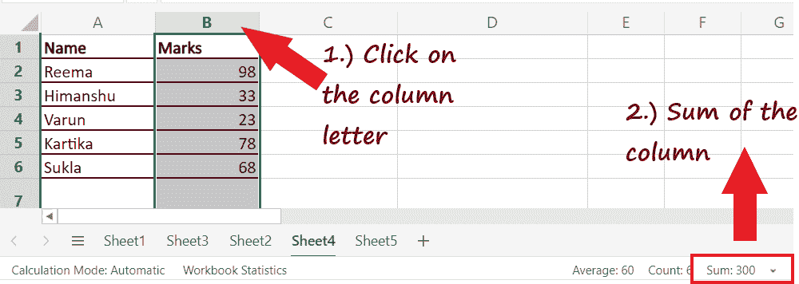
3.  不选择整列，可以**选择几个单元格计算总和。**会在 Excel 状态栏中快速显示所选单元格的总和。

#### 注意:虽然这种方法很快，但它的缺点是既不允许复制，也不显示数字。

## 2.用自动求和在 Excel 中计算总和

列表中的第二种方法是**自动求和。**该方法允许用户**快速总结一列，并将输出保存在表格中。**使用 AutoSum 方法的优势在于，它会自动将数字相加，并将结果显示在指定的单元格中。要应用此方法，请遵循以下步骤。

1.**点击要汇总数字的栏目下方的空单元格**。

#### 注意:要绕过任何附加操作，如范围选择，请始终选择需要求和的列下方的第一个空单元格。

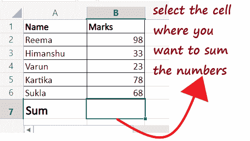

2.转到 ***主页选项卡- >编辑组- >自动搜索*** 选项。

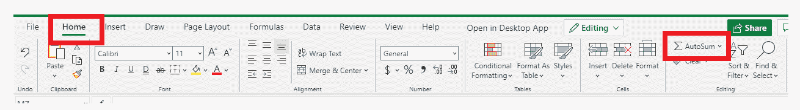

3.Excel 会自动**选取范围**，并将其放入 SUM 函数中。虽然如果需要，你也可以改变范围。

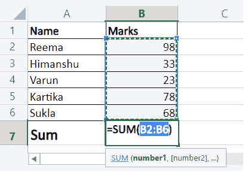

4.点击键盘上的**回车按钮**，你会注意到 Excel 会立即给你所选范围内出现的数字的**和。**

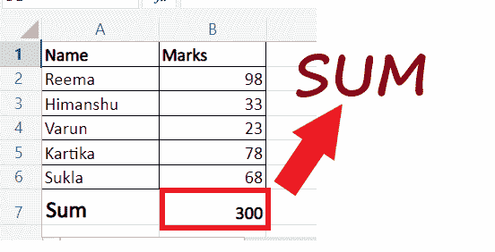

这种方法速度很快，可以让您自动获取求和结果并保存在表中。

## 3.使用求和函数的加法

在 Excel 中常用的求总数的简便方法之一是 **SUM 函数。**SUM 函数用于选择 Excel 工作表中的特定单元格甚至大范围，并计算它们的总和。如果您有一个**大型 excel 列，并且想要在不突出显示范围的情况下计算总和，则此方法是有益的。**不过，还是需要手动输入 SUM 函数。

#### 注意:SUM 函数计算范围内所有选定值的总和，即使单元格被隐藏或过滤。

使用 Excel 中的 **SUM 函数**，可以找到一个单元格区域，一整列/整行，连续的单元格，甚至是非连续的单元格。Excel 用户经常通过将 SUM 函数与其他 **Excel** 函数相结合来创建自定义的高级函数。

要应用此方法，请遵循以下步骤。

1.单击要汇总数字的列下方的空白单元格。

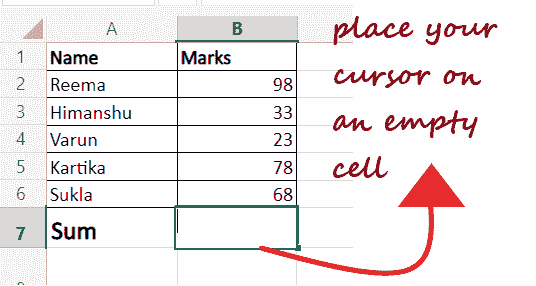

2.以等于 **(=)后跟 SUM ()** 开始公式。在参数中，通过将鼠标指向一个单元格并将光标拖动到末尾来选择单元格的范围。如果需要，您可以直接输入用逗号分隔的单元格引用数。

#### 注意:您也可以手动键入总和范围地址。容易计算大范围数据是有帮助的。例如=SUM(D2:D3000)。

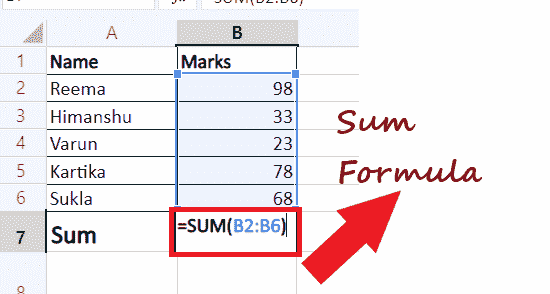

3.按下**回车按钮**，Excel 会立即计算数字之和。

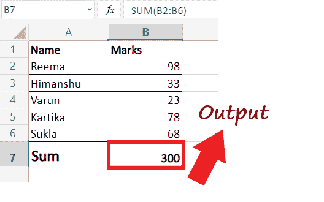

## 4.仅查找可见单元格的总和

在上面的部分，我们已经讨论了 SUM 函数添加所有的值，包括隐藏的和过滤的字段。因此，通过这种方法，我们学会了如何只计算可见单元格的**和。因此，省略过滤或隐藏的单元格。**要应用此方法，请遵循以下步骤。

1.  在 Excel 电子表格中输入数据。
    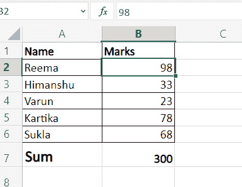
2.  现在，我们将过滤上面的数据集，只获取大于 40 的值。点击任意单元格，进入**数据- >排序&过滤- >过滤图标。**
    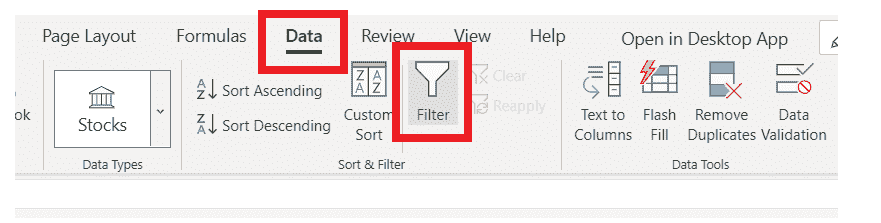
3.  如下所示，过滤器箭头将出现在标题中。点击**标记过滤器箭头。**
    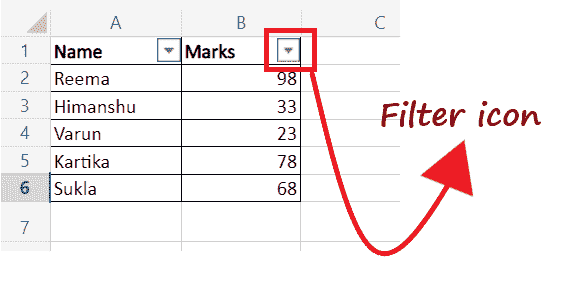
4.  将出现以下窗口。点击**数字过滤器- >大于。**
    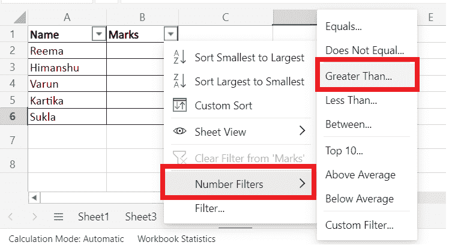
5.  它将显示“自定义过滤器”窗口。在文本框中，**键入 40，然后按确定。**
    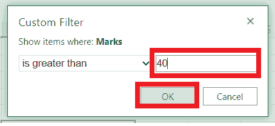
6.  它将向您显示以下**过滤输出。**
    
7.  要快速找到过滤列的总和，选择范围，点击*首页*标签下的 ***【自动求和】*** 。您将在所选单元格中得到您的**过滤总和**。
    
8.  另一种快速求和的方法是选中过滤后的单元格，在 **Excel *状态栏上查看单元格***的**和。** 虽然使用这种方法，您将无法将数据粘贴到工作表中。

## 5.将数据转换为 Excel 表格，并获取列的总和

创建表并计算列的总和也是查找总和的常见方法之一。因此如果你有一个很大的数据集，想求其和，就把你的数据转换成 *Excel 表格。*快速合计表的列和行的总和会很有帮助。要应用此方法，请遵循以下步骤。

1.  将光标放在任意单元格上，按键盘上的快捷键“Ctrl + T”即可**用 Excel 数据创建表格。**您将看到给定的“创建表格”窗口，它将自动为您选择数据。点击确定。
    T3】
2.  Excel 会为您创建一个表格。接下来，在功能区工具栏中，您将看到“设计”选项卡。导航到此选项卡并查找合计行。如下图所示，**勾选 ***总行前面的***复选框。**
    
3.  Excel 会立即**在你的表尾增加一个新行**(用 Total 命名)。虽然它已经计算出了总数，但还是要确保点击你的号码旁边的小箭头图标。
    T3】
4.  从出现的选项中选择**求和选项**。就是这样，你将得到你的数据的**总和。**
    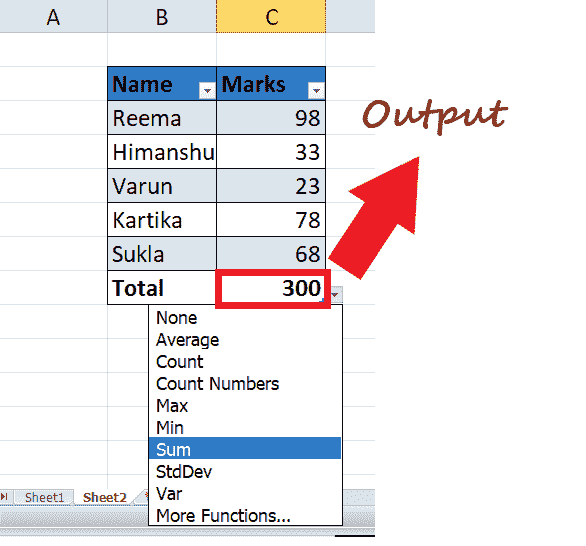
5.  使用这个方法，你可以很容易地找到每一列的和。您也可以尝试其他选项，如平均值、最小值和最大值。

#### 注意:该方法也只将可见(过滤)单元格相加。

* * *