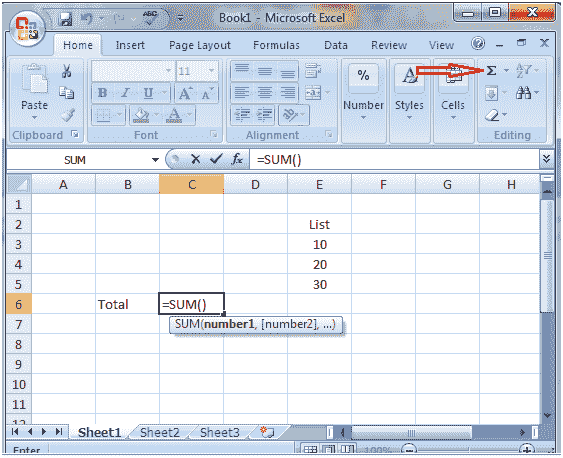
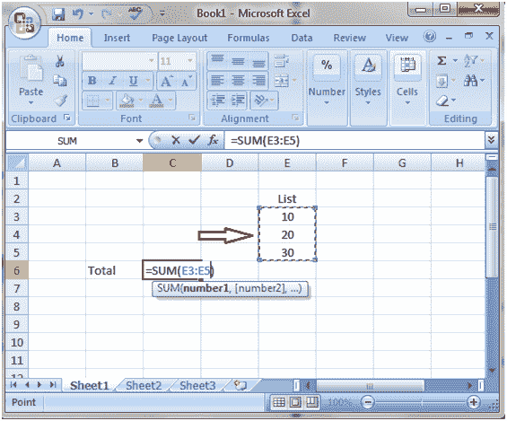

# 用适马按钮在 Excel 中做加法

> 原文:[https://www . javatpoint . com/excel-使用-sigma-button-to-do-add](https://www.javatpoint.com/excel-using-sigma-button-to-do-addition)

选择要显示结果的单元格，然后在主页选项卡中单击功能区右端的适马按钮。您将看到下面给出的图像:

现在选择您想要添加的数据列表。您将看到下图，然后按回车键获得结果。

