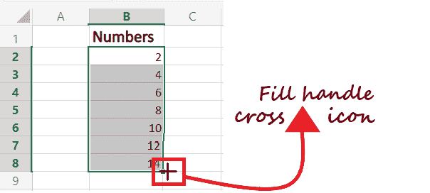
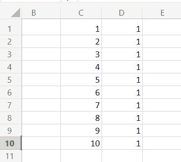
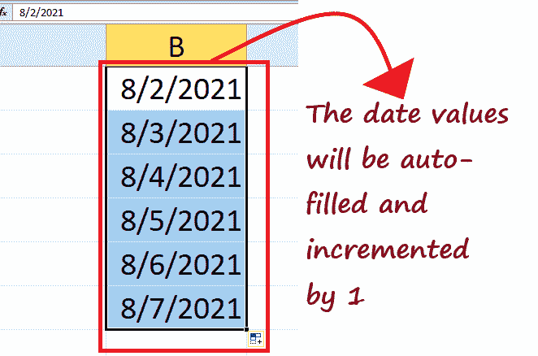
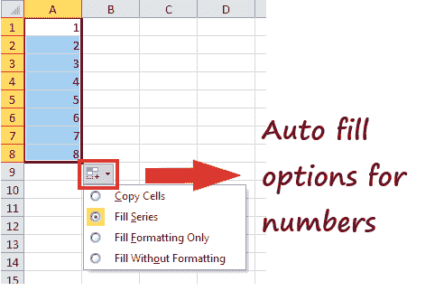
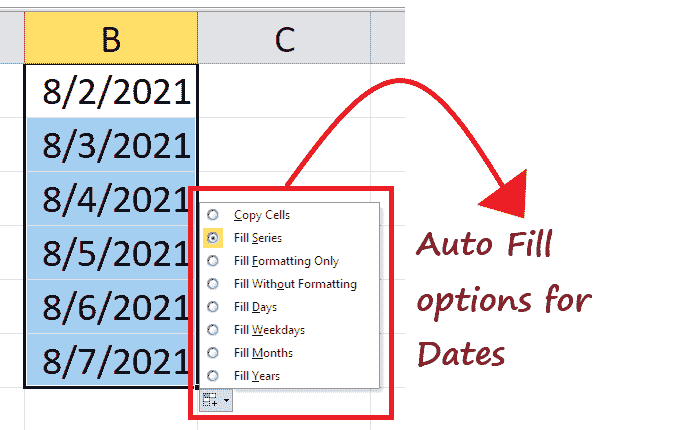
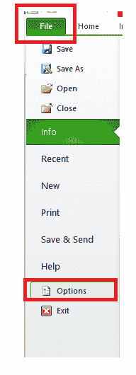
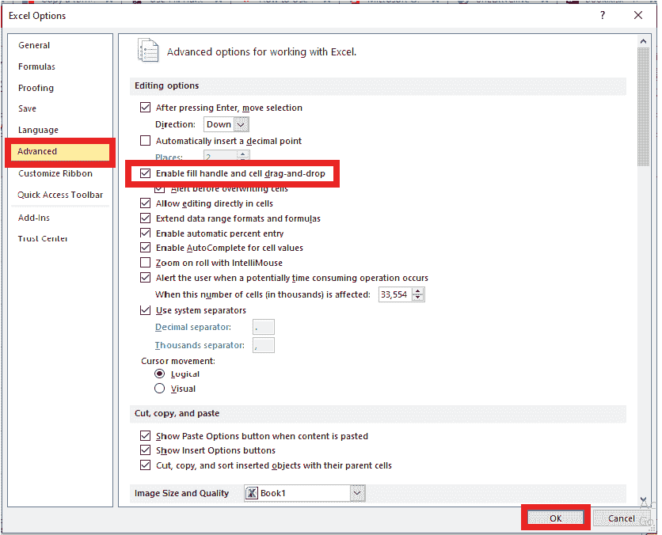

# Excel 填充句柄

> 原文:[https://www.javatpoint.com/excel-fill-handle](https://www.javatpoint.com/excel-fill-handle)

**填充手柄**是一个 Excel 功能，用于**用特定的模式**自动填充数据。您可以将一系列数字、日期和文本组合扩展到所需的单元格数。

Fill handle 是 excel 套件中的一个多功能工具，可以自动完成各种条目、转换数据和其他几个应用程序。这是一个**内置的 excel 功能，默认情况下**是启用的，因此不涉及任何手动过程来实现它。

若要使用填充手柄，请将鼠标指针移动到单元格的右下角；它会变成一个很小的+(十字)符号。拖动十字符号，如果 Excel 识别出该模式，它将使用更新的数据自动填充单元格。否则，它将在所有拖动的单元格中复制相同的数据。

**例如:**让我们在 B2 单元格中输入 2，在 B3 单元格中输入 4。接下来，我们将通过选择两个单元格并将十字(+)号拖到后面的单元格来实现填充句柄。您会注意到，Excel 会通过每个值增加 2 来自动更新单元格。

## 如何在 Excel 中使用填充手柄？

接下来，让我们了解使用填充手柄功能在 Excel 电子表格中快速插入前 25 个数字的步骤。

*   **输入数据的前两个条目**。不像我们在 C1 和 C2 的牢房里输入了 1 和 2。
    T3】
*   选择两个单元格，并将鼠标悬停在矩形窗口的右下角。你会注意到光标会立即变成一个**加号(+)图标**。
    T3】
*   点击鼠标**将十字(+)图标**向下拖动到下面的单元格，直到到达第 25 个值。如下例所示，excel 将自动识别填充前 25 个条目的模式(递增 1)。
    T3】
*   如果您想填充相邻行中的数据，**填充第一个条目，并将指针悬停在选择窗口**的右边缘。它会变成一个**加图标(+)**；双击它。填充手柄将自动**将所有值填充到最后一个单元格**(基于相邻列中的条目)。如下例所示，我们已经将 C 列的值复制到 d 列
    

## 在 Excel 中使用填充句柄的示例

在上面的例子中，我们介绍了在 excel 中使用填充手柄功能来自动填充前 25 个数字的步骤。然而，这是我们已经执行的基本操作。在许多情况下，填充手柄是一个优势，因为它可以自动识别模式并正确填充单元格。

让我们通过日常操作更简单地了解填充手柄功能。

### 1.自动填充工作日名称

在 excel 中输入天数列表是每个用户都要执行的常见操作之一。您可以使用填充手柄功能快速填充周名。遵循下面给出的步骤:

1.  打开你的 excel 电子表格**输入完整的周名，即周一**。也可以输入三个字母命名法，即 Mon。
    T3】
2.  选择单元格，并将鼠标光标置于矩形窗口的右下角。您会注意到光标将变为**加号(+)**。
    T3】
3.  通过**向下拖动光标**，自动完成带有工作日名称的单元格。
    T3】

## 自动填充日期

日期也是我们日常生活中常用的。因此，使用填充手柄，您可以轻松地在电子表格中自动填充日期。

#### 注意:您可以使用填充句柄自动填充 Excel 识别的任何日期格式。

在第一个单元格中输入日期，并将十字(+)号拖到后面的单元格中。日期值将在拖动的单元格中自动填充。您会注意到 Excel 会自动将日字段增加 1。

同样，您可以自动填充月、年、日等。

## 自动填充选项

使用填充手柄并拖动十字(+)图标来自动填充单元格后，您会注意到选择窗口右下角的“自动填充选项”图标(参见下图)。

点击**填充手柄图标**。你会有几个选择。对于不同的数据，这些选项是不同的。例如，如果使用填充手柄自动填充数字列表，您将拥有以下选项。

1.  **复制单元格**:选择该选项可以将选中的数据复制粘贴到拖动的单元格中。
2.  **填充系列**:默认选项。一旦识别出任何模式，它就会自动填充单元格。
3.  **仅填充格式**:选择此选项仅将选定单元格的格式复制到拖动的单元格中。它不会填充值。
4.  **无格式填充**:选择此选项会通过识别图案自动填充单元格，但不会复制单元格的格式。

同样，当您处理日期时，您将有以下填充手柄选项:

1.  **复制单元格**:选择该选项可以将选定的日期复制粘贴到拖动的单元格中。
2.  **填充系列**:默认选项。它会根据日期的模式自动填充日期。
3.  **仅填充格式**:选择此选项仅将选定单元格的格式复制到拖动的单元格中。它不填充日期值。
4.  **无格式填充**:选择此选项会通过识别图案自动填充单元格，但不会复制单元格的格式。
5.  **填充天数**:此选项自动用天数填充单元格。
6.  **填充工作日**:此选项仅用工作日自动填充单元格，并消除周末。
7.  **填充月份**:选择该选项，用递增的月份填充单元格。因此，所有单元格的日数都是相同的，而只有月数会发生变化。
8.  **填充年份**:选择该选项，用递增的年份填充单元格。因此，所有单元格的日数和月数都是相同的，而只有年数会发生变化。

**如果 Excel 填充句柄功能不起作用怎么办？**

在使用 Excel 电子表格时，填充手柄功能经常不起作用。不要担心它是否会发生，因为 Excel 提供了一个手动启用它的选项。

按照以下步骤在 Excel 中手动启用填充手柄功能:

1.  单击文件->选项。
    
2.  将提示“Excel 选项”对话框。从窗口的左窗格中，选择“高级”选项。
3.  查找“编辑选项”部分，并确保勾选“启用填充手柄和单元格拖放”复选框。
4.  单击确定。
    

* * *