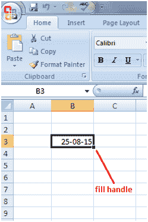
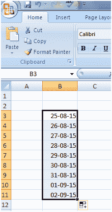

# Excel 用日期填充句柄

> 原文:[https://www.javatpoint.com/excel-fill-handle-with-dates](https://www.javatpoint.com/excel-fill-handle-with-dates)

填充句柄可用于填充多个单元格中的日期。如果需要在工作表中输入完整的月份，则不需要分别键入每个日期。只需选择一个单元格，输入日期，并使用填充手柄将其携带到其他单元格中，Excel 就会在选定的单元格中输入后续日期。查看图片:

