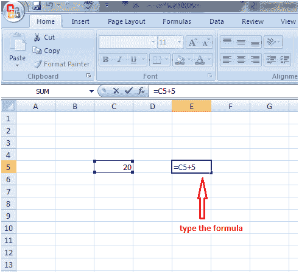
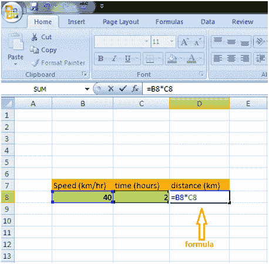
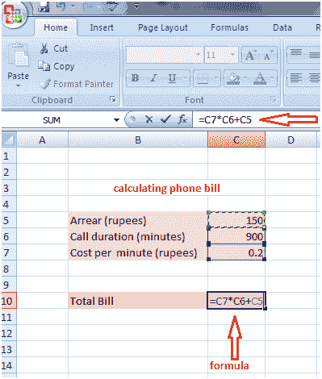

# Excel 创建公式

> 原文：<https://www.javatpoint.com/excel-creating-formulas>

在单元格 C5 中输入数字 20，现在在单元格 E5 中键入公式:=C5+5，然后按回车键。你会得到结果的。公式显示，单元格 C5 中输入的值加上 5，因为值是 20，结果是 25。见图:

以类似的方式，可以创建其他公式:

=C2*5 对于乘法，单元格 C2 中的值乘以 5。

=C2-5 对于减法，从单元格 C2 中的值减去 5。

通过在单元格中键入=然后选择适当的值并在其间键入正确的数学符号，可以创建更多公式。

请参见下图中为计算距离而创建的公式:

请参见下图中为计算电话费而创建的公式:

