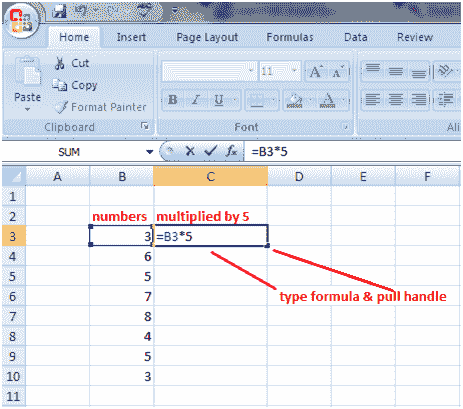
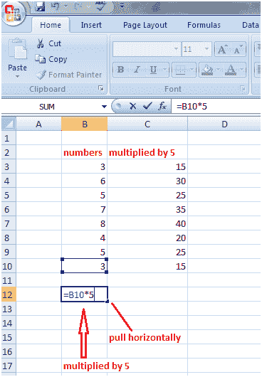

# 公式中的 Excel 填充句柄

> 原文：<https://www.javatpoint.com/excel-fill-handle-in-formulas>

在下面给出的图像中，我们希望将列 B 中的数字乘以 5，因此我们可以为单元格 B3 和列 B 的其他单元格键入公式，如=B3*5，但这在长列表中是不可能的。

在这种情况下，我们使用填充句柄来执行计算。因此，在单元格 C3 中键入公式=B3*5，然后左键单击单元格 C3 的右下角，将出现填充手柄。向下拉动填充手柄，直到单元格 C10，然后离开鼠标。列 B 中的整个数字列表将乘以 5。

拉手也水平工作。见下图。单元格 B10 中的值与单元格 B12 中的 5 相乘，当您向单元格 C12 水平移动拉动手柄时，单元格 C10 中的值也将与 5 相乘。

