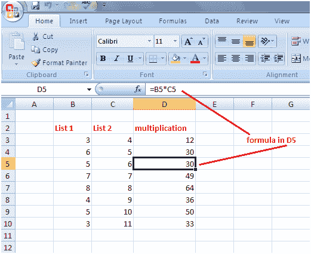

# Excel 相对引用

> 原文:[https://www.javatpoint.com/excel-relative-referencing](https://www.javatpoint.com/excel-relative-referencing)

相对引用表示您不需要为列或行中的每个计算分别键入公式。见图:

在第一个单元格 D3 中键入公式，然后按回车键获得结果，然后使用填充手柄。公式将在相应的单元格中自动更改，列表 1 的所有值将与列表 2 的相应值相乘。

通过这种方式，您可以轻松地将列表 1 的值与列表 2 的相应值相乘，但是如果您想要将列表 1 的所有单元格与列表 2 的单个单元格相乘，例如 C3，那么这是行不通的。