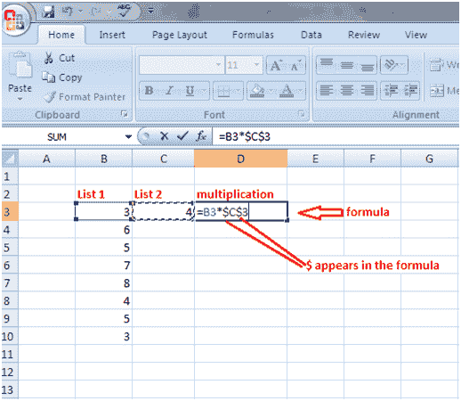
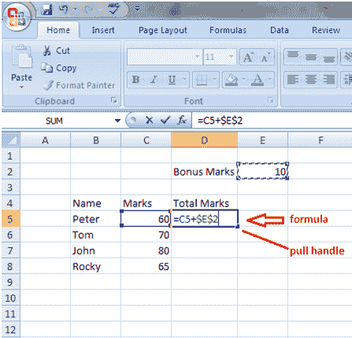

# Excel 绝对引用

> 原文：<https://www.javatpoint.com/excel-absolute-referencing>

绝对引用有助于将多个值与一个特定值相乘。

见下图。列表 1 的值乘以单元格 C3 的值 4。在这种情况下，我们将在公式中使用符号$。

所以我们必须修改公式，输入公式后按 F4 键。$ Sign 将出现在公式中。请参见图中的单元格 D3。然后按回车键得到结果。现在将填充手柄从单元格 D3 拖动到单元格 D10。列表 1 的所有值都将乘以 4。

以类似的方式，在下图中，通过将公式从=C5+E2 修改为=C5+$E$2，将奖励分数添加到学生的分数中。

