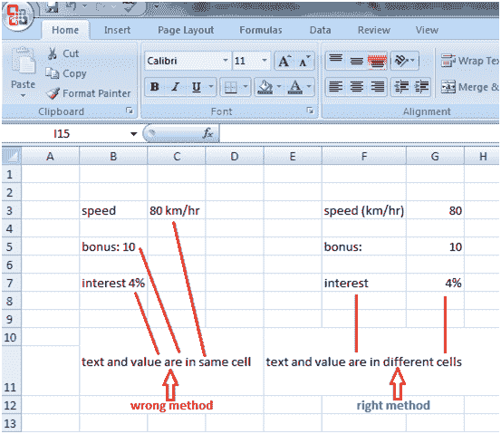
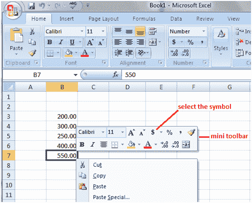
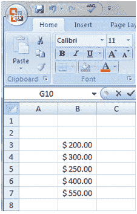

# 在 excel 中键入数据时的说明

> 原文:[https://www . javatpoint . com/excel-一边打字一边指令-数据](https://www.javatpoint.com/excel-instruction-while-typing-data)

在单独的单元格中键入值和文本，否则公式将不起作用。请参见下面给出的示例:

如果你想添加货币符号到数值，然后使用迷你工具栏，如下图所示。

选择单元格区域，然后右键单击。快捷菜单上方会出现一个小工具栏。点击货币符号。它将被添加到给定值中。要查找更多货币符号，请单击货币符号旁边的箭头。请看下面给出的图片。

