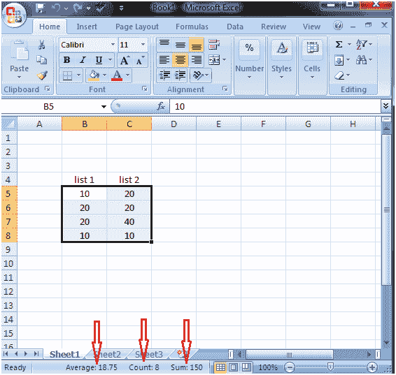
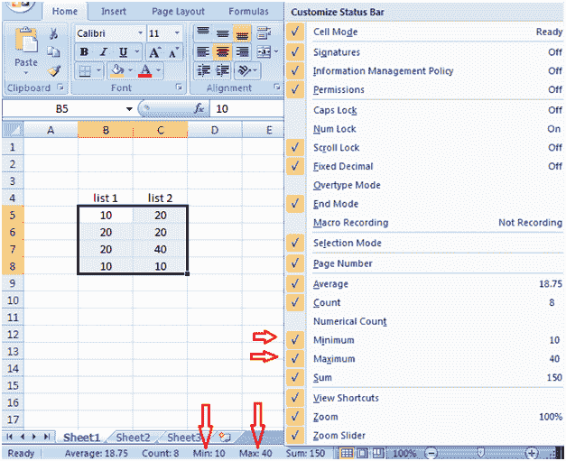

# 快速 Excel 函数

> 原文：<https://www.javatpoint.com/quick-excel-functions>

Excel 中有一些快速函数可以为您提供工作表的统计数据，而无需使用状态栏快速函数等公式。

请参见下面的图片，一旦您选择了所需的范围，您将在状态栏中获得统计数据、数字的平均值、包含值的单元格的数量以及数字的总和。

通过右键单击状态栏，您可以自定义它。您可以在状态栏中添加更多功能。从菜单中选择要在状态栏中添加的功能。见下图，状态栏是自定义的。它还显示了数字的最大值和最小值。

