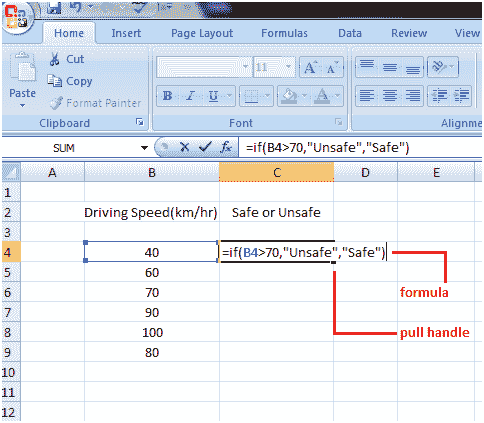

# Excel If 函数

> 原文:[https://www.javatpoint.com/excel-if-function](https://www.javatpoint.com/excel-if-function)

Excel 中的 IF 函数或 IF 语句由逗号分隔的三部分组成。

*   一个条件
*   满足条件时显示什么
*   如果条件不满足，显示什么

在下面的例子中，查看“中频功能”是如何一步一步创建的，以找到安全和不安全的行驶速度。

*   选择要在其中创建“中频功能”的单元格
*   在单元格中键入代码: **=if(**
*   用逗号输入条件: **B4 > 70，**
*   如果条件满足，请键入您想要显示的内容。如果你想显示文本，请用引号括起来:**“不安全”**
*   键入逗号:，
*   在引号内输入条件未满足时要显示的内容:**“安全”**
*   然后合上支架，按回车键。

上面创建的 IF 函数如下所示: **=if(B4 > 70，“不安全”、“安全”)**

因此，如果函数表示 B4 单元格中的速度或值大于 70，则显示不安全，如果小于 70，则显示安全。

按回车键后，您将获得单元格 B4 的结果。向下拖动填充手柄，直到单元格 C9 获得 b 列其他速度的状态