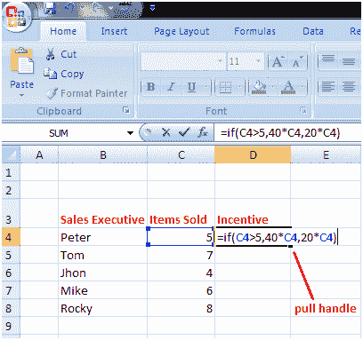
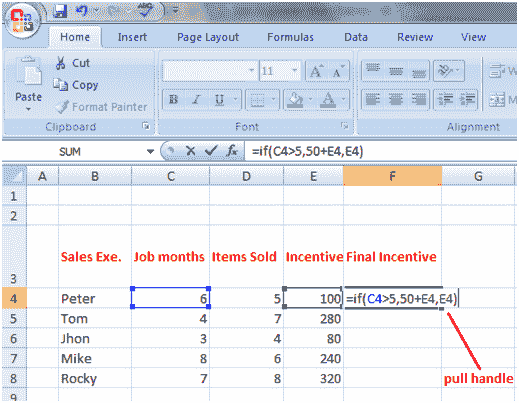
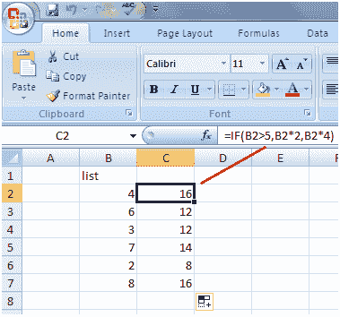
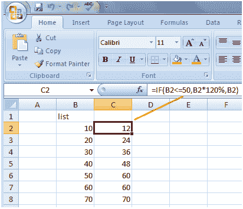
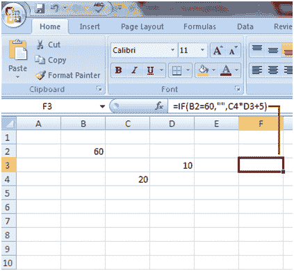

# 带计算的函数

> 原文：<https://www.javatpoint.com/excel-if-function-with-calculations>

“中频函数”可以用于复杂的计算。参见示例:

如果销售主管销售的物品超过 5 件，公司将为每件售出的物品支付 40 卢比的奖励，如果销售主管销售的物品少于 5 件，公司将为每件售出的物品支付 20 卢比的奖励。

查看“中频函数”如何用于计算:

*   选择要在其中创建“中频功能”的单元格
*   在单元格中键入代码:= **if(**
*   用逗号输入条件: **C4 > 5，**
*   如果条件满足，键入您想要显示的内容: **40*C4**
*   键入逗号:，
*   如果条件不满足，键入您想要显示的内容: **20*C4**
*   然后合上支架，按回车键。

IF 函数如下所示:= **if(C4 > 5，40*C4，20*C4)**

所以 IF 函数表示如果 C4 单元中的值大于 5，则乘以 40。如果小于 5，则乘以 20。

**可以修改 IF 函数来执行不同的计算:**

假设在上面的例子中，公司想向那些试用期满 5 个月或工作时间超过 5 个月的员工支付 50 卢比的奖金。

在这种情况下，我们可以在工作月份的工作表中再插入一列，并相应地修改 IF 函数以获得结果。

修改后的中频函数为:=中频(C4>5，50+E4 E4)

它说，如果细胞 C4 的价值大于 5，那么加 50 到 E4，这是彼得的激励。如果小于 5，则保持激励，细胞 E4 的价值不变。请参见下图:

**中频功能的更多例子:**

**=if(B2 > 5，B2*2，B2*4)**

IF 函数表示如果细胞 B2 中的值大于 5，则将该值乘以 2，否则将该值乘以 4。见下图:

中频函数也可以这样构成:=中频(B2>5，2*B2，4*B2)

**=IF(B2 < =50，B2*120%，B2)**

IF 函数表示，如果像元 B2 的值小于 50 或等于 50，则将其增加 20%，否则显示相同的值，不做任何更改。见下图:

**=IF(B2=60，“”，C4*D3+5)**

IF 函数表示，如果单元格 B2 的值等于 60，那么将该单元格留空，否则将单元格 C4 乘以 D3，再加 5。见下图:

* * *