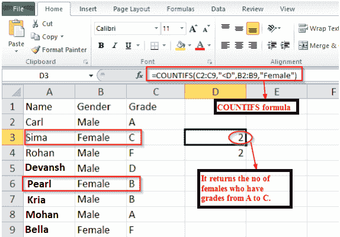

# 如何使用 COUNT、COUNTIF 和 COUNTIFS 函数？

> 原文：<https://www.javatpoint.com/how-to-use-count-countif-and-countifs-function>

## Excel COUNT

COUNT 函数返回包含数字的单元格的绝对数量。此计数包含数字和日期。

### 句法

```

COUNT (value1, [value2]...)

```

其中参数值 1、[值 2]等。可以是单元格区域的任何值或权限。

**示例 1:** 下图返回给定范围内的整数值个数。


**示例 2:** 下图计算 A1: A4 和 B1:B2 范围内的整数值。


## EXCEL COUNTIF

**Excel COUNTIF 函数**用于对符合特定规则或条件的选定范围内的单元格进行计数。

例如，我们可以写一个 COUNTIF 方程来发现工作表中有多少单元格包含一个大于或小于我们考虑的数字。在 Excel 中，COUNTIF 的另一个常见用途是计算带有特定单词或以特定字母开头的单元格。

### 句法

微软 Excel 中 COUNTIF 函数的语法是:

```

COUNTIF (range, criteria)

```

在哪里

**范围:**根据给定标准检查的细胞范围。

**标准:**需要针对范围内每个细胞进行检查的条件。

#### 注意:如果我们的标准是文本字符串或语句，那么它必须包含在双引号中。

**示例:**下面的 COUNTIF 函数计算高于或等于 5 的单元格数。


## excel countries(excel countries)

Excel COUNTIFS 函数至少接受一个单元格区域，如果满足条件，则返回总计数。

### 句法

```

COUNTIFS (criteria_range1, criteria1, [criteria_range2, criteria2],...)

```

其中**标准 _ 范围 1:** 要对照特定标准 1、标准 2 检查的值(或包含值的单元格范围)的数组...(提供的 criteria_range 数组必须都具有相似的长度)。

**标准 1:** 根据标准范围 1、【标准范围 2】中的值检查的条件。....

**示例 1:** 以下示例显示了 COUNTIFS 函数的使用。

在这个例子中，我们要计算满足这两个标准的人数。

1.  一个人应该是女性。
2.  一个等级应该< =D，介于 A 到 c 之间



**例 2:** 统计考试失败的考生总数。“雄性”用于发现以雄性结尾的细胞。


* * *