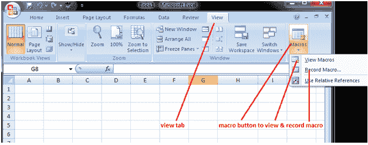
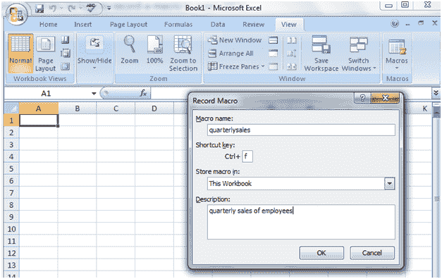
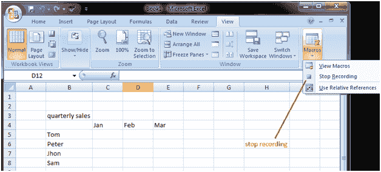
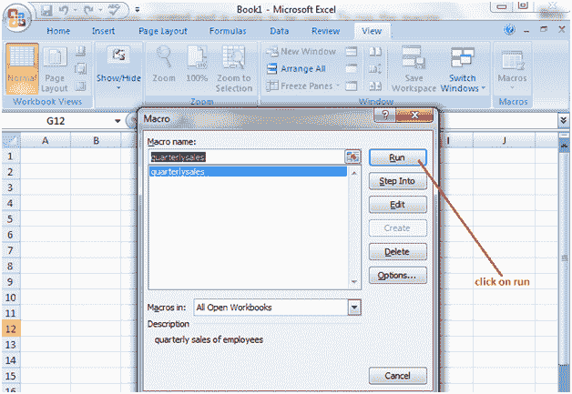

# Excel 宏

> 原文：<https://www.javatpoint.com/excel-macros>

通过使用宏，我们可以记录任务。当你有需要重复执行的任务时，它非常有用。它加快了程序并保证了准确性。

**如何打开宏:**

打开视图选项卡。在功能区的右端，您会发现宏按钮。

单击宏按钮底部显示的箭头。它将显示三个选项；查看宏、记录宏并使用相对引用。见图:

**查看宏:**点击查看宏选项，打开宏对话框，可以运行、编辑或删除宏。

**录制宏:**点击该选项录制宏。单击时，它会显示“记录宏”对话框，您可以在其中填写宏的详细信息。

**使用相对参考:**此选项有助于以相对模式录制宏。使用相对模式，您可以在工作表上的任何位置运行记录的数据。

**录制宏的步骤:**

单击记录宏选项。它将显示宏对话框。填写宏的详细信息，然后单击确定。见下图。

现在执行您想要录制的任务。当任务完成后，点击宏按钮下面的箭头，它将显示三个选项，从这些选项中选择停止录制。见下图:

现在宏已创建并准备好使用，要运行宏，请单击“宏”按钮。您也可以单击查看宏选项；它将显示带有多个选项(如运行、编辑和删除)的对话框。单击运行选项，它将显示记录的任务。见下图:

